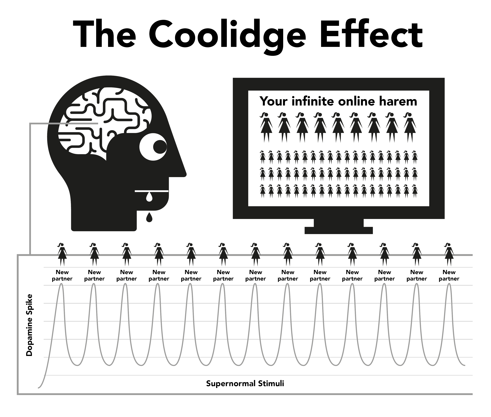

# प्रकृति

Internet porn हमारे natural reward system को हाईजैक कर लेती है, जो असल में हमें जितना हो सके reproduce करते रहने के लिए बना है। Internet porn का तुरंत और आसानी से available होना दिमाग के reward mechanism को normal से कहीं ज्यादा देर तक dopamine बनाते रहने पर मजबूर करता है। Science में इसे Coolidge effect कहते हैं, हो सकता है तुम इसके बारे में जानते हो।

Dopamine एक neurotransmitter है जो दिमाग में "और चाहिए" का भूत बिठा देता हैै, जबकि असली pleasure opioids से मिलता है। जितना ज्यादा dopamine, उतने ज्यादा opioids और उतनी ज्यादा चाहत। Dopamine के बिना, खाने में भी मज़ा नहीं आता और हम उन्हें पूरा नहीं कर पाते, जैसे ज्यादा fat और sugar वाला खाना सबसे ज्यादा dopamine release करवाता है।

Dopamine नई-नई चीज़ों से भी release होता है। Internet पर porn की अनगिनत variety होने से limbic system (reward circuit) में बाढ़ सी आ जाती है, इसलिए पहली बार जब porn देखते हो तो action होता है, orgasm होता है और opioids का एक और धमाका होता है। दिमाग जितना हो सके dopamine पाने की कोशिश में,  इस पूरे script को आसानी से याद करने के लिए store कर लेता है और DeltaFosB नाम का chemical छोड़कर neural pathways को मजबूत बनाता है। अब, कोई sexy ad देखा, अकेला time मिला, stress हुआ या थोड़ा mood खराब हुआ कि दिमाग इन neural pathways को activate कर देता है और तुम 'water slide' पर फिसलने को तैयार हो जाते हो। हर बार ऐसा करने पर और DeltaFosB release होता है, यानी slide और smooth होती जाती है, और अगली बार और आसानी से फिसल जाते हो।

Limbic system में एक self-correcting system होता है जो रोज़ाना dopamine की बाढ़ देखकर dopamine और opioid receptors की संख्या कम कर देता है। दुर्भाग्य से, ये receptors हमें daily life की tensions से निपटने के लिए motivated रखने में भी जरूरी हैं। अब normal खुशियों से मिलने वाला थोड़ा-बहुत dopamine porn के सामने फीका पड़ जाता है, और कम हुए receptors इसे ठीक से पकड़ भी नहीं पाते, जिससे तुम normal से ज्यादा stressed और irritated feel करते हो। इस प्रोसेस को desensitisation कहते हैं।

इस cycle में तुम 'लक्ष्मण रेखा' पार कर जाते हो और guilt, disgust, शर्म, anxiety और डर जैसी feelings trigger हो जाती हैं, जो बदले में dopamine levels को और ऊपर पहुंचा देती हैं और दिमाग इन feelings को गलती से sexual arousal समझ लेता है।

समय के साथ, दिमाग न सिर्फ पहले देखी हुई clips से desensitise हो जाता है, बल्कि उसी तरह की categories और shock level से भी। ये कम motivation फिर कम satisfaction की feelings trigger करता है क्योंकि हमारा दिमाग हर चीज़ को rate करता रहता है, और तुम्हें भूख मिटाने के लिए नई clips ढूंढने पर मजबूर करता है। तो तुम और नई categories ढूंढने लगते हो, और homepage पर वो amateur, shocking clip देखने लगते हो जिसे पहली बार देखकर तुमने कहा था "छी, ये तो मैं कभी नहीं देखूंगा"।कि कभी नहीं देखोगे।

> *"नन्हीं बूंदों की ताज़गी में, दिल ढूंढ लेता है अपनी सवेरा, और फिर से जी उठता है"*
>
> --- खलील जिब्रान

जिंदगी के कठिन पलों में बस थोड़ी सी शांति की जरूरत होती है, पर तुम्हारा desensitised दिमाग उस छोटी सी राहत को कैसे महसूस करेगा जो एक normal इंसान का दिमाग आसानी से कर लेता है?

Dopamine की बाढ़ किसी तेज नशे की तरह काम करती है, जल्दी उतरती है और withdrawal के झटके देती है। बहुत से users को लगता है कि ये झटके वही trauma हैं जो उन्हें छोड़ने की कोशिश में झेलने पड़ते हैं। असल में, ये ज्यादातर mental होते हैं क्योंकि user को लगता है कि उसका सहारा या pleasure छिन गया है।

## छोटा शैतान

Porn का chemical withdrawal इतना subtle होता है कि ज़्यादातर users जीते-मरते ये भी नहीं जान पाते कि वो drug addicts हैं। बहुत से users को drugs से डर लगता है, लेकिन drug addicts हैं। किस्मत अच्छी है कि ये नशा छूट सकता है, पर पहले ये मानना पड़ेगा कि तुम addicted हो। Porn छोड़ने से कोई physical दर्द नहीं होता, बस एक खालीपन और बेचैनी का एहसास होता है, जैसे कुछ missing है, इसीलिए बहुत लोग इसे sexual desire समझ लेते हैं। ये feeling अगर लंबी चले तो बंदा घबराने लगता है, डरने लगता है, परेशान रहता है, confidence खो देता है और चिड़चिड़ा हो जाता है। समझो कि ये भूख है, पर जहर की भूख।

Session शुरू करते ही seconds में dopamine मिल जाता है और craving खत्म हो जाती है, और जैसे ही तुम water slide पर फिसलते हो एक satisfaction की feeling आती है। शुरुआती दिनों में, withdrawal के झटके और उनसे राहत इतनी हल्की होती है कि हमें पता भी नहीं चलता। जब हम regular users बन जाते हैं, तो सोचते हैं कि हमें इसमें मजा आने लगा है या ये 'आदत' बन गई है। सच्चाई ये है कि तब तक हम addicted हो चुके होते हैं पर समझते नहीं हैं। छोटा शैतान तब तक हमारे दिमाग में घर कर चुका होता है, इसलिए हम थोड़े-थोड़े time में water slide पर फिसलकर उसे खाना खिलाते रहते हैं।

सब लोग किसी न किसी reason से porn देखना start करते हैं। चाहे कोई light user हो या heavy user, असली point एक ही है। दिमाग में एक छोटा शैतान बैठा है जिसको feeding चाहिए। और सबसे sad बात पता है क्या है? कि जब भी session करता है तब वो पुरानी वाली normal feeling ढूंढ रहा होता है - वो peace, वो confidence जो addiction से पहले था।

## The Annoying Construction

तुमने notice किया है कब पड़ोस में कोई building बन रही हो? सुबह से शाम तक खट-खट, धम-धम। फिर जब शाम को सब quiet हो जाता है, तो कैसा relief feel होता है! ये असली relaxation नहीं है, बस वो आवाज़ बंद हुई है। अगले session से पहले हमारा body complete होता है, फिर हम brain को force करते हैं dopamine निकालने के लिए, और जब finish होता है तो withdrawal का झटका लगता है। इसमें कोई दर्द-वर्द नहीं होता, बस एक खालीपन सा feel होता है। दिखता नहीं है, पर ये body में leak होते टपकते नल की तरह होता है।

यार, हमारा दिमाग इसे ठीक से समझ नहीं पाता। हमें बस इतना पता है कि porn चाहिए और masturbate से वो तड़प मिट जाती है। पर ये feeling बहुत short time की होती है क्योंकि तड़प को दूर करने के लिए फिर से porn चाहिए होती है। जैसे ही finish होते हो, craving वापस शुरू हो जाती है और तुम इस trap में फंसे रहते हो। एक feedback loop चलता रहता है, जब तक तुम इसे break नहीं करते!

Porn का ये trap वैसा ही है जैसे tight जूते पहनना सिर्फ इसलिए ताकि उन्हें उतारने में मजा आए। तीन main reasons हैं कि users इसे इस नजरिए से क्यों नहीं देख पाते।

1.  बचपन से हमारे दिमाग में ये भरा गया है कि internet porn बस एक modern चीज़ है, जो magazine वाले porn की जगह आ गया है। इस झूठ को इस सच्चाई के साथ mix करा गया है कि masturbation बुरी बात नहीं है। तो फिर हम मानें क्यों न?

2.  क्योंकि dopamine withdrawal में कोई real pain नहीं होता, बस एक खालीपन और insecurity का feeling होता है जो भूख और normal stress से अलग नहीं लगता, ये feeling एक porn session में बदल जाता है क्योंकि वही वक्त होता है जब हम internet porn की तरफ जाते हैं। हम इस feeling को normal मान लेते हैं।

3.  असल में users internet porn को सही तरीके से क्यों नहीं समझ पाते? क्योंकि ये उल्टा काम करता है। जब तुम इसे नहीं use कर रहे होते, तब तुम्हें वो खालीपन feel होता है। शुरू-शुरू में लत लगने का process बहुत subtle और धीरे-धीरे होता है, इसलिए वो खालीपन normal लगता है और पिछले session session को blame नहीं करता। पर जैसे ही तुम browser on करते हो और session start करते हो, तुरंत एक boost मिलता है। तुम कम nervous या ज्यादा chill feel करते हो। तो सारा credit porn को चला जाता है।

ये 'उल्टा' process drugs को छोड़ना मुश्किल बना देता है। एक heroin addict panic करता है जब उसे heroin नहीं मिलती; और फिर सोचो उसकी कैसी खुशी होती है जब वो आखिर में नस में heroin inject करता है। जो लोग heroin के addicted नहीं हैं, उन्हें ये panic वाली feeling नहीं होती।

Heroin उस तड़प को दूर नहीं करता, वो इसे पैदा करता है। ऐसे ही, जो लोग porn नहीं देखते, उन्हें न तो ये खालीपन feel होता है, न ही internet नहीं मिलने पर tension होता है। normal लोगों को तो ये समझ में ही नहीं आता कि कोई flat screen पर, बिना sound के, fake body वाली videos से कैसे satisfy हो सकता है। आखिर में तो users को खुद भी समझ नहीं आता कि वो ये क्यों कर रहे हैं।

लोग बोलते हैं कि porn देखने से relax होते हैं या satisfy feel होता हैै। पर सोचो, तुम satisfy कैसे हो सकते हो अगर पहले से ही कोई कमी न हो? non-user को ये unsatisfied वाली feeling नहीं होती, वो बिना sex वाली date के बाद भी completely relaxed रहता है, जबकि user तब तक relax नहीं होता जब तक वो दिमाग में बैडे 'छोटे शैतान' को satisfy न कर ले।

## मजा या सहारा?

एक important बात याद रखो — users को quit करना मुश्किल क्यों लगता है? क्योंकि उन्हें लगता है कि वो कोई real मजा या सहारा छोड़ रहे हैं। पर समझो, *तुम कुछ भी नहीं छोड़ रहे हो*। Porn के trap को समझने का best तरीका है इसे खाने से compare करना। Regular खाने की आदत की वजह से हमें meals के बीच भूख नहीं लगती, सिर्फ तब पता चलता है जब खाना late हो। कोई physical pain नहीं होता, बस पेट में खालीपन और थोड़ी बेचैनी का feeling होता है जिसे हम भूख समझते हैं। और फिर खाना खाने में मजा आता है।

Porn भी बिल्कुल खाने जैसी लगती है, पर है नहीं। भूख की तरह, इसमें कोई दर्द तो नहीं होता और reward mechanism भी similar तरीके से काम करता है। यही खाने से similarity से user को लगता है कि ये real मजा या सहारा है। खाना और porn बहुत similar लगते हैं, असल में ये एकदम opposite हैं।

Pornography appears to be almost identical, but it’s not. Like hunger, there’s no physical pain and the reward mechanism behaves in similar ways, but it’s this similarity to eating that tricks the user into believing there’s a genuine pleasure or crutch. Although eating and porn appear to be very similar, in reality they’re exact opposites.

-   खाना तुम्हें जिंदा रखता है, energy देता है, जबकि porn तुम्हारी life की रौनक छीन लेती है।

-   खाने का स्वाद real होता है (जैसे दाल-चावल, या पानी-पूरी) और खाने में पूरी life मजा आता है। Porn तुम्हारे happiness receptors को खराब करता है और खुश रहने की ability को नष्ट कर देता है।

-   खाने से भूख पैदा नहीं होती, जबकि पहला porn session dopamine की craving शुरू करता है और हर अगला session भी। ये craving को दूर करने के बजाय, पूरी life के लिए तड़पा देती है।

क्या खाना एक habit है? अगर लगता है तो इसे पूरी तरह छोड़ के देखो! खाने को habit कहना वैसा ही होगा जैसे सांस लेने को habit कहना - दोनों जीने के लिए जरूरी हैं। ये सच है कि लोगों को अलग-अलग time पर अलग-अलग तरह का खाना खाने की habit होती है, पर खाना खुद कोई habit नहीं है। Porn भी नहीं है। User browser इसलिए खोलता है क्योंकि वो पिछले session से पैदा हुए खालीपन को खत्म करना चाहता है, अलग-अलग time पर अलग-अलग तरह की और ज्यादा extreme genres के साथ।

Internet पर लोग porn को habit बोलते हैं और EasyPeasy भी आसानी के लिए इसे 'habit' कहता है। पर एक बात गांठ बांध लो - porn कोई habit नहीं है, *ये नशे की लत है*! जब हम porn use करना शुरू करते हैं, तो हमें खुद को मजबूर करना पड़ता है इसे झेलने के लिए। पता चलने से पहले ही, हम ज्यादा से ज्यादा अजीब और shocking porn की तरफ बढ़ने लगते हैं। मजा शिकार में है, शिकार मारने में नहीं।। Orgasm के बाद dopamine का नशा उतर जाता है, इसीलिए users 'edge' (orgasm को delay) करना चाहते हैं और कई browser windows और tabs के बीच jump करते हैं।

## लक्ष्मण रेखा cross करना

Drug की तरह, शरीर पुरानी clips के effects के लिए immunity develop कर लेता है, और दिमाग कुछ और strong मांगने लगता है। थोड़े time तक एक ही clip देखने से पिछले session से पैदा हुए खालीपन पूरी तरह दूर नहीं होता। porn की जन्नत में एक जंग चल रही होती है: तुम अपनी 'लक्ष्मण रेखा' के safe side पर रहना चाहते हो, पर तुम्हारा दिमाग तुम्हें उस forbidden-fruit वाली clip पर click करना चाहता है।

Porn session के बाद तुम्हें लगता है अच्छा है, पर तुम उस बंदे से ज्यादा nervous और कम relaxed होते हो जिसने कभी शुरू ही नहीं किया, चाहे तुम सोचो कि तुम porn paradise में हो। ये तो tight जूते पहनने से भी ज्यादा पागलपन है क्योंकि जिंदगी में आगे बढ़ने के साथ, जूते उतारने के बाद भी परेशानी बढ़ती जाती है। क्योंकि user को पता है कि दिमाग में बैडे 'छोटे-शैतान' को खाना खिलाना है, वो खुद time तय करता है, जो अक्सर चार तरह के situations पर या इनके combination में होता है:

बोरियत / concentration - एकदम opposite चीज़ें!
Stress / relax होना - एकदम opposite चीज़ें!

कौन सा जादुई नशा है जो कुछ minutes पहले जो effect कर रहा था, उसका उल्टा कर देता है? सच्चाई ये है कि porn न तो बोरियत और stress दूर करती है, न ही concentration और relaxation में help करती है। जरा सोचो, हमारी life में नींद के अलावा और किस तरह के मौके होते हैं? अगर तुम सोच रहे हो कि 'realistic' या 'soft' type की porn पर shift कर लो, तो याद रखो कि इस book में जो बताया गया है वो सभी तरह की porn पर लागू होता है - चाहे print हो, webcam हो, pay-per-view हो, chat हो या live show हो। इंसान का शरीर दुनिया की सबसे advanced system है, पर कोई भी living being, चाहे वो amoeba हो या कीड़ा, तब तक जिंदा नहीं रह सकता जब तक उसे खाने और जहर में फर्क न पता हो।

Natural selection ने हमारे दिमाग और बॉडी को ऐसे rewards देने के लिए डिज़ाइन किया है जो इंसान को आगे बढ़ाए और जिंदा रखे। पर ये supernormal stimuli के लिए तैयार नहीं - जो nature से कहीं ज्यादा बड़े, चमकदार और extreme हैं। सोचो, एक flat screen की image भी हमें exite कर देती है। पर वही image बार-बार देखो तो फीकी लगने लगती है। Real life में कुछ natural limits होती हैं जो हमें दूसरा काम करने पर मजबूर करती हैं, पर internet porn में ऐसी कोई limit नहीं है, इसलिए तुम अपनी पूरी life एक virtual कोठे में बर्बाद कर देते हो!

ये सोचना गलत है कि सिर्फ physically और mentally कमजोर लोग ही porn के चक्कर में पड़ते हैं, और lucky वो हैं जिन्हें पहली बार में ही घिन आ गई और वो जिंदगी भर के लिए बच गए। या फिर वो जो mentally इस मुश्किल process से गुजरने के लिए तैयार नहीं थे - जैसे कि खुद को addict बनाने की कोशिश करना, 'पकड़े जाने' का डर या फिर browser privacy settings चलाने में technologically कमजोर होना। पर सबसे बुरी बात तो teenagers की है - जो material ढूंढने और अपने history deletion में पूरे expert होते हैं - और जो बढ़ती संख्या में इसमें पड़ रहे हैं।

internet porn का मजा वहम है। बस एक category से दूसरी category में भटकते रहना, बस अपने नए-नए की भूख वाले 'बंदर' को 'सेफ' porn genres की 'लक्ष्मण रेखा' के अंदर रखने की कोशिश, ताकि dopamine की dose मिलती रहे। एकदम heroin के नशेड़ियों जैसा - उन्हें भी सिर्फ अपनी खुमारी मिटाने के चक्कर में ही किक मिलता है।

## लक्ष्मण रेखा के आस-पास का खेल

वो एक clip जो देखते रह जाते हैं, उसमें भी users खुद को सिखाते रहते हैं कि porn clips के बुरे और बदसूरत हिस्सों को ignore करें। अगर solo clip भी हो, तो भी वो उन body parts पर focus करते हैं जो उन्हें सबसे ज्यादा attract करते हैं। असल में, कुछ लोग तो इस लक्ष्मण रेखा के आस-पास के dance में ही मजा लेते हैं, बहाने ढूंढते हैं कि वो 'soft stuff' पसंद करते हैं और supernormal stimuli के आदी नहीं हैं। लेकिन एक user से, जो मानता है कि वो सिर्फ एक खास actor या genre तक ही सीमित है, ये पूछो, *"अगर तुम्हें अपनी normal porn न मिले और सिर्फ कोई unsafe genre ही मिले, तो क्या तुम masturbating मारना बंद कर दोगे?"*

कभी नहीं! बंदा कुछ भी देख के masturbate करेगा। नई-नई category, अलग orientation, look-alike actory, खतरनाक locations, shocking relationships - कुछ भी चलेगा, बस दिमाग का शैतान शांत हो जाए। शुरू में तो सब बकवास लगता है, पर टाइम के साथ वो भी नॉर्मल लगने लगता है। Real sex के बाद भी, job के बाद भी, बुखार में, जुकाम में, flu में, गले में दर्द हो तब भी, यहां तक कि hospital में भी लोग सेशन मार लेते हैं।

इसका मजे से कोई लेना-देना नहीं है यार। अगर sex ही करना है, तो laptop के साथ क्या मतलब? कुछ लोगों को जब पता चलता है कि वो addicted हैं तो डर जाते हैं। सोचते हैं अब तो छोड़ना और मुश्किल हो जाएगा। पर असल में ये तो अच्छी खबर है, दो बड़े कारणों से।

1. लोग इसलिए पोर्न देखते रहते हैं क्योंकि उन्हें लगता है कि नुकसान तो बहुत हैं पर कुछ मजा भी तो मिल रहा है। उनको लगता है कि छोड़ने के बाद कुछ miss हो जाएगा, life में वो बात नहीं रहेगी। पर सच्चाई ये है कि porn कुछ देती नहीं है, उल्टा छीनती है।

2. Internet porn भले ही addiction है जो दिमाग में dopamine flood लाता है, पर इसकी लत इतनी जल्दी लगती है कि ये कभी बहुत गहरी नहीं होती। withdrawal के झटके इतने हल्के होते हैं कि ज्यादातर लोग जिंदगी भर ये जाने बिना ही मर जाते हैं कि उन्हें ये झटके लग रहे थे।

तो फिर लोगों को छोड़ना इतना मुश्किल क्यों लगता है? महीनों तक तड़पते रहते हैं और फिर भी कभी न कभी मन कर ही जाता है? असल में दूसरी वजह है - brainwashing। Addiction से तो डील कर लेते हैं लोग। देखो ना, business trip या travel में दिनों तक बिना porn के रह लेते हैं, कोई withdrawal के झटके नहीं लगते। क्योंकि दिमाग का छोटा-शैतान जानता है कि hotel room में पहुंचते ही loptaop खुलेगा। कितना भी टेढ़ा client हो या boss पागल हो, tension नहीं लेते क्योंकि पता है dose मिल ही जाएगी।

## चलो Cigarette से समानता देखते हें

Cigarette पीने वालों को दस घंटे Cigarette न मिले तो बुरा हाल हो जाता है। पर वही बंदा नई कार ले आए तो उसमें कभी नहीं पीएगा। movie hall में, shopping mall में, मंदिर में - कहीं नहीं मिलती पर कोई टेंशन नहीं लेते। train-flight में भी कोई बवाल नहीं करते। उल्टा खुश रहते हैं कि कोई तो है जो रोक रहा है।

porn देखने वाले mommy-papa के घर में या family फंक्शन में बिना किसी tension के रुक जाते हैं। असल में ज्यादातर लोग लंबे time तक बिना किसी दिक्कत के रुके रहते हैं। दिमाग का neurological छोटा-शैतान इतना मुश्किल नहीं होता, भले ही लत लगी हो। लाखों लोग ऐसे हैं जो live भर कभी-कभार ही देखते हैं, पर उनकी लत उतनी ही है जितनी रोज देखने वालों की। यहां तक कि कुछ heavy users जो छोड़ चुके हैं, वो भी कभी-कभार झांक लेते हैं। बस फिर क्या, mood खराब हुआ नहीं कि फिर से उसी water slide पर फिसल जाते हैं।

देखो, मैंने पहले भी बोला था, real problem porn addiction नहीं है। ये तो बस हमारे mind को confuse करती रहती है actual problem से - कि हमारा brainwash हो चुका है। और ये मत सोचो कि porn के side effects exaggerate किए जा रहे हैं। Actually, लोग कम बता रहे हैं इसके नुकसान। कुछ लोग बोलते हैं कि एक बार neural pathway बन गई तो life भर रहेगी, और chance मिला नहीं कि फिर से वही पुरानी slide पर फिसल जाओगे। पर ये सच नहीं है। हमारा system इतना strong है कि कुछ हफ्तों में normal हो जाता है।

कभी भी late नहीं होता quit करने के लिए! Online communities को देख लो, हर age के लोग अपनी (और अपने partner की life) को fresh start दे रहे हैंं। और कुछ लोग तो next level पर चले जाते हैं - semen retention practice करते हैं, Karezza try करते हैं, और sex life को next level पर ले जाकर अपने partner को extra pleasure दे रहे हें।

Long time और heavy users को tension लेने की जरूरत नहीं है। उनके लिए भी quit करना उतना ही आसान है जितना casual users के लिए। और weird बात ये है कि कुछ मामलों में तो ज्यादा easy है। क्योंकि जितना deep गए हो, उतनी ज्यादा relief feel होती है। मैंने तो एकदम zero पर आ गया और एक भी withdrawal feel नहीं हुआ। Actually, withdrawal period भी actually enjoyable था।

लेकिन सबसे पहले, हमें अपने brain का brainwashing हटाना होगा।