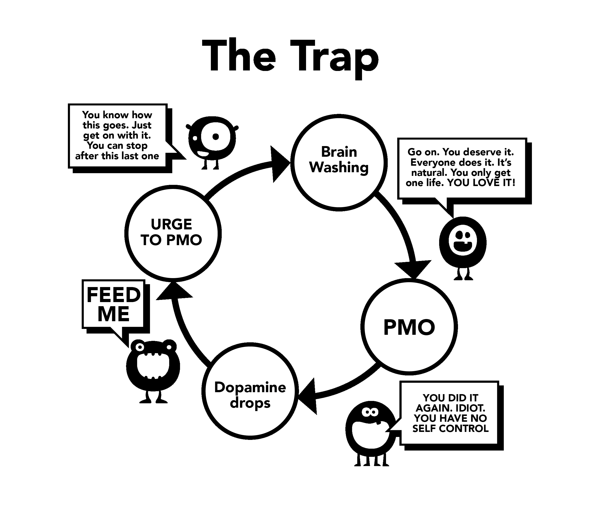

# Brainwashing

ये दूसरी वजह है कि हम porn क्यों start करते हैं। इस brainwashing को समझने के लिए पहले हमें supernormal stimulus के दिमाग पर effects को समझना पड़ेगा। हमारा brain इस 'online कोठे' के लिए ready ही नहीं था, पंद्रह मिनट में इतनी सारी hot videos के बीच switch कर लेते हैं जितने हमारे दादा-परदादा को पूरी life में नहीं मिलते थे।

Past में बहुत सारी बकवास advice मिलती थी, जैसे कि masturbation से अंधापन आ जाता है। ये सब डराने वाली बातें totally over थीं। अच्छा हुआ science ने इन पुरानी beliefs को clear कर दिया। लेकिन अब तो एकदम opposite scene हो गया है। बचपन से ही हमारे subconscious mind में sexual content और images की बमबारी होती रहती है। Magazines और ads में तो double meaning का खेल चलता रहता है। कुछ music videos तो एकदम next level की होती हैं। पर tension मत लो, इसे एक game की तरह लो। देखो कौन से components use कर रहे हैं - shock value है? नया-पन? colours? size? taboo? nostalgia? वगैरा। ये game तो छोटे बच्चों को भी समझा सकते हैं, एक तरह की awareness के लिए।

Core message क्या है? कि "इस दुनिया में सबसे important चीज, मेरी last सोच और action, orgasm होगा।" लगता है exaggerate कर रहा हूं? कोई भी TV show या film देख लो - sex के natural feelings (touch, smell, voice) को orgasm के साथ mix करके दिखाते हैं। हमें conscious तौर पर पता नहीं चलता, पर दिमाग के अंदर ये सब slowly-slowly settle होता जाता है।

## Science क्या कहती है

दूसरी side की बात भी चलती है: कि performance down हो जाएगी, motivation खत्म हो जाएगा, असली relationships से ज्यादा virtual porn अच्छी लगने लगेगी। YourBrainOnPorn.com जैसी sites और internet के groups ये सब बताते हैं, पर ये सब लोगों को porn use करने से रोक नहीं पाता। Logic के हिसाब से तो रोकना चाहिए, पर fact ये है कि कोई नहीं रुकता। भले ही YourBrainOnPorn.com पर कितने ही health risks बताए हों, young age में कोई इन warnings को seriously नहीं लेता।

मजे की बात है, इस confusion में सबसे बड़ी problem user खुद होता है। ये सोच गलत है कि जो porn देखते हैं वो इरादे से या physically कमज़ोर होते हैं। जब पता चल जाए कि addiction है, तो उससे deal करने के लिए mentally strong होना पड़ता है। sad बात ये है कि लोग खुद को loser और anti-social समझने लगते हैं।  हो सकता है कि तुम्हारा दोस्त real life में बहुत मजेदार इंसान हो, अगर उसने self-pleasure की वजह से खुद को judge न किया होता।

## Willpower से छोड़ने के problems

जो लोग willpower से quit करने की try करते हैं, वो सोचते हैं कि उनमें willpower की कमी है और अपनी mental peace की band बजा लेते हैं। Self-control में fail होना और self-hate में पड़ जाना, दो अलग-अलग चीजें हैं। और वैसे भी, कौन सा rule है कि sex से पहले हर बार properly turned on होना चाहिए या partner को fully satisfy करना चाहिए? याद रखो, ये कोई habit नहीं है, ये एक addiction है। Cricket खेलने जैसी habit छोड़ने के लिए तो कोई खुद से बहस नहीं करता, पर porn addiction में ये normal है - ऐसा क्यों?

Supernormal stimulus से brain की wiring change हो जाती है, इसलिए इस brainwashing से बचना बहुत important है। एकदम वैसे ही जैसे used car बेचने वाले से डील करते हो - हां में हां मिलाते जाओ पर दिमाग में एक बात भी मत लो। तो ये मत सोचो कि हर time sex चाहिए, वो भी perfect होना चाहिए, और जब real sex न मिले तो porn use करो।

'Safe porn' के चक्कर में भी मत पडो; ये तो तुम्हारे दिमाग में बैठे छोटे-शैतान ने तुम्हें फंसाने के लिए create किया है। क्या कोई amateur porn को certify करता है? Porn sites users की history देखती हैं और वही content बनाती हैं जो बिकता है। किसी category में views बढ़े नहीं कि तुरंत वैसा content upload कर देती हैं। और ये मत सोचो कि educational है या ladies के लिए 'safe' content है। अपने आप से सीधा पूछो: "मैं ये क्यों देख रहा हूं? सच में जरूरी है?"

**नहीं, बिल्कुल जरूरी नहीं है!**

ज्यादातर लोग झूठी शेखी बघारते हैं कि हम तो बस soft porn देखते हैं तो कोई tension नहीं है। पर असल में वो हर time willpower से temptation को control करने में लगे रहते हैं। ये रोज का drama जब चलता है, तो धीरे-धीरे willpower खत्म हो जाती है। फिर life की दूसरी important चीज़ों में लोग पिछड़ने लगते हैं - जैसे gym जाना, diet follow करना। इन सब में fail होने से बंदा खुद को loser समझने लगता है और फिर से porn की तरफ भाग जाता है। और अगर porn नहीं देखी तो सारी frustration और depression family और friends पर निकालता है।

एक बार internet porn की addiction लग जाए, तो brainwashing और बढ़ जाती है। तुम्हारा subconscious mind जानता है कि दिमाग के छोटे-शैतान को खाना चाहिए, और बाकी सब block हो जाता है। लोग quit करने से डरते हैं, उस empty feeling से डरते हैं जो dopamine की flooding रोकने पर आती है। बस इसलिए कि तुम्हें ये feeling realize नहीं होती, ये मतलब नहीं कि वो exist नहीं करती। बिल्कुल वैसे ही जैसे गर्मी में लोग AC के नीचे क्यों बैठते हैं ये समझने की जरूरत नहीं है - बस पता है कि वहां ठंड मिलेगी।

## Passivity

The passivity of our minds and dependence on authority leading to brainwashing is the primary difficulty of giving up porn. Our upbringing in society, reinforced by the brainwashing of our own addiction and combined with the most powerful - our friends, relatives and colleagues. The phrase ‘giving up’ is a classic example of the brainwashing, implying genuine sacrifice. The beautiful truth is there's nothing to give up; on the contrary, you’ll be freeing yourself from a terrible disease and achieving marvellous positive gains. We’ll begin removing this brainwashing now, starting with no longer referring to ‘giving up’ but to stopping, quitting or perhaps the true position, **escaping!**

The only thing that persuades us to use initially is other people doing it and feeling that we’re missing out. We work hard to become hooked, yet we never find what they've been missing. Every time we see another clip it reassures us there must be something in it, otherwise people wouldn't be doing it and the business wouldn't be so big. Even when they kick the habit, the ex-user feels they’re being deprived when a discussion on a sexy entertainer, singer or even a porn star comes up during parties or social functions. *“They must be good if all my friends talk about them, right? Do they have free pictures online?”* They feel safe, they’ll just have one peek tonight and before they know it, they’re hooked again.

The brainwashing is extremely powerful and you need to be aware of its effects. Technology continues to grow and the future will bring exponentially faster sites and access methods. The porn industry is investing millions in virtual reality so that it will become the next best thing. We don't know where we’re going, unequipped to deal with present technology or what is to come.

We’re about to remove this brainwashing. It isn't the non-user who's being deprived, but the user who is forfeiting a lifetime of:

-   Health

-   Energy

-   Wealth

-   Peace of mind

-   Confidence

-   Courage

-   Self-respect

-   Happiness

-   Freedom

What do they gain from these considerable sacrifices? **ABSOLUTELY NOTHING**, apart from the illusion of trying to get back to the state of peace, tranquillity and confidence that the non-user always enjoys.

## Withdrawal Pangs

As explained earlier, users believe they use porn for enjoyment, relaxation or some sort of education. The actual reason is relief of withdrawal pangs. Our subconscious mind begins to learn that internet porn and masturbation at certain times tends to be pleasurable. As we become increasingly hooked on the drug, the greater the need to relieve the withdrawal pangs becomes and the further the subtle trap drags you down. This process happens so slowly that you aren't even aware of it, most young users don't realise they’re addicted until attempting to stop and even then, many won't admit it.

Take this conversation a therapist had with hundreds of teenagers:

>**Therapist:** “*You realise that internet porn is a drug and the only reason why you’re using is that you cannot stop.*”
>
>**Patient:** “*Nonsense! I enjoy it, if I didn’t, I would stop.*”
>
>**Therapist:** “*Just stop for a week to prove to me you can if you want to.*”
>
>**Patient:** “*No need, I enjoy it. If I wanted to stop, I would.*” 
>
>**Therapist:** “*Just stop for a week to prove to yourself you aren't hooked.*”
>
>**Patient:** “*What’s the point? I enjoy it.”*

As already stated, users tend to relieve their withdrawal pangs at times of stress, boredom, concentration or combinations of these. In the following chapters, we’ll target these aspects of the brainwashing.
