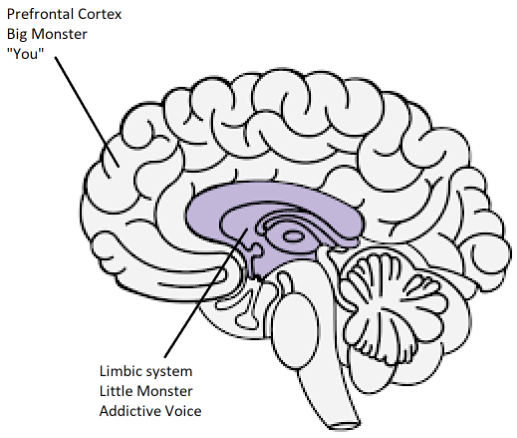

# Resources {-}

[एक porn addict का चिंतन](resources/meditations.pdf) - Guillaco

[EasyPeasy Statements Checklist](https://old.reddit.com/r/pmohackbook/comments/id6nie/easypeasy_statements_checklist/) - SWATxKATS

[9 मिनट का Meditation](https://www.youtube.com/watch?v=tw7XBKhZJh4) - Sam Harris

[Waking Up Meditation Course](https://wakingup.com) - Sam Harris

[Modernity से बाहर निकलना](https://jdemeta.net/2019/09/15/exiting-modernity/) - Meta Nomad // ([pdf](https://jdemeta.net/wp-content/uploads/2019/09/Exiting-Modernity.pdf))

[Schools को भेजा गया मेरा letter](resources/principal.pdf)

[Freedom Forever (PMO Hacknotes)](https://sites.google.com/view/freeforever/home)

[तुम relapsing क्यों कर रहे हो - u/Different_Guide_5205](https://old.reddit.com/r/pmohackbook/comments/mynwjl/why_youre_relapsing/)

[डर से छुटकारा - u/Different_Guide_5205](https://old.reddit.com/r/pmohackbook/comments/n5027n/countering_fear/)

## REBT Coping Statements {-}

- *“भले ही 'मुश्किल' लग रहा हो, मैं PMO छोड़ सकता हूं यार। इतना tough भी नहीं है, और कितनी भी मेहनत लगे, it’s worth it!”*

- *“बस इन urges को भाव नहीं देना है। जितना ignore करूंगा, उतना ही आसान होता जाएगा इनसे बचना।”*

- *“मैं जैसा भी हूं, अपने आप को accept कर सकता हूं - हां boss, सारी कमियों और failures के साथ।”*

- *“ऐसा लगता है PMO problems को फटाफट solve कर देगा, पर सच्चाई है कि ये और बड़ी बला बन जाती है।”*

- *“कभी-कभी मन करता है सारी tensions भुलाकर PMO में डुब जाउं, पर ये कोई reason थोड़ेही है।”*

- *“हां, जब मन की चीज नहीं मिलती तो बुरा लगता है। पर इतना बुरा भी नहीं है जितना मैं सोच रहा हूं। मैं इसे positive तरीके से भी तो देख सकता हूं।"”*

- *“गलत बर्ताव अच्छा तो कभी नहीं लगेगा, पर मैं इसे झेल सकता हूं और शायद इसे रोकने का कोई plan भी बना सकता हूं।”*

- *“चाहे मैं कितनी बार fail हो जाऊं, इससे मैं कोई निकम्मा नहीं बन जाता। बस इतना है कि उस time मैंने कुछ गलत किया, बस।”*

- *“जो चाहिए वो जरूरी नहीं कि मिले ही। फिर भी ठीक-ठाक खुश रह सकता हूं, भले उतना नहीं जितना मिलने पर होता।”*

- *“कौन नहीं चाहता कि उसका काम धांसू हो? पर ये कोई जरूरी नहीं है। नहीं हुआ तो दुनिया खत्म नहीं हो जाएगी, मैं कोई कम नहीं हो जाऊंगा। कोशिश जारी रख सकता हूं, बिना perfect होना कि tension लिए”*

- *“जिंदगी में दुख-निराशा तो आएगी ही। पर जब मैं जिद पकड़ लेता हूं कि 'ये नहीं होना चाहिए, वो नहीं होना चाहिए', तब खुद ही अपनी वाट लगा लेता हूं - Panic, Depression, गुस्सा, सब एक साथ।”*

- *“हां, बहुत बार अपना वादा तोड़ा है मैंने, पर इसका ये मतलब थोड़ी है कि इस बार भी नहीं कर पाऊंगा। नई शुरुआत कर सकता हूं ना।”*

- *“Tension और Depression से तो मझे भी डर लगता है, पर इसका मतलब ये नहीं कि फटाफट PMO कर लूं। हां, दो मिनट के लिए राहत मिलेगी, पर problem solve थोड़ी होगी। उल्टा long-term में problem और बड़ी हो जाएगी।”*

- *“लोग बुरा बर्ताव करते हैं तो मैं अपने आप को क्यों जला रहा हूं? मैं खुद अपनी पैर पर कुल्हाड़ी मार रहा हूं - 'उनको ऐसा होना चाहिए, वैसा होना चाहिए' की रट लगाकर। उनकी हरकतों से नहीं, मेरी अपनी जिद मुझे जला रही है”*

## EasyPeasy को Jack Trimpey की Addictive Voice Recognition Technique (AVRT) के साथ कैसे use करैं {-}

*Credit: Discord पर az#8773*

ये उन लोगों के लिए है जो brainwashing हटने के बावजूद Allen Carr के Easyway method से addiction छोड़ने में struggle कर रहे हैं। मैं मान रहा हूं कि जो भी ये पढ़ रहा है, उसने Allen Carr की कोई किताब पढ़ी है और उनका Easyway (यानी EasyPeasy) method समझा है। अगर नहीं पढ़ी है तो मेरी सलाह है पहले पढ़ लो। Jack Trimpey की 'Rational Recovery' पढ़ना भी help करेगा। अगर नहीं पढ़ी तो tension मत लो, मैं यहां basics conver कर दूंगा, पर फिर भी पढ़ लेना बेहतर रहेगा क्योंकि उसमें और detail में जाएंगे। ये किसी एक addiction के लिए नहीं है, हर तरह की addiction पर लागू होता है। यहां मैं Easyway को एक और successful method 'Addictive आवाज़ Recognition Technique' (AVRT) से compare करूंगा और दोनों को mix करूंगा। मेरा मानना है कि Easyway बाकी सब addiction recovery methods से बेहतर है, पर AVRT को समझना भी जरूरी है। ये उन लोगों के लिए missing like हो सकता है जो बड़े शैतान को मारने के बाद भी Easyway से fail हो जाते हैं।

Addiction से निकलने के बहुत सारे तरीके हैं, सबकी अपनी success rate है। मैं दूसरे तरीकों की बात नहीं करूंगा क्योंकि ज्यादातर time waste हैं और मैं ये short में समझाना चाहता हूं। मैं सिर्फ दो तरीकों के बारे में बताऊंगा - Allen Carr का Easyway और Jack Trimpey (Rational Recovery के faunder) का AVRT। दोनों की success ratea बहुत अच्छी है, पर दोनों अलग-अलग चीजों पर foucs करते हैं। Easyway और AVRT में एक समानता है। Easyway addiction को 'छोटा शैतान' और 'बड़ा शैतान' में बांटता है, और AVRT दिमाग को 'addictive आवाज़' (यानी जानवर) और 'तुम' में। Addictive आवाज़ और छोटा शैतान एक ही चीज है, और बड़ा शैतान (यानी brainwashing) वो सोच है जो तुम्हें लगवाता है कि addiction से कोई फायदा या सहारा मिलता है। Easyway बड़े शैतान को खत्म करने पर focus करता है और छोटे शैतान को ज्यादा नहीं देखता। AVRT उल्टा करता है - छोटे शैतान पर focus करता है, बड़े को नजरअंदाज करता है। Easyway मनोवैज्ञानिक addiction को खत्म करता है, AVRT तुम्हें सिखाता है कि कैसे physical addiction को पहचानो जो तुम्हारी जगह लेने की कोशिश कर रहा है, और खुद को उससे अलग करो। मजेदार बात है कि दोनों तरीके अलग-अलग चीजों पर focus करते हैं फिर भी दोनों की success rate बहुत अच्छे है।

मैं मानता हूं कि Easyway बाकी सब addiction recovery के तरीकों से बेहतर है, और मैं इसे सबसे ऊपर रखता हूं। फिर भी इसमें दो छोटी कमियां हैं। पहली कमी ये है कि ये छोटे शैतान को हल्के में लेता है। मैं personal कहानियां नहीं डालना चाहता, पर मेरे और दूसरों के experience से लगता है कि कुछ लोग Easyway में इसलिए fail नहीं होते कि उन्होंने बड़े शैतान को पूरी तरह नहीं मारा (हालांकि ये भी होता है)। वे इसलिए fail होते हैं क्योंकि उन्होंने छोटे शैतान को हल्के में ले लिया। ज्यादातर लोगों के लिए छोटा शैतान कोई बड़ी problem नहीं है, इसीलिए Easyway की success rate अच्छी है। लेकिन कुछ लोगों के लिए, जिनमें मैं भी शामिल हूं, ये problem बन जाता है। दूसरी कमी है कि Easyway कहता है कि हर failure या तो instruction न follow करने की वजह से होती है, या फिर बड़े शैतान को पूरी तरह न मारने की वजह से।

Easyway का basic idea ये है। Addiction के दो part होते हैं - एक dopamine की physical लत, और दूसरा psychological लत जो सोच (brainwashing) से बनती है कि addiction से कोई मजा़ या सहारा मिलता है। इन्हें छोटा और बड़ा शैतान कहते हैं। Easyway के मुताबिक, छोटा शैतान बस एक खालीपन है, थोड़ी सी असुरक्षा की feeling, जो मुश्किल से notice होती है। जब तुम बड़े शैतान को मार देते हो - यानी brainwashing खत्म कर देते हो ये समझकर कि तुम्हारी addiction से कोई फायदा नहीं है, जो मजा़ या सहारा लगता है वो सिर्फ भ्रम है, और सबसे जरूरी, addiction के बिना की ज़िंदगी से डरने की कोई बात नहीं है - तब craving गायब हो जाती हैं। ये craving इस डर से पैदा होती हैं कि अपने छोटे सहारे के बिना ज़िंदगी बेकार हो जाएगी, और इस डर की वजह से तुम छोड़ने पर doubt करते हो, और यही craving बन जाती है। तुम इस डर को तब हरा सकते हो जब समझ जाओ कि addiction के बिना ज़िंदगी कितनी बेहतर होगी, और इस खुशी की feeling को बनाए रखो।

मैं मानता हूं कि ये addiction से निकलने का best तरीका है, पर ये छोटे शैतान पर ज्यादा ध्यान नहीं देता। Theory के हिसाब से जब बड़ा शैतान खत्म हो जाएगा, तो बेचारा कमजोर छोटा शैतान अपने आप सूख कर मर जाएगा। और वैसे भी वो इतना छोटा है कि दिखता ही नहीं, तो कौन चिंता करे। बहुत लोगों के लिए छोटा शैतान मायने नहीं रखता, पर मेरे और दूसरों के experience से लगता है कि ये हमेशा सच नहीं है। जब लोग Easyway में fail होते हैं, तो Easyway के मुताबिक सिर्फ दो वजहें हो सकती हैं - या तो तुमने instruction सही से follow नहीं किए, या फिर बड़े शैतान को पूरी तरह नहीं मारा। मैं मानता हूं कि ये सोच नुकसानदेह है, और बाद में बताऊंगा क्यों।

Addictive आवाज़ Recognition Technique (AVRT) दिमाग को दो हिस्सों में बांटता है - lower दिमाग (limbic system) जहां addiction रहती है, और higher दिमाग (prefrontal cortex) जहां तुम रहते हो (या कम से कम तुम्हारे विचार और ego)। Jack Trimpey addictive आवाज़ को जानवर कहता है क्योंकि ये हमारे दिमाग के animal part में रहता है और इसे बस एक ही चीज पता है, "मुझे चाहिए और अभी चाहिए"। मुझे इसे जानवर की तरह देखना उपयोगी नहीं लगता, पर शायद ये इससे बेहतर है कि तुम इसे अपना हिस्सा मानो। Addictive आवाज़ (AV, छोटा शैतान) तुम्हारी दिमागी-आवाज़ को control कर लेता है और इसका इस्तेमाल तुम्हारे खिलाफ करता है ताकि तुम addiction में पड़ो। उसे ऐसा करना पड़ता है क्योंकि वो तुम्हारी body movements को control नहीं कर सकता। अभी कोशिश करो - अपना हाथ चेहरे के सामने उठाओ और उंगलियां हिलाओ। अब अपनी addiction से यही करने को कहो। वो नहीं कर सकती। इसका मतलब है कि आखिरी control तुम्हारे हाथ में है।

Addictive आवाज़ सिर्फ तुम्हारी दिमागी-आवाज़ को ही control नहीं करता, ये चालाकी से "मैं" के पीछे छिप जाता है। ये कहता है "मुझे अभी X की जरूरत है", "मुझे X करने की कितनी याद आ रही है", "अभी X करूं तो कितना मज़ा आएगा, आज के बाद तो मैं deserve करता हूं।" AVRT इस बात पर जोर देता है कि तुम अपनी addictive आवाज़ नहीं हो, तुम्हें बस ऐसा लगता है। जब तुम addictive आवाज़ को 'अपना नहीं' पहचान लेते हो और ना कह देते हो, तो ये "मैं" छोड़कर "तुम", "हम" या "हमें" इस्तेमाल करने लगता है। यही proof है कि ये तुम नहीं हो।

जब तुम अपने AV को "नहीं" बोलते हो, तो ये होता है:
"मुझे अभी X की जरूरत है" बदल जाता है "अरे यार, तुम्हें X की जरूरत है और तुम जानते हो।" "मुझे X करने की कितनी याद आ रही है" बन जाता है "अरे यार, तुम्हें भी X की याद आ रही है, feel नहीं हो रहा?" "अभी X करूं तो कितना मज़ा आएगा, आज के बाद तो मैं deserve करता हूं" बदल जाता है "इतना सब झेलने के बाद हम X deserve करते हैं, तुम हमें कैसे मना कर सकते हो?"

यहां एक बात clear करनी जरूरी है। ये वो 'रस्साकशी' नहीं है जिसके बारे में Allen Carr बात करता है। वो 'रस्साकशी' cognitive dissonance है - जब तुम्हारे अंदर दो या ज्यादा विरोधी belief systems हों, जो बड़े शैतान को न मारने का नतीजा है। "मैं X नहीं करना चाहता क्योंकि इसके नुकसान हैं, पर ये मुझे Y feel करवाता है इसलिए करना चाहता हूं।" यही रस्साकशी है और ये बड़े शैतान की करामात है। जब brainwashing हटाकर बड़ा शैतान मर जाता है, तो addiction के लिए उकसाने वाली आवाज सिर्फ छोटे शैतान (AV) से आएगी। चूंकि AV "मैं" का इस्तेमाल करता है, इसलिए इसे बड़े monster से confuse कर सकते हो।

एक और जरूरी बात - AV एक बड़ा झूठा है। इसे बस dopamine चाहिए, चाहे कीमत कुछ भी हो। तुम्हारा AV तुम्हें जानलेवा situation में भी डालने की कोशिश करेगा अगर उसे लगता है कि इससे उसे नशा मिलेगा।

पहले मैंने कहा था कि "Easyway के मुताबिक, fail होने के सिर्फ दो कारण हो सकते हैं - या तो तुमने instruction सही से follow नहीं किए, या फिर बड़े शैतान को पूरी तरह नहीं मारा। मैं मानता हूं कि ये नुकसानदेह है और बताऊंगा क्यों।" ये नुकसानदेह इसलिए है क्योंकि AV को न पहचान पाने की वजह से मैं और दूसरे Easyway users गलती से सोचने लगे कि हमने बड़े शैतान को पूरी तरह नहीं मारा। इसलिए हम किताब फिर से पढ़ते हैं ताकि brainwashing को दोबारा मार सकें, हालांकि हम उसे पहले ही मार चुके हैं। AV को न पहचानना और ये मानना कि 'Easyway में fail होने का मतलब है कि तुम बड़े शैतान को नहीं मार पाए' - इससे तुम फिर से बड़े शैतान पर focus करने लगोगे, जबकि वो पहले ही मर चुका है। तुम Allen Carr की किताबें बार-बार पढ़ने के चक्कर में पड़ सकते हो, कुछ समय ठीक रहोगे और फिर relapse कर जाओगे।

जब AV कहता है "मैं अभी X करना चाहता हूं क्योंकि इससे मुझे Y feel होता है", और अगर तुमने brainwashing हटा दी है और बड़े शैतान को मार दिया है, तो तुम सोच सकते हो "पर मैं जानता हूं कि ये सच नहीं है, तो फिर मैं अभी भी क्यों मानता हूं? क्या मैं brainwashing को पूरी तरह नहीं हटा पाया?" सच्चाई ये है कि तुमने brainwashing हटा दी है, इसका सबूत है कि तुम जानते हो कि AV जो कह रहा है वो गलत है। बस तुम्हें लगता है कि AV तुम हो क्योंकि वो "मैं" का इस्तेमाल करता है। जब तुम AV को पहचानोगे और उसे मजबूर करोगे कि वो "मैं" की जगह "तुम", "हम" या "हमें" का इस्तेमाल करे, तब तुम्हें पता चलेगा कि ये बड़ा शैतान नहीं, छोटा शैतान है। अगर ये वाकई बड़ा शैतान होता तो "मैं" को "तुम", "हम" या "हमें" में नहीं बदलता।

जब AV कहता है "please, बस एक आखिरी बार X कर लें, पुरानी यादों के लिए, बस एक बार?" और तुम "नहीं" बोलते हो, तो एक emotional reaction आ सकता है। डर लग सकता है या दुख हो सकता है। ये समझना बेहद जरूरी है कि ये feeling तुमसे नहीं आ रही, ये उससे आ रही है। अगर तुम AV को पहचान नहीं पाते, तो तुम्हें लगेगा कि ये emotion तुम्हारा है और तुम हार मान लोगे। AV को पहचानो और जान लो कि ये emotions तुम्हारे नहीं हैं, उसके हैं, और फिर इस बात की खुशी मनाओ।

जब तुम दोनों methods को मिला लेते हो (अगर जरूरत हो, हर किसी को छोटे शैतान से problem नहीं होती) और हर बार AV को पहचानने पर खुशी और जोश महसूस करते हो, तो जीत तुम्हारी है।
