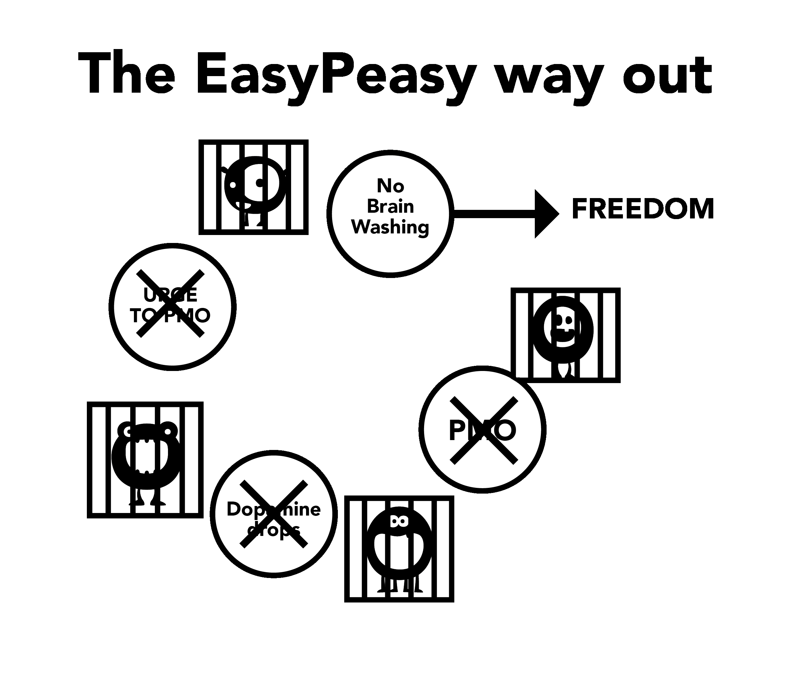

# Aspecten van hersenspoeling

Het grote monster van de pornoval is ontstaan door de samenkomst van vele aspecten, waaronder maatschappelijke invloed, mediavoorstellingen, leeftijdsgenoten en het eigen persoonlijke verhaal van de gebruiker. Het niet ontmantelen van deze misvattingen tijdens het gebruik van de wilskrachtmethode leidt uiteindelijk tot gevoelens van gemis, waardoor de gebruiker terugvalt in de valkuil. Het ontmantelen van de ingebeelde waarde van porno is cruciaal voor succes en stelt je in staat te zien waar je bestolen wordt!

Belangrijk om op te merken is de link tussen hersenspoeling en angst. Het is de angst voor het voelen van ***toekomstige afkickverschijnselen*** die de pijnen creëert. Angst is zelf de pijn. Denk na over wanneer je afkickverschijnselen hebt gehad, zoals zweterige handpalmen, kortademigheid, slaapproblemen en een onvermogen om helder te denken. Denk nu aan vergelijkbare situaties waarin je die gevoelens hebt gehad: sollicitatiegesprekken, zenuwen rond een aantrekkelijk persoon, spreken in het openbaar, enzovoort. Dit zijn dezelfde angstige gevoelens die de angst veroorzaakt. Simpel gezegd, hoe kan een fysieke drug mensen nog steeds maanden na het stoppen blijven haken? Het moet mentaal zijn, toch?

## Stress

Niet alleen grote tragedies in het leven, maar ook kleine stressfactoren drijven gebruikers naar het verboden 'onveilige' gebied dat eerder was uitgesloten. Stressfactoren zijn onder meer sociaal contact, telefoongesprekken, angsten van huisvrouwen met jonge kinderen, en vele andere. Laten we telefoongesprekken als voorbeeld nemen, met name voor een zakenpersoon. De meeste gesprekken zijn niet van tevreden klanten of je baas die je feliciteert, er is altijd wel enige vorm van irritatie. Thuiskomen bij het alledaagse gezinsleven van gillende kinderen en de emotionele eisen van hun partner veroorzaakt bij de gebruiker - als ze dat al niet doen - het verlangen naar de beloofde verlichting van porno die avond. Ze lijden onbewust aan afkickverschijnselen, ontspanningsmechanismen zijn verzwakt en onvoorbereid op extra irritatie. Door de pijnen gedeeltelijk te verlichten tegelijk met normale stress, wordt het totaal verminderd en krijgt de gebruiker een tijdelijke oppepper. De oppepper is geen illusie, de gebruiker voelt zich daadwerkelijk beter dan daarvoor, maar ze zijn gespannener dan ze zouden zijn als niet-gebruiker.

Het volgende voorbeeld is niet bedoeld om je te schokken - EasyPeasy belooft geen dergelijke behandeling - maar is bedoeld om te benadrukken dat porno je zenuwen vernietigt in plaats van ze te ontspannen.

Probeer je eens voor te stellen dat je het punt bereikt waarop je niet meer opgewonden kunt raken, zelfs niet met een zeer sexy en aantrekkelijke partner. Neem heel even de tijd en probeer je voor te stellen hoe het zou zijn als een heel lieve en charmante persoon moet concurreren en faalt met de virtuele pornosterren die je 'harem' bezetten om je aandacht te krijgen. Stel je het gevoel voor van iemand die, ondanks die waarschuwing, doorgaat met gebruiken en sterft zonder ooit echte seks te hebben gehad met deze charmante en bereidwillige partner.. 

Het is gemakkelijk om deze mensen af te doen als vreemde figuren, maar verhalen zoals deze zijn niet verzonnen - dit is wat de vreselijke nieuwigheid van de pornodrug met je brein doet. Hoe meer je door het leven gaat, hoe meer moed wordt weggenomen en hoe meer je wordt misleid om te geloven dat porno het tegenovergestelde doet.

Bent u ooit overvallen door paniek wanneer de WiFi plotseling stopt met werken of te traag is? Niet-gebruikers lijden er niet onder, omdat internetporno dat gevoel veroorzaakt. Naarmate je door het leven gaat, vernietigt het systematisch je zenuwen en moed, waardoor DeltaFosB krachtige neurale glijbanen vormt in zijn nasleep, geleidelijk je vermogen om nee te zeggen vernietigend. Tegen de tijd dat de viriliteit is gedood, gelooft de gebruiker dat porno hun nieuwe partner is en is niet in staat het leven zonder te confronteren.

*Internetporno verlicht je zenuwen niet, het vernietigt ze langzaam.* Een van de grote voordelen van het doorbreken van de verslaving is de terugkeer van je natuurlijke zelfvertrouwen en zelfverzekerdheid.

Er is geen noodzaak om jezelf te beoordelen op je vermogen om een partner tevreden te stellen - dit is geen vrijheid. Maar deze vrijheid kan niet worden verkregen door door te gaan met het insmeren van de dopamineglijbaan op manieren die je geluk en libido ondermijnen door het herhalen van hetzelfde destructieve gedrag.

## Verveling

Als je net als veel mensen bent, zodra je in bed stapt, ben je al op je favoriete pornowebsite, waarschijnlijk al vergeten totdat je eraan herinnerd wordt. Het is tweede natuur geworden. Op dezelfde manier is het een misvatting dat porno verveling verlicht, omdat verveling een stemming is, die optreedt wanneer je lange tijd bent onthouden of probeert te minderen.

De werkelijke situatie is als volgt: wanneer je verslaafd bent aan de bovennormale aantrekkingskracht van internetporno en vervolgens probeert te onthouden, voelt het alsof er iets ontbreekt. Als je iets hebt om je gedachten bezig te houden dat niet stressvol is, kun je lange tijd zonder problemen doorbrengen zonder de afwezigheid van de drug te voelen. Echter, wanneer je je verveelt, is er niets om je gedachten af te leiden, dus voed je het monster. Als je jezelf verwent en niet probeert te stoppen of te minderen, wordt zelfs het starten van een privé browservenster een automatisme. Dit ritueel verloopt automatisch; als de gebruiker probeert zich sessies van de afgelopen week te herinneren, kunnen ze zich slechts een klein deel ervan herinneren, zoals de allerlaatste sessie of de sessie na een lange onthouding.

De waarheid is dat porno verveling indirect verhoogt omdat orgasmes je onergieloos maken en in plaats van een energieke activiteit te ondernemen, gebruikers de neiging hebben om rond te hangen, verveeld en hun afkickverschijnselen te verlichten. Het tegengaan van de hersenspoeling is belangrijk omdat gebruikers porno vaak bekijken als ze zich vervelen; onze hersenen zijn bedraad om porno als interessant te begrijpen. Op dezelfde manier zijn we er ook van overtuigd dat seks - zelfs slechte seks - ontspanning bevordert. Het is een feit dat koppels, wanneer ze verdrietig zijn of onder stress staan, seks willen hebben. In afwezigheid van onderscheid tussen erotische en voortplantende seks, zie hoe snel je van elkaar weg wilt na het verplichte orgasme. Als het stel gewoon had besloten om te knuffelen, te praten of te knuffelen en te gaan slapen, hadden ze zich opgelucht gevoeld.

## Concentratie

Masturbatie en seks helpen niet bij concentratie - wanneer je probeert te concentreren, vermijd je automatisch afleidingen. Daarom, wanneer een gebruiker zich wil concentreren, denken ze niet eens na - ze openen automatisch de browser, voeden het kleine monster en verminderen gedeeltelijk de drang. Ze gaan verder met de zaak waar ze mee bezig zijn en vergeten al snel dat ze porno hebben bekeken. Na jaren van dopamine-overstroming beïnvloeden de neurologische veranderingen vaardigheden zoals het verkrijgen van informatie, planning en impulsbeheersing.

Je wordt ook gedreven om nieuwigheid te bieden voor de volgende sessie, omdat dezelfde inhoud niet langer voldoende dopamine en opioïden genereert. Dus je zult moeten ronddwalen op het internet op zoek naar nieuwigheid, vechtend tegen de drang om de grens naar schokkend materiaal over te steken, wat op zijn beurt meer stress veroorzaakt en je onvervuld achterlaat na het voltooien.

Concentratie wordt ook nadelig beïnvloed doordat de dopamine-receptoren worden verminderd als gevolg van natuurlijke tolerantie voor de grote pieken, waardoor het voordeel van kleinere dopamineboosts van natuurlijke ontspanningsmiddelen wordt verminderd. Je concentratie en inspiratie zullen aanzienlijk worden verhoogd naarmate dit proces wordt verminderd. Voor velen is het juist het aspect van concentratie dat hen ervan weerhoudt om succesvol te zijn met de wilskrachtmethode: ze kunnen omgaan met prikkelbaarheid en slecht humeur, maar het falen om zich te concentreren op iets moeilijks nadat hun steunpilaar is verwijderd, maakt het voor velen onmogelijk.

Het verlies van concentratie dat gebruikers ervaren bij het proberen te ontsnappen, is niet te wijten aan het ontbreken van seks, laat staan porno. Je hebt mentale blokkades wanneer je verslaafd bent aan iets en als je een mentale blokkade hebt, wat doe je dan? Je start de browser - wat de blokkade niet geneest - dus wat doe je dan? Je doet wat je moet doen, je gaat gewoon verder zoals niet-gebruikers doen.

Wanneer je een gebruiker bent, wordt niets toegeschreven aan de oorzaak: gebruikers hebben nooit *seksuele disfunctie*, slechts af en toe wat downtime. Het moment dat je stopt met gebruiken, wordt alles wat misgaat toegeschreven aan de reden waarom je bent gestopt. Nu, wanneer je een mentale blokkade hebt, in plaats van er gewoon mee door te gaan, begin je te zeggen "*Als ik nu maar mijn harem zou kunnen controleren, dan zou dat al mijn problemen oplossen*". Dan begin je te twijfelen aan je beslissing om te stoppen en te ontsnappen aan de slavernij.

Als je gelooft dat porno een echte hulp is bij concentratie, zal je je zorgen maken erover ervoor zorgen dat je niet kunt concentreren. Twijfel, niet de fysieke afkicksverschijnselen, veroorzaakt het probleem. Onthoud altijd, het zijn de gebruikers die lijden onder de pijnen, niet de niet-gebruikers.

## Ontspanning

De meeste gebruikers denken dat porno hen helpt ontspannen. Dat doet het niet. De wanhopige zoektocht om de fix te krijgen in die 'donkere steegjes van het internet' en de persoonlijke strijd om aan de leiband te trekken om de rode lijn over te steken, klinkt zeker niet als een erg ontspannende activiteit.

Naarmate de avond valt na een uitstapje naar een nieuwe plek of een lange dag, gaan we zitten om te ontspannen, ons honger en dorst te stillen en volledig tevreden te zijn. De gebruiker doet dat niet, omdat ze nog een andere honger te bevredigen hebben. Gebruikers denken aan porno als de kers op de taart, maar in werkelijkheid is het de 'kleine monster' dat gevoed moet worden. De waarheid is dat de verslaafde nooit volledig kan ontspannen en naarmate het leven vordert, wordt het exponentieel erger. Laten we eens kijken naar een online opmerking van een ex-gebruiker:

> "*Ik geloofde echt dat ik een kwaadaardige demon in mijn karakter had, nu weet ik dat ik er inderdaad een had, maar het was geen wezenlijke tekortkoming in mijn karakter, maar het kleine internetpornomonster dat het probleem veroorzaakte. Tijdens die momenten dacht ik dat ik alle problemen van de wereld had, maar als ik terugkijk op mijn leven, vraag ik me af waar alle grote stress was. In alles in mijn leven had ik de controle, het enige dat mij controleerde was de pornoslavernij. Het trieste is dat ik zelfs vandaag mijn kinderen niet kan overtuigen dat het de slavernij was die ervoor zorgde dat ik zo prikkelbaar was.*"

Elke keer dat pornoverslaafden hun acties proberen te rechtvaardigen hoor ik dezelfde redenen: “*Oh het helpt mij om te ontspannen.*” Neem online account van een alleenstaande vader als voorbeeld. Zijn zesjarige zoon wilde in zijn bed slapen na het kijken van een enge film, maar zijn vader weigerde dit zodat hij zijn sessie kon hebben en uren kon doorgaan.

Een paar jaar geleden dreigden adoptieautoriteiten om rokers te verbieden kinderen te adopteren. Een man belde woedend op. "*Je hebt het helemaal mis,*" zei hij, "*Ik kan me herinneren dat toen ik een kind was, als ik een omstreden kwestie met mijn moeder wilde bespreken, ik wachtte tot ze een sigaret opstak omdat ze dan meer ontspannen was.*" Waarom kon de man niet met zijn moeder praten als ze geen sigaret rookte?

Waarom zijn sommige gebruikers zo gestrest wanneer ze niet aan hun behoefte kunnen voldoen, zelfs na echte seks? Een verhaal online beschrijft een man die werkzaam is in de reclamesector en altijd vrouwen van hoge kwaliteit beschikbaar heeft om mee uit te gaan, maar hij verloor interesse om ze mee uit eten te nemen omdat internetporno veel makkelijker was, geen restaurantkosten met zich meebracht en geen mogelijkheid tot een 'nee' van zijn date aan het einde van de avond. Waarom zou hij zich druk maken wanneer zijn "kleine monster" hem laat verlangen naar het laag-risico, hoog-opbrengst schema binnen handbereik zodra hij thuis is?

Waarom zijn niet-gebruikers dan volledig ontspannen? Waarom kunnen gebruikers niet ontspannen zonder een oplossing voor een dag of twee? Lees over de ervaring van een gebruiker die de nuchterheid-eed aflegt en stopt, en je zult merken dat de strijd met verleidingen: duidelijk niet ontspannen als ze niet langer toegestaan zijn om het 'enige genot' te hebben waarvan ze 'recht hebben om van te genieten'. Ze zijn vergeten hoe het is om volledig ontspannen te zijn. Porno kan worden vergeleken met een vlieg die gevangen zit in een bekerplant, in het begin eet de vlieg de nectar maar op een onmerkbaar moment begint de plant de vlieg te eten.

Is het niet tijd dat je uit de plant klimt?

## Energie

De meeste gebruikers zijn zich bewust van de vooruitstrevende effecten die het zoeken naar nieuwigheid en escalatie van porno heeft op hun beloningssysteem en seksuele systemen van de hersenen. Echter, ze zijn zich niet bewust van het effect dat het heeft op hun energieniveau.

Een van de fijne details van de pornoval is dat de effecten ervan op ons, zowel fysiek als mentaal, zo geleidelijk en onmerkbaar optreden dat we ons er niet van bewust zijn en in plaats daarvan afkick als normaal beschouwen. Het effect is vergelijkbaar met dat van slechte eetgewoonten: we kijken naar mensen die zwaarlijvig zijn en vragen ons af hoe ze zichzelf zo hebben kunnen laten worden. Maar stel je voor dat het 's nachts gebeurde - je ging naar bed slank, met spieren en geen grammetje vet op je lichaam - en je werd wakker om jezelf dik, opgeblazen en met een buikje te vinden. In plaats van wakker te worden en je volledig uitgerust en vol energie te voelen, voel je je ellendig, lusteloos en nauwelijks in staat om je ogen open te houden.

Je zou in paniek raken, je afvragen welke vreselijke ziekte je 's nachts had opgelopen, en toch is de ziekte precies dezelfde. Het feit dat het twintig jaar heeft geduurd om daar te komen, is niet van belang. Porno is hetzelfde: als het mogelijk was om je geest en lichaam onmiddellijk over te brengen om je een directe vergelijking te geven van hoe je je zou voelen na slechts drie weken stoppen met porno, dan zou dat alles zijn wat nodig is om je te overtuigen. Je zou je afvragen, zou het echt zo goed voelen, of komt dat neer op "*Was ik echt zo diep gezonken?*" Je zou je niet alleen gezonder voelen, met meer energie, maar ook veel meer zelfvertrouwen hebben en een verbeterd vermogen om je te concentreren.

Gebrek aan energie, vermoeidheid en alles wat daarmee samenhangt, worden handig onder het tapijt geveegd van 'ouder worden'. Vrienden en collega's die ook een zittende levensstijl leiden, dragen verder bij aan de normalisatie van dit gedrag. De overtuiging dat energie het exclusieve voorrecht is van kinderen en tieners, en dat ouderdom al begint in je twintiger jaren, is een ander symptoom van hersenspoeling, net als het niet bewust zijn van eet- en bewegingsgewoonten als gevolg van de samengestelde effecten van dopamine-desensitisatie.

Kort nadat je stopt met porno, zal het wazige en drukkende gevoel je verlaten. Het punt is dat je met porno altijd je energie verbruikt en in dat proces de chemie van je limbisch systeem verstoort. In tegenstelling tot stoppen met roken, waarbij het herstel van je fysieke en mentale gezondheid slechts geleidelijk verloopt, levert stoppen met porno uitstekende resultaten vanaf dag één. Het doden van het 'kleine monster' en het sluiten van de waterglijbanen kost wat tijd, maar het herstellen van je beloningscentrum lijkt in niets op de langzame glijdende weg naar de put. Als je het trauma van de wilskrachtmethode doormaakt, zullen eventuele gezondheids- of energiewinsten worden tenietgedaan door de depressie waar je doorheen gaat. Helaas is het niet mogelijk voor EasyPeasy om je onmiddellijk over te brengen naar je geest over drie weken, maar jij kunt het wel! Je weet instinctief dat wat je wordt verteld juist is, het enige wat je hoeft te doen is **je verbeelding te gebruiken!**

## Sociale Avondsessies

Dit is misinformatie die logisch lijkt, maar dat niet is. Om je eetlust onder controle te houden, ga je thuis eten voordat je naar een restaurant of feestje gaat? Dat is wat je doet met sessies voor sociale avonden, er vermoeid uitzien en niet op je best zijn. De wijdverbreide adoptie van versiertechnieken heeft druk gelegd op presteren, versieren en scoren. Proberen je zenuwen te verdrinken met porno en middelen zal het probleem alleen maar erger maken op de lange termijn. Persoonlijk hou ik wel van een beetje angst om me gefocust en betrokken te houden, en jezelf mentaal en fysiek uitputten met een orgasme zal niet helpen.

Sociaal avondporno wordt veroorzaakt door twee of meer van onze gebruikelijke redenen voor plezier/prop zoeken, sociale functies in hun kern zijn zowel stressvol als ontspannend. Dit lijkt misschien een tegenstrijdigheid, maar elke vorm van socialisatie kan stressvol zijn — zelfs met vrienden — omdat je wilt zijn wie je bent en volledig ontspannen wilt zijn. Er zijn veel gelegenheden waarbij meerdere factoren tegelijk aanwezig zijn, neem bijvoorbeeld autorijden, aangezien tenslotte je leven op het spel staat. Stressvol, met concentratie vereist gedurende langere perioden. Je hoeft je niet bewust te zijn van deze factoren, je onderbewustzijn ontvangt al de boodschap. Op dezelfde manier, wanneer je jezelf in files bevindt of verveeld bent tijdens lange snelwegritten, houdt de belofte van een sessie bij thuiskomst je gedachten bezig.

Een ander goed voorbeeld is een eerste date, waarbij je geest vragen begint te stellen over de persoon die je gaat ontmoeten. Als je enthousiasme begint te verminderen nadat je de persoon in levenden lijve hebt ontmoet, zul je je te ontspannen gaan voelen, en dan schuldig voelen over dit gevoel. De innerlijke strijd is begonnen, "*Ik wil seks of haal me hier zo snel mogelijk weg,*" waardoor je klaar bent voor porno na de date.

Zelfs als de date goed verliep en je uren later bij hen thuis bent, ongeacht hoe het verloopt, zul je niet tevreden zijn als je enige doel is om een orgasme te bereiken. Andere keren rijd je alleen naar huis, je enige gedachte is je online harem in plaats van jezelf te feliciteren met je inspanningen. Je kunt erop rekenen dat iemand in deze positie bij thuiskomst vaak een sessie zal hebben, en het zijn vaak juist nachten als deze — wakker worden met een ongemakkelijk gevoel van leegte — die we het meest zullen missen als we overwegen te stoppen met porno. We denken dat het leven nooit meer zo plezierig zal zijn. In feite is het dezelfde principe dat hier aan het werk is: de sessies bieden eenvoudigweg verlichting van de afkickverschijnselen, waarbij soms grotere behoeften worden ervaren dan op andere momenten, waardoor de waterglijbaan wordt gesmeerd voor de volgende impuls.

Laat dit duidelijk zijn: het zijn niet internetporno en harem bewoners die speciaal zijn, het is de gelegenheid. Zodra de behoefte aan porno wordt weggenomen, zullen dergelijke gelegenheden plezieriger worden en stressvolle situaties minder stressvol.

