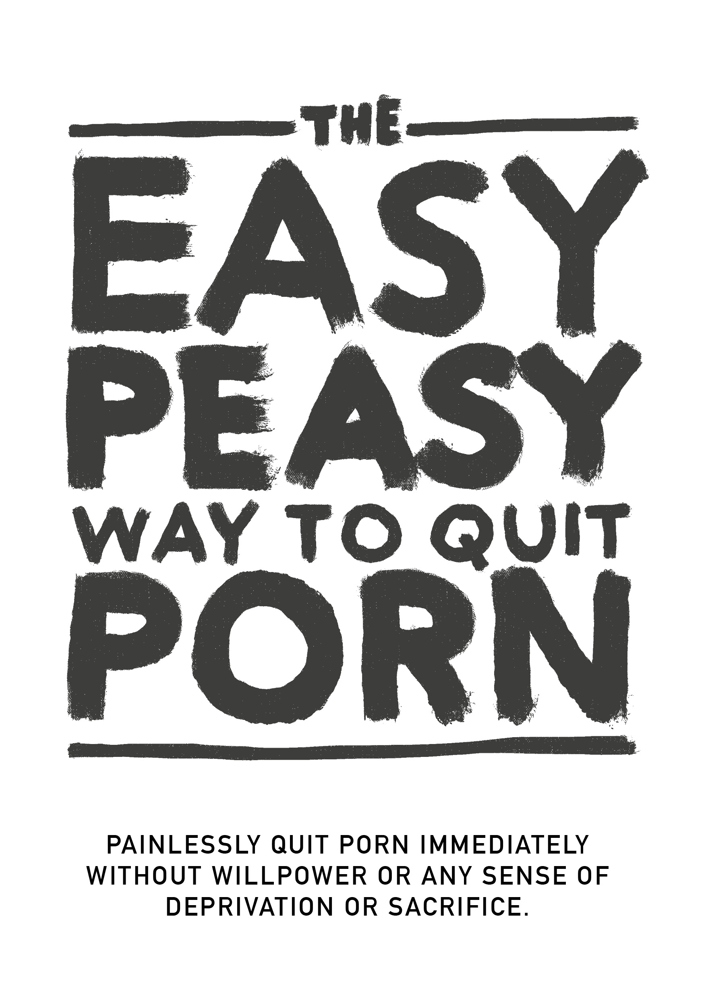

# Introductie

{width=45% height=45%}

[Audiobook](https://www.youtube.com/watch?v=ZktxO6adTnI) ([MP3](https://drive.google.com/file/d/1eU5mB7WXuknAMTgeITsF2MZmAEKG5aFE/view) | [MP3 (uncut)](https://1drv.ms/u/s!AnXDgZXI9WE5j9YGojB-crpKNyGeDw?e=aXyUrd))

SLA GEEN HOOFDSTUKKEN OVER!

Dit open source boek zal je in staat stellen om onmiddellijk, pijnloos en permanent te stoppen met het gebruik van porno, zonder wilskracht of enig gevoel van verlies of opoffering. Het zal geen oordeel, schaamte of druk leggen om pijnlijke maatregelen te ondergaan.

In feite is er absoluut geen noodzaak om je gebruik te verminderen of te beperken terwijl je leest; dit te doen is eigenlijk schadelijk.

Misschien ben je terughoudend bij de gedachte, of een van de miljoenen die actief proberen te stoppen. Als dat zo is, gaat wat je al hebt gelezen misschien tegen alles in wat je ooit hebt gehoord, maar vraag jezelf af of wat je is verteld heeft gewerkt? Als dat het geval was, zou je dit boek helemaal niet lezen.

Misschien herken je jezelf in de volgende vragen:

Besteed je veel meer tijd aan het bekijken van porno dan je oorspronkelijk van plan was?

Ben je niet succesvol in pogingen om te stoppen of je consumptie van porno te beperken?

Heeft de tijd die je besteedt aan het bekijken van porno interferentie veroorzaakt met, of voorrang gekregen boven persoonlijke of professionele verplichtingen, hobby's of relaties in je leven?

Doe je moeite om je pornoconsumptie geheim te houden (bijv. browsergeschiedenis verwijderen, liegen over het bekijken van porno)?

Heeft het bekijken van porno significante problemen veroorzaakt in intieme relaties?

Ervaar je een cyclus van opwinding en plezier voor en tijdens het bekijken van porno, gevolgd door gevoelens van schaamte, schuld en spijt achteraf?

Besteed je aanzienlijke hoeveelheden tijd aan het nadenken over porno, zelfs wanneer je het niet bekijkt?

Heeft het bekijken van porno andere negatieve gevolgen gehad in je persoonlijke of professionele leven (bijv. gemist werk, slechte prestaties, verwaarloosde relaties, financiële problemen)?

Als je een pornogebruiker bent die er voor masturbatie of seks überhaupt en om welke reden dan ook van afhankelijk is, hoef je alleen maar verder te lezen.

Als je hier bent voor een geliefde, hoef je alleen maar hun overtuigen om dit boek te lezen.

Maar als het niet lukt om ze te overtuigen, lees dan het boek zelf. Het begrijpen van de methode helpt bij het overbrengen van de boodschap en het voorkomen dat je kinderen eraan beginnen. Laat je niet misleiden door het feit dat ze er nu geen toegang toe hebben - dat hebben ze allemaal voordat ze verslaafd raken.

## Over het boek {-}

Dit boek is een herschreven versie van een herschrijving van Allen Carr's EasyWay to Smoking voor porno, het is gratis en open source en gelicentieerd onder CC-BY-SA. Het succes ervan rust op het fundament dat je:
GEEN HOOFDSTUKKEN OVERSLAAT

Wanneer je een combinatieslot opent, moet je de nummers in de juiste volgorde invoeren. Verslaving is niet anders.

Persoonlijk heeft de oorspronkelijke Google Sites-versie (die niet door mij is geschreven) mijn leven veranderd. Als je net als de meeste mensen bent, ontdekte je porno toen je relatief jong was en heb je het sindsdien gebruikt. Totdat je struikelde over de overweldigende - maar enigszins gecensureerde - literatuur die waarschuwt voor de gevaren. Zoals ikzelf, heb je waarschijnlijk successen geboekt met verschillende lengtes van streaks, maar ben je altijd uiteindelijk bezweken voor illusoire driften. Ik ben blij te kunnen melden dat deze methode volledig anders werkt, en de enige methode is die heeft gewerkt.

Of misschien is dit boek je door een bezorgde partij gestuurd en ben je sceptisch. Allereerst, bedankt dat je er in ieder geval naar kijkt. Hier zal binnenkort verder op worden uitgebreid, maar herinner je je alsjeblieft kort het eerste moment dat je naar porno keek. Verwachtte je dat je er voor de rest van je leven naar terugkeren? Volgens mijn eigen informele studies over dit onderwerp (vrienden lastigvallen om dit boek te lezen), is EasyPeasy even effectief voor de incidentele pornogebruiker als voor de zwaar verslaafde. Het is niet erg lang, met een grote kans op grote winsten, dus ik smeek je om verder te lezen.
De methode beschreven in dit hackboek is:
- Direct.
- Even effectief voor zowel zware gebruikers als af en toe gebruikers.
- Veroorzaakt geen slechte afkickverschijnselen.
- Vereist geen wilskracht.
- Heeft geen shockbehandeling, hulpmiddelen of trucjes nodig.
- Zal niet leiden tot het vervangen van deze verslaving door andere verslavingen, zoals overeten, roken of drinken.
- Permanent.
Je vindt dit misschien onmogelijk te geloven, maar dit gevoel wordt door veel mensen gedeeld.

>*"Dit is het baanbrekende werk voor pornoverslaving."*
>
>--- Iemand op Reddit die ik niet kan vinden, ik denk niet dat de woordspeling opzettelijk was.

>"*Ik was 10 jaar lang verslaafd. Die 10 jaar was ik gekweld door depressie, twijfel, angst en de angst dat mijn geheim uit zou komen. Na elke sessie haatte ik mezelf, en na elke 'pornodieet' gleed ik snel weer terug in de kwaadaardige cirkel. Maar dit boek heeft me geholpen te stoppen. Ik was altijd defensief tegenover porno in het verleden. Nu, na dit boek twee keer te hebben gelezen, ben ik in de aanval. Porno heeft geen controle meer over me en voelt nu als een trieste grap.*">
>
> --- u/DeepNewt

> "*Een paar dagen geleden werd ik 20 jaar oud. Voor het eerst in zeer lange tijd heb ik mijn verjaardag doorgebracht zonder in de val van porno te zitten, en dat is allemaal te danken aan dit boek dat ik een paar maanden geleden toevallig tegenkwam. Daarvoor had ik zoveel tijd besteed aan proberen te stoppen op traditionele manieren, en ik had zoveel innerlijke strijd ervaren en mezelf permanent gelabeld als een verslaafde. Het boek heeft dat allemaal voor mij opgelost. Waar ik eerder bang was dat ik geen controle over mezelf had, zelfs toen ik het kleine monster onbewust al had verslagen, kan ik nu trots zijn dat ik geen verslaafde meer hoef te zijn.
>
>*Ik heb eigenlijk geen reden om dit te plaatsen, ik voelde gewoon dat ik dit ergens anders dan in mijn hoofd moest neerschrijven omdat het zoveel voor me betekent. Als je dit leest en eraan denkt om het boek te lezen of aan te bevelen, geloof me dan dat het beter werkt dan elke andere methode die er is. Mijn grootste tip is om aantekeningen te maken, wat misschien grappig klinkt, maar het heeft me echt geholpen bepaalde ideeën te versterken.*”
>--- u/Suspicious_Web_4594

> "*Gebaseerd*"
>
> --- Anoniem, /fit/

## Waarschuwing

Als je verwacht dat dit boek je 'bang' maakt om te stoppen met het gebruik van pornografie vanwege de verschillende gezondheidsproblemen die gebruikers lopen, zoals seksuele disfunctie (inclusief door porno veroorzaakte erectiestoornissen), onbetrouwbare opwinding, verlies van interesse in echte seksuele partners, hypofrontaliteit van de hersenen, en de blinde beschuldiging dat het een vieze, walgelijke gewoonte is en jij een domme, ruggengraatloze, zwakke kwal bent, dan zul je zwaar teleurgesteld zijn. Die tactieken hebben mij nooit geholpen om te stoppen en als ze jou zouden helpen, zou je al gestopt zijn.

Conventionele methoden om te stoppen pleiten voor het gebruik van wilskracht, of 'pornodiet' vervangingsmethoden zoals 'eens in de n dagen gebruiken' en het verminderen van consumptie. Sommige websites vermelden peer-reviewed onderzoek over neurotransmitters en neuroplasticiteit, en hoewel deze sites informatief zijn, zijn velen zich bewust van de gezondheidsrisico's en kiezen ervoor om niets te doen, hoewel dergelijk materiaal meestal wordt vermeden. Uiteindelijk zijn ze even ineffectief omdat ze de redenen voor het gebruik van porno niet echt wegnemen. Uiteindelijk is iets tot verboden fruit maken niet hoe je verslaving behandelt.

Deze methode, die bekend staat als EasyPeasy, werkt anders. Sommige van de dingen die nu gezegd gaan worden, zijn misschien moeilijk te geloven, maar tegen de tijd dat je dit boek hebt uitgelezen, zul je ze niet alleen geloven, maar je zult je afvragen hoe je ooit bent gehersenspoeld om anders te geloven.

Er is een veelvoorkomend misverstand dat we ervoor kiezen om naar porno te kijken. Porno-verslaafden (ja, verslaafden) kiezen niet meer voor het kijken naar porno dan alcoholisten ervoor kiezen om alcoholisten te worden, dan heroïneverslaafden ervoor kiezen om heroïneverslaafden te worden. Het is waar dat we ervoor kiezen om de laptop of smartphone op te starten, de browser te starten en onze favoriete 'online harem' te bezoeken. Af en toe kies ik ervoor om naar de bioscoop te gaan, maar ik koos er zeker niet voor om mijn hele leven in de bioscoop door te brengen. Oorspronkelijk brachten nieuwsgierigheid en menselijke natuur me daarheen, maar ik was er niet aan begonnen als ik had geweten dat ik verslaafd zou raken, wat leidde tot de achteruitgang van mijn gezondheid, geluk en relaties. *“Als ik maar had geweten over seksuele disfunctie bij mijn eerste bezoek aan die pornosite!”*

Neem even de tijd om te reflecteren. Heb je ooit de 'positieve' beslissing genomen dat je porno nodig hebt om te masturberen? Of dat je porno-geïnduceerde fantasieën nodig hebt om seks met je partner op te peppen? Of dat je op bepaalde momenten in je leven geen goede nachtrust
kon hebben of zelfs een avond na een zware werkdag niet kon doorbrengen zonder te surfen naar porno? Of dat je je niet kon concentreren of stress kon hanteren zonder het? Op welk moment besloot je dat je *porno nodig had, dat je het *permanent in je leven nodig had, je onzeker voelde, zelfs in paniek raakte zonder porno, zonder je online harem?

Net als elke andere pornogebruiker ben je in de meest sinistere en subtiele val gelokt die de mensheid en de natuur ooit hebben bedacht. Er is geen levend persoon, of ze nu zelf gebruiker zijn of niet, die graag zou willen dat hun kinderen porno gebruiken om met stress om te gaan of voor plezier. Dit betekent dat alle verslaafden wensen dat ze nooit waren begonnen. Dat is niet verrassend: niemand heeft porno nodig om van het leven te genieten of met stress om te gaan voordat ze verslaafd raakten.

Tegelijkertijd willen alle gebruikers blijven gebruiken. Niemand dwingt ons immers om de incognitomodus van onze browser te starten. Of ze de reden nu begrijpen of niet, alleen gebruikers besluiten om aan te kloppen bij de deuren van hun online harems.

Als er een magische knop zou zijn die de gebruiker kon indrukken om de volgende ochtend wakker te worden alsof ze nog nooit hun eerste tubesite hadden bezocht, zouden de enige verslaafden morgen de jonge mensen zijn die nog 'aan het experimenteren' zijn.

Het enige dat ons ervan weerhoudt om te stoppen is **ANGST!** Angst veroorzaakt door de overtuiging dat we een onbepaalde periode van ellende, verlies en onvervulde drang moeten overleven om vrij te zijn van porno. Deze angsten komen voort uit onlogische overtuigingen, zowel aangeleerd als gekregen, zoals:
•	Masturbatie of seks die leidt tot een orgasme is het enige en belangrijkste in het leven.

•	Porno is 'veiliger' dan echte seks omdat porno mij niet kan afwijzen.

•	Porno is educatief en nuttig.

•	Recht hebben op een 'superieure' sekservaring.

•	Meer is altijd beter.

Deze onlogische overtuigingen leiden tot onlogische gevolgen wanneer ze worden toegepast, waaronder:

•	Verering en obsessie wanneer een 'perfecte 10/10' wordt gevonden.

•	Jezelf zien als een verliezer als je geen seks hebt, alsof het de belangrijkste ervaring in het menselijk leven is.

•	Wachten op een perfecte 10.

•	Overmatig oordelend en kritisch zijn ten opzichte van potentiële partners.

•	Jezelf dwingen om seks te hebben, of je het nu wilt of niet.

Het is de angst dat een avond alleen maar ellendig zal zijn, besteed aan het bestrijden van oncontroleerbare impulsen. Angst dat de avond voor examens een nachtmerrie zal zijn zonder porno. Angst dat we nooit in staat zullen zijn om ons te concentreren, stress te hanteren, of zo zelfverzekerd te zijn zonder onze kleine steun en dat onze persoonlijkheid en karakter zullen veranderen.

Maar vooral angst dat 'eens een verslaafde, is altijd een verslaafde': dat we nooit volledig vrij zullen zijn, de rest van ons leven verlangen naar de vaak door porno veroorzaakte orgasmes op vreemde tijden. Als je, net als ik, alle conventionele manieren hebt geprobeerd om te stoppen en de ellende en marteling van de 'wilskracht methode' hebt doorstaan, zul je niet alleen worden beïnvloed door die angst, je zult ervan overtuigd zijn dat je nooit kunt stoppen.

Als je terughoudend, in paniek of het gevoel hebt dat de tijd niet juist is om te stoppen, laat me je verzekeren dat je terughoudendheid en paniek niet wordt verminderd door porno - het wordt veroorzaakt door porno. Je hebt niet besloten om in de pornoval te vallen, maar zoals bij alle vallen, is het ontworpen om ervoor te zorgen dat je vast blijft zitten. Vraag jezelf af, toen je die eerste pornofoto's en -video's bekeek, heb je toen besloten om terug te blijven komen om ze te bekijken zolang je leeft? Dus wanneer ga je stoppen? Morgen? Volgend jaar? Stop met jezelf voor de gek te houden! De val is ontworpen om je levenslang vast te houden. Waarom denk je anders dat al die andere verslaafden niet stoppen voordat het hun leven 'doodt'?

Ik heb verwezen naar een magische knop; EasyPeasy werkt net als die magische knop. Laat me heel duidelijk zijn, EasyPeasy is geen magie, maar voor mezelf en anderen die het zo gemakkelijk en plezierig vonden om te stoppen, lijkt het wel zo!

De waarschuwing luidt als volgt:
Dit is een kip-en-ei-situatie: elke verslaafde wil stoppen en elke verslaafde kan het gemakkelijk en plezierig vinden om te stoppen. Alleen angst weerhoudt gebruikers ervan om een poging te doen om te stoppen. De grootste winst is om verlost te zijn van die angst, maar je zult niet vrij zijn van die angst totdat je het boek hebt voltooid. Integendeel, je angst kan toenemen terwijl je verder leest, wat je ervan zou kunnen weerhouden om het uit te lezen. Neem deze opmerking van een vrouw als voorbeeld.
***“Ik heb zojuist EasyPeasy uitgelezen. Ik weet dat het pas vier dagen geleden is, maar ik voel me zo geweldig, ik weet dat ik nooit meer porno zal hoeven te gebruiken. Ik begon vijf maanden geleden voor het eerst met het lezen van je boek, las tot halverwege en raakte in paniek. Ik wist dat als ik verder zou lezen, ik zou moeten stoppen. Was ik niet dom?”***

Je hebt niet besloten in de val te lopen, maar wees duidelijk in je gedachten: je zult er niet aan ontsnappen tenzij je de bevestigende beslissing neemt om dat te doen. Misschien sta je al op het punt om te stoppen, of misschien ben je nerveus bij de gedachte alleen al, maar hoe dan ook, onthoud alsjeblieft: **JE HEBT NIETS TE VERLIEZEN!**

Als je aan het einde van het boek besluit dat je wilt doorgaan met het gebruiken van porno voor masturbatie of seks, dan is er niets dat je daarvan weerhoudt. Je hoeft zelfs niet te minderen of te stoppen met het gebruik van porno tijdens het lezen van het boek, en onthoud, er is geen schokkende behandeling. Integendeel, ik heb alleen maar goed nieuws voor je. Kun je je voorstellen hoe Andy Dufresne zich voelde toen hij eindelijk ontsnapte uit de Shawshank-gevangenis? Zo voelde ik me toen ik ontsnapte uit de pornoval, en zo voelen de ex-gebruikers die EasyPeasy hebben gebruikt zich ook. Tegen het einde van het boek, zo zul jij je voelen! Ga ervoor!

## Tot slot... {-}

Iedereen kan het gemakkelijk en plezierig vinden om te stoppen met porno, ook jij! Het enige wat je hoeft te doen is de rest van dit boek met een open mind lezen; hoe meer je begrijpt, hoe gemakkelijker het zal zijn. Zelfs als je geen woord begrijpt, zolang je de instructies volgt, zul je het gemakkelijk vinden. Het belangrijkste is dat je niet door het leven zult gaan treuren om porno of je beroofd voelen, en tegen het einde van het boek zal het enige mysterie zijn waarom je het zo lang hebt gedaan.

Met EasyPeasy zijn er slechts twee redenen voor falen.
**Falen om de instructies op te volgen.**
Sommigen zullen het vervelend vinden dat het boek zo dogmatisch is over bepaalde aanbevelingen, zoals het niet proberen te minderen of vervangende methoden te gebruiken. Ik ontken zeker niet dat er velen zijn die erin geslaagd zijn om te stoppen met behulp van dergelijke trucjes, maar ze zijn geslaagd ondanks en niet dankzij hen. Sommige mensen kunnen liefde bedrijven terwijl ze op een hangmat staan, maar het is niet de makkelijkste manier. De combinatie voor het openen van het slot van deze val staat in dit boek, maar ze moeten in de juiste volgorde worden gebruikt: van het ene hoofdstuk naar het volgende gaan en geen hoofdstukken overslaan.
**Falen om het te begrijpen.**

Neem niets voor vanzelfsprekend aan, bevraag niet alleen wat je wordt verteld, maar ook je eigen opvattingen en wat de maatschappij je heeft verteld over seks, internetporno en verslaving. Bijvoorbeeld, degenen die geloven dat het gewoon een gewoonte is, vraag jezelf af waarom andere gewoonten - waarvan sommige plezierig zijn - gemakkelijk te doorbreken zijn, terwijl een gewoonte die verschrikkelijk aanvoelt, energie, tijd en kracht kost, zo moeilijk te doorbreken is. Degenen die geloven dat je van porno geniet, vraag jezelf af waarom andere dingen die oneindig veel plezieriger zijn, je kunt nemen of verlaten. Waarom *moet* je porno hebben, paniek slaat toe als je dat niet hebt?

EasyPeasy staat op het punt je de kennis te geven over hoe gemakkelijk en plezierig het is om te stoppen met porno. Net als veel anderen is een van mijn grootste triomfen in het leven geweest om aan de pornoval te ontsnappen. Er is geen reden om je depressief te voelen, integendeel, je staat op het punt iets te bereiken waar elke gebruiker op de planeet van zou dromen: **VRIJHEID!**

**ONTHOUD, SLA GEEN HOOFDSTUKKEN OVER.**

Enkele termen voordat je begint:
***PMO***: De cyclus van porno, masturbatie en orgasme.
***Online harem***: Websites die snelle internetporno hosten.

## Tips voor het lezen en laatste kleine opmerkingen

**Lees dit boek niet als een gewoon boek**, Het is erg kort, en je zou het binnen een paar uur moeten kunnen uitlezen. De meeste mensen hebben baat bij het *markeren of maken van aantekeningen*, en ze raden meestal aan om het een paar keer** opnieuw te lezen** om de lessen volledig te verankeren.
Waarom dit hackboek? Omdat Allen Carr al lang geleden is overleden en de instellingen die hij heeft opgericht internetporno niet opnemen als een van de verslavingen waarvoor ze behandeling bieden. Ik krijg er geen geldelijke of andere voordelen van.

Gedurende dit boek zullen ikzelf, de oorspronkelijke Hackauteur, en Allen Carr transparant verschijnen om je een unieke en overtuigende methode te bieden om gemakkelijk en pijnloos te stoppen.

**Hackboek:** Een boek gebaseerd op en gehackt van een ander boek. De oorspronkelijke auteur wordt volledig gecrediteerd. 

Een aantal communities bestaat ook voor het hackboek, maar ik zou aanraden ze pas te bekijken nadat je het boek hebt uitgelezen.

[urbit](https://urbit.org) - ~mislyr-midnyt/coomer (Nu werkt het eigenlijk!! Beste mogelijke contactmethode, gebruik deze aub.) | [coomer meme archive](https://coomer.org) | [analytics](https://plausible.io/easypeasymethod.org) | [matrix](https://matrix.to/#/!xmJZznbJXuwzEGSEti:matrix.org?via=matrix.org) | [discord](https://discord.com/invite/bCXEnf9) | [reddit](https://reddit.com/r/pmohackbook) | [feedback form](https://forms.gle/p7cTxowaNpKqgi5Z7)

Snelle herinnering: **SLA GEEN HOOFDSTUKKEN OVER**

Ik zou je geluk wensen, maar zoals je al snel zult leren, heb je het niet nodig.

Veel succes,

Hackauthor²

{width=88 height=31}

Dit werk is gelicenseerd onder de [Creative Commons Attribution-ShareAlike 4.0 International License](https://creativecommons.org/licenses/by-sa/4.0/). Code is [GPLv3](https://gitlab.com/snuggy/easypeasy/-/blob/master/LICENSE).
