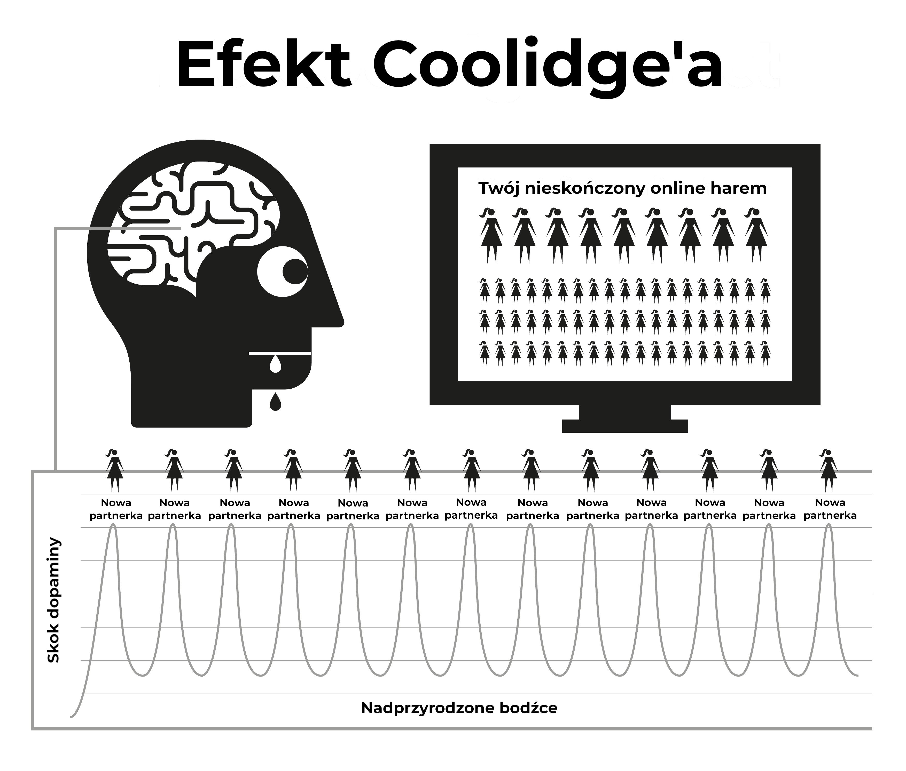

# Natura

Internetowe porno działa przez przejmowanie naturalnych mechanizmów nagradzania stworzone abyś prokreował tak długo jak możesz. Natychmiastowa i w wysoce dostępna forma internetowego porno sprawia, że mechanizm nagrody w mózgu produkuje dopaminę znacznie dłużej niż zwykle. Z naukowego punktu widzenia, to się nazywa efekt Coolidge'a , o którym możesz już być świadom.

Dopamina jest neuroprzekaźnikiem skojarzony z odczuciami pragnienia, z właściwą przyjemnością produkowaną przez opioidy. Więcej dopaminy, więcej opioidów i więcej działania. Bez dopaminy, czynności takie jak jedzenie nie są przyjemnie i nieukończone, z wysoką ilością tłuszczu i cukru produkuje największe uwolnienie chemiczne.

Dopamina jest też wypuszczana jako reakcja na nowość. Z pozornie nieskończoną ilością dostępnej pornografii, zalewa układ limbiczny (system nagrody), więc przy pierwszym razie kiedy widzisz porno, działasz, orgazmując i wywołując kolejną powódź opioidów. Zachęcamy do zdobywania tak tyle dopaminy jak możliwe, mózg przechowuje to jako skrypt dla łatwego przypomnienia i wzmacnia ścieżki nerwowe przez uwolnienie chemikalia zwanym DeltaFosB. Teraz, mózg wywołuje te ścieżki w odpowiedzi na sygnały, takie jak seksowne reklamy, czas samemu, stres lub poczucie przybicia i nagle jesteś gotowy zjechać ze ’wodnej zjeżdżalni'. Every time this is repeated, more DeltaFosB is released so the water slide is greased, alive and easier to ride down the next time.

Układ limbiczny ma system samopoprawczy, aby przyciąć liczbę receptorów dopaminy i opioidu, częste i dzienne zalania dopaminą jest wykryte. Niestety, te receptory też są potrzebne, aby nas motywować do radzenia sobie z stresami dziennego dnia. Nominalne ilości dopaminy produkowane przez nagrody naturalne nie da się wprost porównać z pornografią i nie są aż wydajnie wchłaniane przez zmniejszone receptory, prowadząc nas do poczucia się bardziej zestresowanym i podrażnionym niż zwykle. Ten proces jest znany jako odczulanie.

W tym cyklu przekroczyłeś ’czerwoną linię’ i wywołałeś emocje tak jak poczucie winy, odraza, wstyd, niepokój oraz strach, które kolei podnoszą poziomy dopaminy jeszcze wyżej i wywołuje u mózgu błędną interpretację tych odczuć jako podniecenie seksualne.

Z biegiem czasu, nie tylko mózg odczula się na poprzednie filmiki, które widział, ale też do podobnych gatunków oraz poziomu szoku. Ta zmniejszona motywacja wyzwala odczucia niższej satysfakcji gdy nasze mózgi uczestniczą w ciągłym ocenianiu, pchając cię do szukania filmików do zaspokojenia głodu. Zatem poszukujesz nowości, kilkając na amatorskie, wywołujące szok fimliki na stronie głównej, o której z pewnością powiedziałeś, że nie zrobiłbyś tego na pierwszej wizycie.

> *"Bowiem małe rzeczy odświeżają serca jak poranna rosa."*
>
> --- Kahlil Gibran

Ulotne poczucie bezpieczeństwa jest wszystkim co jest potrzebne, aby przejść przez ciężki okres w życiu, ale czy twój odczulony mózg da radę złapać kroplę odstresowującą, którą mózg osoby nieużywającej jest w stanie użyć?

Zatopienie dopaminą działa jak  szybko działający lek, spadając szybko i wywołując napady odstawienne. Większość użytkowników ma taką iluzję, że napady to okropna trauma, którą cierpią próbując lub być zmuszonym do zaprzestania. W rzeczywistości, są one głównie umysłowe, albowiem użytkownik czuje się pozbawiony ich przyjemności lub podpory.

## Mały potwór

Właściwe chemiczne odstawienie od porno jest takie delikatne, że większość użytkowników żyło bez zdawania sobie sprawy, że są narkomanami. Większość użytkowników boją się narkotyków, ale są dokładnie tym czym są, narkomanami. Na szczęście to jest łatwy narkotyk do odrzucenia, ale musisz najpierw zaakceptować, że jesteś, w rzeczywistości, uzależniony . Odstawienictwo od porno nie powoduje żadnego fizycznego bólu i jest ledwie pustym, niespokojnym uczuciem, jakby czegoś brakowało, który jest powodem dlaczego wiele wierzy, że jest z czymś powiązane z potrzebą seksualną. Przedłużone, to uczucie staje się nerwowością, brakiem pewności w swoje ciało, wzburzeniem, niską pewnością siebie i nadwrażliwością. To jest jak głód, na truciznę.

W ciągu kilka sekund angażowania się w sesję,dopamina jest dostarczana i zachcianki odchodzą, powstające z poczucia spełnienia kiedy zjeżdżasz ze wodnej zjeżdżalni. Na początku, napady odstawienne oraz ich późniejsze ukojenie są takie drobne, że jesteśmy ich nieświadomi. Kiedy stajemy się regularnymi użytkownikami, wierzymy, że tak jest, bo polubili to lub nabyli sobie 'nawyk'. Prawda jest taka, że jesteśmy dawno uzależnieni, ale nie zdajemy sobie sprawy. Mały potwór już jest w naszych mózgach, więc raz na jakiś czas zjeżdżamy z wodnej zjeżdżalni aby jego nakarmić.

Wszyscy użytkownicy zaczynają szukać porno z nieracjonalnych powodów. *Jedynym* powodem, dla którego każdy kontynuuje używania porno, nieważne czy to jest zwyczajny czy hardkorowy użytkownik, to nakarmienie tego małego potwora. Cały dylemat to seria okrutnych i niejasnych kar, ale chyba najbardziej żałosnym aspektem jest sens przyjemności, którą użytkownik otrzymuje przy sesji, próbując wrócić do poczucia spokoju, wyciszenia oraz pewności we własne ciało, które mieli przed staniem się uzależnionym na pierwszym miejscu.

## Irytujący alarm

Znasz te uczucie, kiedy alarm domowy sąsiada przez cały dzień dzwonił -- lub jakaś inna drobna ciągła przykrość -- wtedy głos nagle przestaje i cudowne poczucie pokoju i ciszy obmywa ciebie? To nie jest napra, ale koniec zdenerwowania. Przed zaczęciem następnej sesji nasze ciała są kompletne, ale później zaczynamy zmuszać nasze mózgi do pompowania dopaminy i wtedy skończyliśmy, a to odczucie zaczyna odchodzić, cierpimy na napady odstawienne. To nie są bóle fizyczne, to ledwie  puste odczucie. Nie jesteśmy nawet świadomi, że to istnieje, ale to jest jak kapiący kran w środku naszych ciał.

Nasze racjonalne umysły nie rozumieją tego, ale przecież nie muszą. Jedyne co wiemy jest to, że chcemy porno i kiedy się masturbujemy, pragnienie odchodzi. Jednak, satysfakcja jest ulotna, ponieważ żeby złagodzić pragnienie, potrzebne jest więcej pornografii. Gdy tylko zaczniesz szczytować, pragnienie wraca i pułapka ciągle cię trzyma. Sprężenie zwrotne, chyba że je złamiesz!

Pułapka porno jest podobna do zakładania ciasnych butów tylko po to, aby otrzymać otrzymać przyjemność ze zdjęcia ich. Są trzy główne powody dlaczego użytkownicy nie mogą tak popatrzeć.

1.  Od narodzin, byliśmy poddawani sporej ilości prania mózgu, mówiącym nam że internetowe porno to po prostu kolejny współczesny rozwój, który zastąpił wersję drukowaną. Ten błąd jest pakowany z prawdą, że masturbacja nie krzywdzi, zatem czemu im nie wierzyć?

2.  Ponieważ fizyczne odstawienie dopaminy nie obejmuje faktycznego bólu, ledwie puste odczucie niepewności nieodłączne od głodu oraz normalnego stresu, to odczucie manifestuje się na sesję porno, gdyż w tych chwilach mamy tendencję do szukania pornografii. Mamy skłonność do uważania tego odczucia za normalne. 

3.  Jednakże, głównym powodem dlaczego użytkownicy nie radzą sobie z zobaczeniem prawdziwego światła internetowego porno, jest przez działanie tyłem do przodu. To wtedy *nie* konsumujesz tego, z czego cierpisz na to puste odczucie. Z powodu procesu stawania się uzależnionym niesamowicie subtelne i stopniowe w wczesnych latach, to puste odczucie jest uważane za normalne i nie jest za to obwiniać na poprzedniej sesji. W momencie kiedy przeglądarka jest włączona i zaczynasz swoją sesję, dostajesz natychmiastowy zastrzyk i stajesz się mniej nerwowy lub bardziej zrelaksowany, więc internetowe porno otrzymuje zasługę.

Te działanie ’tyłem do przodu’ sprawia, że wszystkie narkotyki są trudne do odrzucenia. Wyobraź sobie stan paniki uzależnionego od heroiny bez żadnej heroiny przy sobie; teraz wyobraź sobie niezmierną radość, kiedy nareszcie będą mogli sobie wstrzyknąć igłę do żyły. Osoba nie uzależniona nie będzie cierpiała na te uczucie paniki.

Heroina nie łagodzi tego odczucia, powoduje je. Podobnie, osoby nie używające nie cierpią na puste odczucie potrzeby oglądania internetowego porno, lub paniki kiedy są offline. Osoby nieużywające nie rozumieją w jaki sposób użytkownicy uzyskują przyjemność z dwuwymiarowych filmików z wyciszonym dźwiękiem i nienaturalnymi proporcjami ciała. W końcu, użytkownicy też nie rozumią.

Mówimy o internetowej pornografii jako relaksującej lub zadowalającej, ale jak możesz być zadowolony, gdy nie jesteś najpierw niezadowolony? Osoba nieużywająca nie męczy się w tym stanie niezadowolenia, kompletnie zrelaksowany po randce bez seksu, gdzie użytkownik nie jest dopóki nie zadowolili swojego "małego potwora".

## Przyjemność czy podpora?

Ważne przypomnienie - głównym powodem, dla którego użytkownicy znajdują trudność w rzuceniu, jest to wiara, że rezygnują z prawdziwej przyjemności lub podpory. Jest istotne do zrozumienia, że w ogóle nie rezygnujesz z *absolutnie niczego*. najlepszym sposobem do zrozumienia subtelności pułapki porno, to porównanie tego z jedzeniem. Nawyk regularnych posiłków powoduje, że nie czujemy się głodni pomiędzy nimi, tylko jesteśmy świadomi głodu kiedy posiłek jest opóźniony. Nie ma tu fizycznego bólu, po prostu puste i niepewne uczucie uznane jako głód. Proces zaspokojenia naszego głodu jest bardzo przyjemnym przeżyciem.

Pornografia wydaje się być prawie podobna, ale nie jest. Jak głód, nie ma tu fizycznego głodu i mechanizm nagrody działa w podobny sposób, jednak jego podobieństwo do jedzenia, które skłania użytkownika do wierzenia, że jest w tym prawdziwa przyjemność lub podpora. Mimo że jedzenie i porno wydaje się być bardzo podobni, w rzeczywistości są przeciwieństwami.

-   Jesz, żeby przetrwać i dać swojemu życiu energii, gdzie porno przyciemnia i odcina twój urok.

-   Jedzenie faktycznie dobrze smakuje, a jedzenie jest naprawde przyjemnym doświadczeniem, którym się nacieszamy przez całe nasze życie. Porno wymaga samo-sabotowaniu receptorów szczęścia i tym samym niszczy twoje szanse na radzeniu sobie i poczucia szczęśliwym.

-   Jedzenie nie tworzy głodu i naprawde je uśmierza, gdzie pierwsza sesja z porno rozpoczyna pragnienie dopaminy w każdej późniejszej sesji. Daleko od uśmierzenia jego, zapewnia cierpienie na resztę twojego życia.

Czy jedzenie jest nawykiem? Jeśli tak myślisz, spróbuj to w całości przerwać! Żeby opisać jedzenie jako nawyk to tak jak opisanie oddychania jako nawyku, one są potrzebne do przetrwania. To prawda, że ludzie mają nawyk zaspokojenia swojego głodu w innych czasach z różnorodnymi rodzajami jedzenia, ale jedzenie w samo sobie nie jest nawykiem. Tak samo jak porno. Jedyny powód, dla którego użytkownik uruchamia przeglądarkę, to próba zakończenia pustego odczucia, które poprzednia sesja stworzyła, w innych czasach z różnorodnymi eskalujący gatunkami.

W internecie, porno jest często określany jako nawyk i dla wygody, EasyPeasy też określa to jako "nawyk". Jednakże, bądź ciągle świadomy tego, że porno nie jest nawykiem, jest **narkomanią!** Kiedy zaczynamy używać porno, zmuszamy do radzenia sobie z tym. Zanim się obejrzysz, eskalujemy do coraz bardziej dziwacznego i szokującego porno. Dreszcz jest w polowaniu, nie w zabijaniu, z dopaminą gwałtownie wychodzącą po orgaźmie, tłumacząc to dlaczego użytkownicy chcą ’edgować (edżować)’ (opóźniać orgazm) przez przeskakując pomiędzy kilkoma okienkami z przeglądarki i tabami.

## Przekroczenie czerwonej linii

Jak z każdym narkotykiem, ciało ma tendencję do rozwinięcia odporności na te same filmiki, nasz mózg chcący więcej lub coś innego. Po krótkim okresie oglądania tego samego filmiku, przestaje kompletnie uśmierzyć napady odstawienia, które poprzednia sesja stworzyła. Odbywa się ciągnięcie liny w tym raju porno, chcesz zostać po bezpiecznej stronie swojej "czerwonej linii", ale twój mózg pyta cię, aby kliknąć na filmik typu zakazany owoc.

Czujesz się lepiej po angażowaniu się w tę sesję porno, ale jesteś bardziej nerwowy i mniej zrelaksowany niż ktoś, kto nikt nie zaczął, nawet jak żyjesz w mniemanym raju porno. Ta sytuacja jest jeszcze bardziej żałosna od noszenia ciasnych butów, bo jak idziesz przez życie, coraz większy dyskomfort zostaje po zdjęciu butów. Ponieważ użytkownicy wiedzą, że mały potwór musi być nakarmiony, oni sami decydują o czasie, z tendencją na cztery rodzaje okazji lub ich kombinacja.
Boredom / Concentration - Zupełne przeciwieństwa!
Stress / Relaxation - Zupełne przeciwieństwa!

Jaki magiczny lek może nagle odwrócić, które spowodowały minuty później? Prawda jest taka, że porno zarówno nie łagodzi nudy i stresu ani nie promuje koncentracji oraz relaksacji. Jeśli pomyślisz o tym, jakie inne typy okazji znajdują się w naszych życiach, zaśnięcie w barze? Jeśli masz pomysły na osłabieniu przy innych typach "realistycznych" lub "miękkich" rodzajach porno, proszę zapamiętaj, że zawartość tej książki dotyczy wszelkiej pornografii, drukowanej, kamery internetowe, pay-per-views, z czatem, programy na żywo, itd. Ludzkie ciało jest najbardziej wyrafinowaną rzeczą na Ziemi, ale żaden gatunek żyjący, nawet najmniejsza ameba czy dżdżownica, nie przetrwa bez znania różnicy pomiędzy jedzeniem, a trucizną.
Przez naturalną selekcję nasze umysły i ciała rozwinęły techniki do nagradzania działań, które powiększają i utrzymują ludzkość. Nie są przygotowani na nadprzyrodzone bodźce, które są większe, jaśniejsze i ostrzejsze, niż wszystko, co jest znalezione w naturze, nawet większość wyciszonych dwuwymiarowych obrazów powoduje u nas pobudzenie. Ale bez przerwy patrz na ten sam obrazek i już nie będą. W prawdziwym życiu, kontrola i równowaga zapewnia cię do patrzenia na coś innego, ale internetowe porno nie ma takiego ogranicznika, powodując że spędzasz swoje życie w wirtualnym haremie!

To złudzenie, że fizycznie i psychicznie słabi ludzie stają się użytkownikami, szczęściarze będący tymi, którzy swój pierwszy przypadek odrzucającym i są wyleczeni na całe życie. Alternatywnie, nie są mentalnie przygotowani do przejścia srogiego procesu nauki walczenia z nie bycia uzależnionym, strachem przed "byciem przyłapanym" lub nie bycie wystarczająco fachowy, aby operować ustawieniami prywatności przeglądarki. Chyba najbardziej tragiczną częścią tego całego biznesu, że polegają na nastolatkach -- doświadczonych w znalezieniu materiału i zakrycia swoich śladów -- którzy zaczynają w zwiększonej ilości.

Cieszenie się internetowym porno to iluzja. Skakanie z gatunku do gatunku, ledwie trzymając naszą nowinkową ’małpę’ w obrębie "czerwonej linii" "bezpiecznych" gatunków porno po to, żeby naprawić naszą dopaminę. Jak uzależnieni od heroiny, naprawde tylko cieszą cię rytuałem łagodzenia tych napadów.

## Z wysokiego poziomu tańca wokół czerwonej linii

Nawet z jednym filmikiem na którym się zatrzymali, użytkownicy przez cały czas uczą się filtrowania złych lub brzydkich porcji klipów porno. Nawet jak są solo, oni nadal filtrują według części ciała, które są najbardziej dla atrakcyjne. W rzeczywistości, niektórzy biorą przyjemności z tańca wokół czerwonej linii, szukając wymówek do deklarowania, że lubią "softcore" i to, że nie są uzależnieni od nadprzyrodzonych bodźców. Ale zapytaj się użytkownika, który wierzy, że trzymają się pewnego aktora lub gatunku, *"Jeśli nie możesz dostać normalnej wersji porno i tylko mógłbyś otrzymać niebezpieczne gatunki, przestałbyś masturbować?"*

Nie ma mowy! Użytkownik zamastubuje do wszystkiego, eskalujących gatunków, różnic w orientacji seksualnej, sobowtórów wykonawców, niebezpiecznych otoczeń, szokujących związków, wszystko żeby zaspokoić małego potwora. Na początek smakują okropnie, ale z czasem nauczysz się nimi cieszyć. Użytkownicy będą szukać pustego spełnienia po prawdziwym seksie, po długim czasie w pracy, gorączki, przeziębienia, grypy, bólu gardła i nawet w trakcie przyjęcia do szpitala.

Przyjemność nie ma nic z tym wspólnego, jakby seks był pożądany, nie miałoby sensu sięgać po laptop. Niektórzy użytkownicy znajdują w tym coś alarmującego do zauważenia, że są narkomanami i będą wierzyć, że będzie przez to jeszcze trudniejsze do zaprzestania. W rzeczywistości, to są dobre wieści z dwóch powodów.

1.  Powodem dlaczego większość kontynuuje używanie tego, pomimo że wiedzą o przewyższających wadach nad zaletami, wierzymy, że jest coś przyjemnego w porno lub to, że działa jak jakaś podpora. Jesteśmy złudzeni, że po zaprzestaniu, będzie pustka, pewne sytuacje nigdy nie będą takie same. W rzeczywistości porno nie tylko nic nie przynosi, tylko zabiera.

2.  Mimo, że internetowe porno jest najmocniejszym wyzwalaczem na zalanie dopaminą przez nowość i seks, to przez prędkość, w jakim stajesz się uzależniony, tak naprawde nie jesteś tak bardzo uzależniony. Rzeczywiste napady odstawienne są takie delikatne, że większość użytkowników żyło i umierał bez uświadomienia sobie, że na nie cierpieli.

Dlaczego, więc większość użytkowników widzi trudność w zaprzestaniu, przechodząc przez miesiące tortur i spędzania reszty swojego życia tęskniąc za te dziwne czasy? Odpowiedzią jest drugi powód, pranie mózgu. Uzależnienie przez neuroprzekaźniki jest tak łatwe z poradzeniem sobie, że większość użytkowników jeździli bez porno na delegacje lub podróże, niewzruszonym na napady odstawiennie. Ich mały potwór jest bezpieczny w wiedzy, że otworzysz swój laptop jak tylko wrócisz do swojego pokoju w hotelu. Możesz przetrwać  nieznośnego klienta oraz swojego megalomańskiego menedżera, wiedząc że naprawa jest na wyciągnięcie ręki.

## Analogia Palącego

Dobrą analogią jest tą od palącego tytoń. Jakby mieli przetrwać dziesięć godzin dziennie bez papierosa, powyrywali by sobie włosy z głowy, ale większość palaczy kupią nowy samochód i powstrzymać się od palenia w nim. Większość odwiedzi teatry, supermarkety, kościoły i brak możliwości nie stworzy im problemu. Nawet w pociągach czy w samolotach nie byłoby sprzeciwów. Palacze są zawsze zadowoleni, że ktoś lub coś zatrzymuje ich od palenia.

Użytkownicy automatycznie powstrzymują się od używania internetowego porno w domu ich rodziców w trakcie spotkania rodzinnego i innych wydarzeń z małym dyskomfortem. W rzeczywistości, większość użytkowników mieli wydłużone okresy czasu, w trakcie których powstrzymują się bez wysiłku. Neurologiczny mały potwór jest łatwy z radzeniem sobie nawet jak jesteś nadal uzależniony. Istnieją miliony użytkowników, którzy zostali zwyczajnymi użytkownikami przez całe swoje życia i są tak uzależnieni jak ciężki użytkownik. Są nawet ciężcy użytkownicy, którzy wykopali nawyk, ale okazjonalnie zerkają, smarując zjeżdżalnie wodną, żeby z niej skorzystać w następnym upadku nastroju.

Jak mówiono wcześniej, rzeczywiste uzależnienie od porno nie jest głównym problemem, po prostu działa jak katalizator w trzymaniu naszych umysłów w zakłopotaniu nad prawdziwym problemem – pranie mózgu. Nie myśl sobie, że złe efekty internetowego porno są  jakkolwiek przesadzone, jeśli coś to są niestety zaniżone. Okazjonalnie, plotki się rozchodzą, że ścieżki neuronowe są stworzone do życia, z właściwą mieszanką szansy i bodźców znowu wysyłających cię z powrotem do zawsze działającej wodnej zjeżdżalni, ale są nieprawdziwe. Nasze mózgi i ciała są cudownymi maszynami, dochodzące do siebie w ciągu tygodni.

Nigdy nie jest za późno by przestać! Szybkie przeglądanie po społecznościach online pokażą ci ludzi w każdym wieku resetujących swoje życia (oraz swoich partnerów). Jak ze wszystkim, ludzie wnoszą to na wyższy poziom, ćwicząć zatrzymanie nasienia, Karezzę i przez odróżnienie sensorycznych i mnożących stronach seksu, partnerzy są szczęśliwsi niż kiedykolwiek byli.

Może być to pocieszeniem dla życiowych lub ciężkich użytkowników, że jest takie łatwe do zatrzymania jak dla zwyczajnych użytkowników, a w szczególny sposób jest łatwiejsze. Im dalej cię to ciągnie, tym większa jest ulga. Kiedy przestałem, od razu poszedłem na  *zero* i nie miałem żadnego złego napadu. W rzeczywistości, proces był naprawde przyjemny niż w trakcie okresu odstawienniszego.

Ale najpierw, musimy poradzić sobie z praniem mózgu.

