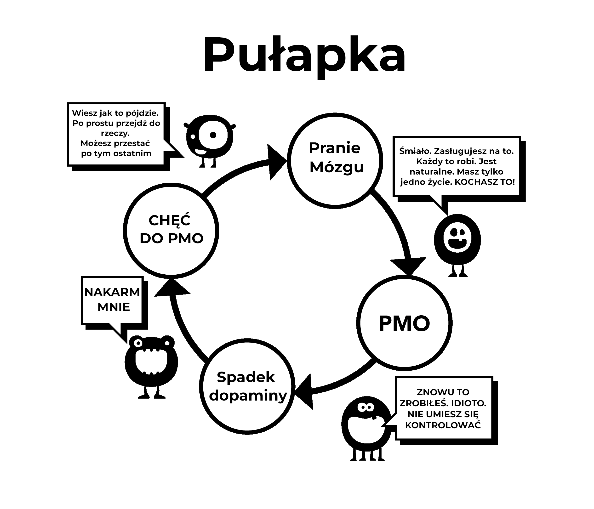

# Pranie mózgu

To jest drugi powód dlaczego zaczynamy tego używać. Zrozumienie w pełni tego prania mózgu wymaga od nas najpierw zbadania silnych efektów nadprzyrodzonych bodźców . Nasze mózgi nie są po prostu przygotowanie na stworzenie "online haremu", pozwalając nam na przeskakiwanie pomiędzy większą ilością potencjalnych partnerów w piętnaście minut, niż nasi przodkowie w ciągu kilku istnień.

Było wiele mylnych porad w przeszłości, jednym z przykładów jest to, że masturbacja prowadzi do ślepoty. Ten, wraz z innymi taktykami zastraszenia, wyraźnie przesadził. Nieporozumienia jak to miały prawo do bycia obalonym przez naukę. Ale dziecko zostało wyrzucone wraz z wodą kąpielową; od najwcześniejszych lat nasze podświadome umysły są bombardowane seksualnymi przesłaniami i obrazami, magazynami i reklamami wypełnionymi podtekstem. Niektóre teledyski są niezwykle sugestywne, ale nie rozpaczaj, zrób z tego grę, aby zidentyfikować jakich komponentów używają – to jest szok, nowość, kolor, rozmiar, tabu, nostalgia, itd. Taką grę można nauczyć dojrzewające dzieci jako metoda kształcenia ich.

W swojej istocie, wiadomość to *"Najcenniejszą rzeczą na ziemi, moja ostatnia myśl lub działanie, to będzie orgazm."* Czy to hiperbola? Zobacz fabułę w filmach i zobaczysz mieszankę sensorycznych (dotyk, zapach, głos) i rozmnażające (orgazmiczne) części seksu. Jej wpływ nie jest rejestrowany w naszej świadomości, ale podświadomość ma czas na pochłonięcie tego.

## Rozumowanie naukowe

Jest rozgłos w drugą stronę, straszenie zaburzeniem seksualnym, utratą motywacji, preferowanie wirtualnego porno od prawdziwych dziewczyn, YourBrainOnPorn i liczne internetowe subkultury, ale te ruchy naprawde nie powstrzymują ludzi od używania. Logicznie mówiąc powinni, ale prostym faktem jest to, że nie przestają. Nawet ryzyka zdrowotne wypisane od recenzowanych badań na YourBrainOnPorn nie wystarcza na powstrzymanie młodzieży do zaprzestania.

Ironicznie mówiąc, najpotężniejszą siłą w tym zamieszaniu to sam użytkownik. To złudzenie, że użytkownicy są ludźmi słabej woli lub fizycznie słabi. Musisz być fizycznie silnym, żeby radzić sobie z uzależnieniem kiedy poznałeś jego istnienie. Chyba najbardziej bolesnym aspektem jest to, że umieszczają się jako nieudanych przegrywów i nieznośnym introwertykiem. Jest to prawdopodobne, że przyjaciel byłby osobiście bardziej interesujący, gdyby się nie poniżali dla poszukiwania samozadowolenia.

## Problemy z użyciem siły woli  

Użytkownicy rzucający metodę siły woli obwiniają swój brak siły woli oraz niszczą swój spokój i szczęście. To jest jedna rzecz, aby polec w samodyscyplinie, a kolejną aby poczuć wstręt do siebie. Przecież, nie ma prawa, które wymaga abyś miał wzwody przez cały czas przed seksem, odpowiednio podniecony i zdolny do zadowolenia swojej partnerki. Pracujemy nad uzależnieniem, nie nad nawykiem i w żadnym momencie nie kłócisz się z sobą na rzucenie nawyku jak na przykład granie w golfa, ale robienie tego samego z uzależnieniem od porno zostało znormalizowane, ale dlaczego?

Nieustanny kontakt z nadprzyrodzonym bodźcem przeprogramowuje twój mózg, więc budowanie odporności na pranie mózgu jest kluczowe, jak kupowanie samochodu od dealera używanych samochodów -- grzecznie kiwać głową, ale nie wierzyć ani słowie, które wypowiada. Zatem nie wierz, że musisz mieć tak tyle seksu jak możesz, to wszystko jest wyjątkowo dobre, z brakiem obecności używania porno.

Nie graj także w grę bezpiecznego porno, twój mały potwór stworzył tą grę, aby cię zwabić. Czy amatorskie porno jest certyfikowane przez jakiś autorytet? Strony pornograficzne zbierają dane od swoich użytkowników i używają ich do zaspokojenia ich potrzeb, jeśli zobaczą wzrost konkretnej kategorii, będą się skupiać na niej i wypuścić zawartość jak najszybciej. Nie daj się zwieść edukacyjnemu zamiarowi lub "bezpiecznym" filmikom reklamowane przez kobiety. Zacznij się pytać: *"Dlaczego to robie? Czy naprawde muszę?"*

**Oczywiście że nie**

Większość użytkowników przyrzeka, że oglądają tylko nieruchome i softcore porno i związku z tym jest w porządku, kiedy naprawde siłują się ze smyczą, walcząc ze swoją siłą woli, aby oprzeć się pokusami. Jak jest to zrobione zbyt często i zbyt długo, to wyczerpuje ich siłę woli w znacznym stopniu i zaczynają zawodzić w innych życiowych projektach, gdzie siła woli jest wielce wartościowa, jak ćwiczenie, bycie na diecie, itp. Porażka w tych obszarach sprawia, że czują się nieszczęśliwi i winni, kaskadując i wykopując ich z powrotem do pornografii. Jeśli tego nie zrobią, wyładowują swoją złość i depresję na swoich bliskich.

Kiedy jesteś podtopiony dopaminą z porno, pranie mózgu się powiększa Twój podświadomy umysł wie, że mały potwór musi być nakarmiony, blokując wszelkie inne rzeczy. To strach powstrzymuje ludzi od rzucenia, strach przed tym, że to puste, niepewne uczucie, które dostają kiedy przestaną topić swoje mózgi dopaminą. Sam fakt, że jesteś nieświadomy tego nie oznacza, że nie ma tego. Nie musisz tego rozumieć bardziej niż kot, który musi zrozumieć gdzie są rury z gorącą wodą, kot po prostu wie, że jak usiądzie w pewnych miejscach będzie czuł ciepło. 

## Bierność

Bierność naszych umysłów i zależność na autorytet prowadzący do prania mózgu jest podstawową trudnością w zrezygnowaniu z porno. Nasze wychowanie w społeczeństwie, wzmocnione przez pranie mózgu naszym uzależnienie, połączone z najmocniejszymi - naszymi przyjaciółmi, bliskimi oraz kolegami. Faza "rezygnowania" to klasyczny przykład prania mózgu, sugeruje prawdziwe poświęcenie. Piękną prawdą jest to, że nie trzeba z niczego rezygnować; wręcz przeciwnie, będziesz się uwalniał z okropnej choroby i osiągniesz wspaniałe korzyści. Zaczniemy od usuwania prania mózgu odrazu, zaczynają od nieodniesienia się do "zrezygnowania" ale przestania, rzucenia lub może rzeczywistą sytuację, **ucieknięcia!**

Jedyną rzeczą, która nas przekonuje do użycia początkowo są to inni ludzie robiący to, przez to odczuwając, że coś przegapiamy. Pracujemy ciężko, żeby być uzależnieni, ale nigdy nie znajdujemy tego, co oni przegapili. Za każdym razem kiedy zobaczymy kolejny filmik, zapewnia nas, że coś musi w nim być, inaczej ludzie nie robiliby tego, a biznes nie byłby taki wielki. Nawet jak próbują odrzucić nawyk, były użytkownik czuje, że są czegoś pozbawieni gdy następuje dyskusja na temat seksownej artystce, piosenkarce lub nawet o gwieździe porno w trakcie imprez lub w funkcjach społecznych. *"Musi być dobre jak wszyscy moi przyjaciele mówią o nich, nie? Czy mają darmowe zdjęcia w internecie?"* Czują się bezpiecznie, dziś wieczorem będą mieli tylko jedno zerknięcie i zanim zauważą, znowu są uzależnieni.

Pranie mózgu jest niezwykle silne i musisz być świadomy jego efektów. Technologia kontynuuje swój rozwój, a przyszłość przyniesie wzrastająco szybsze strony i metody dostępu. Przemysł pornograficzny inwestuje miliony w wirtualną rzeczywistość, aby stało się następną najlepszą rzeczą. Nie wiemy gdzie zmierzamy, nie przygotowani do rozprawienia się z obecną technologią lub z tym co przyjdzie.

Zamierzamy usunąć to pranie mózgu, to nie osoba nieużywająca jest pozbawiona czegoś, ale użytkownik, który traci życie pełne:

-   Zdrowia

-   Energii

-   Bogactwa

-   Spokoju w umyśle

-   Pewności siebie

-   Odwagi

-   Szacunku do samego siebie

-   Szczęścia

-   Wolności

Co zyskają z tych znacznych poświęceń? **ABSOLUTNIE NIC**, poza iluzją próby wrócenia do stanu spokoju, ciszy i pewności siebie, którą osoba nieużywająca zawsze się cieszy.

## Napady odstawienne

Jak wcześniej wyjaśniłem, użytkownicy wierzą, że używają porno dla przyjemności, relaksacji lub dla jakiejś edukacji. Prawdziwym powodem jest ulga od napadów odstawiennych. Nasza podświadomy rozum zacznie się uczyć, że internetowe porno i masturbacja w niektórych czasach może być przyjemna. Gdy stajemy się coraz bardziej uzależnieni na narkotyku, tym większa potrzeba, aby złagodzić napady odstawienne oraz tym głębiej ta subtelna pułapka cię ściąga. Ten proces dzieje się tak wolno, że nie jesteś tego świadom, większość młodych użytkowników nie zdaje sobie sprawy, że są uzależnieni, dopóki nie spróbują przestać i nawet wtedy, większość się nie przyzna.

Weźmy na przykład konwersację, którą terapeuta miał z setkami nastolatków:

>**Terapeuta:** "*Zdajesz sobie sprawę, że internetowe porno jest narkotykiem i jedynym powodem dlaczego używasz, bo nie możesz przestać.*"
>
>**Pacjent:** "*Bzdura! Podoba mi się, jakby się nie podobało, przestałbym.*"
>
>**Terapeuta:** "*To po prostu zaprzestań na tydzień, żeby udowodnić mi, że możesz jak chcesz.*"
>
>**Pacjent:** "*Nie trzeba, podoba mi się to. Jakbym chciał, przestałbym.*" 
>
>**Terapeuta:** "*To po prostu zaprzestań na tydzień, żeby udowodnić sobie, że nie jesteś uzależniony.*"
>
>**Pacjent:** "*Jaki to ma sens? Lubię to."*

Jak wcześniej podałem, użytkownicy mają tendencje do złagodzenia ich napadów odstawiennych w czasach stresu, nudy, koncentracji lub kombinacji tych rzeczy. W poprzedzających rozdziałach, skupimy się na aspektach prania mózgu.

