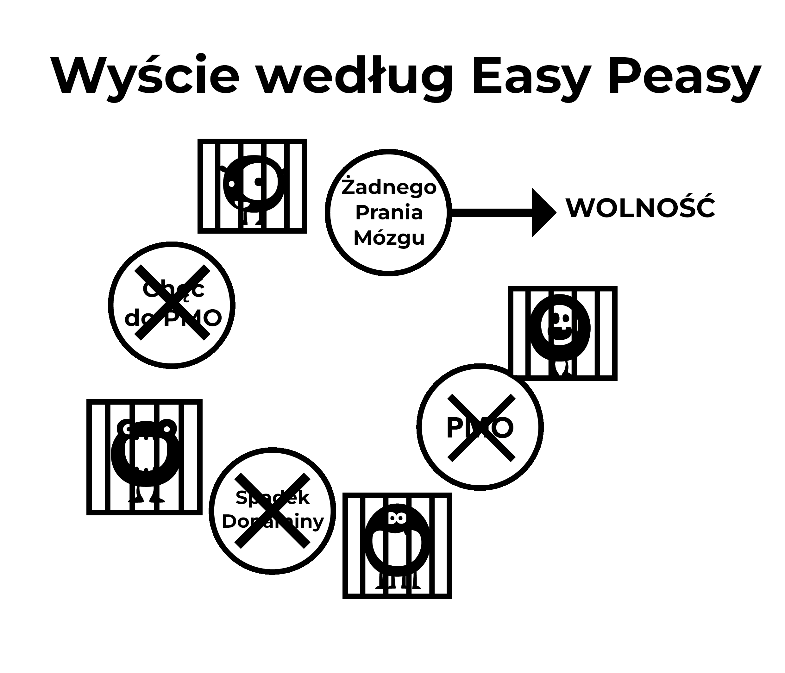

# Aspekty prania mózgu

Wielki potwór pułapki porno jest hodowany przez zwieńczenie wielu aspektów, włączając w to społeczne siły, wizerunek medialny, rówieśników oraz własna wewnętrzna narracja użytkownika. Porażka w dekonstrukcji tych mitów jednocześnie używając metody siły woli ostatecznie doprowadzi do odczucia deprawacji, która prowadzi użytkownika z powrotem do pułapki. Dekonstrukcja wyobrażonej wartości porno jest ważna do osiągnięcia sukcesu i pozwoli ci zobaczyć gdzie jesteś okradany!

Ważne do zanotowania jest połączenie pomiędzy praniem mózgu, a strachem. To strach przed odczuciem ***przyszłych napadów odstawiennych*** tworzy te napady. Strach w samym sobie jest napadem. Pomyśl o tym kiedy miałeś symptomy odstawienia takie jak pocenie się łap, krótkość w oddechu, problemy ze spaniem oraz niemożliwość jasnego myślenia. Teraz pomyśl o podobnych sytuacjach, gdzie miałeś te odczucia: rozmowy o pracę, nerwówki obok atrakcyjnej osoby, wystąpienie publiczne, itp. To są te same odczucia niepokoju, które tworzy strach. Krótko mówiąc, jak narkotyk może nadal uzależnić ludzi miesiące po zaprzestaniu? Musi to być mentalnie, poprawne?

## Stres

Nie tylko wielkie życiowe tragedie, ale też drobne stresy doprowadzają użytkownika do poprzednio wykluczonej "niebezpiecznej" strefy. Stresy te obejmują spotkania towarzyskie, rozmowy telefoniczne, lęki gospodyni domowej z małymi dziećmi i wiele innych. Weźmy jako przykład rozmowy telefoniczne, szczególnie w przypadku biznesmena. Większości telefonów nie są telefony od zadowolonych klientów czy szefa, który ci gratuluje, jest jakieś zdenerwowanie. Powrót do domu do przyziemnego życia rodzinnego z krzyczącymi dziećmi i emocjonalnymi żądaniami partnera powoduje, że użytkownik - jeśli jeszcze tego nie robi - fantazjuje o obiecanej tej nocy uldze w porno. Nieświadomie cierpią na napady ostrawienne, destresory osłabione i nieprzygotowane na dodatkowe zaostrzenie. Częściowo łagodzi napady w tym samym czasie co normalny stres, całość jest zmniejszona, a użytkownik dostaje tymczasowe wzmocnienie. To pobudzenie nie jest iluzją, użytkownik rzeczywiście czuje się lepiej niż przedtem, ale jest bardziej spięty niż byłby jako osoba nieużywająca.

Poniższy przykład nie ma na celu szokowania ciebie, EasyPeasy nie obiecuje takiego zabiegu, ale ma podkreślić, że porno raczej niszczy nerwy niż je relaksuje.

Spróbuj wyobrazić sobie dojście do etapu, w którym nie jesteś w stanie się podniecić, nawet z bardzo seksownym i atrakcyjnym partnerem. Przez chwilę zatrzymaj się i spróbuj wyobrazić sobie życie, w którym bardzo urocza i czarująca osoba musi rywalizować i przegrywać z wirtualnymi gwiazdami porno zajmującymi twój "harem", aby przyciągnąć twoją uwagę. Wyobraź sobie umysł osoby, która po otrzymaniu tego ostrzeżenia kontynuuje używanie i umiera, nie uprawiając nigdy prawdziwego seksu z tym uroczym i chętnym partnerem. Łatwo jest odrzucić tych osoby jako dziwaków, ale historie takie jak te nie są fałszywkami, to jest to, co okropna nowość narkotyku porno robi z twoim mózgiem. Im bardziej idziesz przez życie, tym bardziej odwaga jest wysysana i tym bardziej oszukujesz się, że porno robi coś przeciwnego.

Czy kiedykolwiek ogarnęła Cię panika, gdy bez ostrzeżenia WiFi przestaje działać lub jest zbyt wolne? Nieużytkownicy nie cierpią z tego powodu, ponieważ internetowe porno *powoduje* to uczucie. W miarę jak idziesz przez życie, systematycznie niszczy twoje nerwy i odwagę, pozostawiając DeltaFosB, do tworzenia potężnych neuronowych zjeżdżalni wodnych, stopniowo niszcząc twoją zdolność do powiedzenia nie. Do etapu, gdzie zabita została męskość, użytkownik wierzy, że porno jest jego nowym partnerem i nie jest w stanie stawić czoła życiu bez niego.

*Internetowe porno nie łagodzi twoich nerwów, tylko powoli je niszczy*. Jednym z wielkich korzyści z zerwania z nałogiem jest powrót swojej naturalnej pewności siebie i wiary w siebie.

Nie ma potrzeby samooceniania się na podstawie zdolności do zaspokojenia partnera, to nie jest wolność. Ale tej wolności nie można uzyskać, kontynuując smarowanie dopaminowego zjazdu wodnego w sposób, który podcina twoje szczęście i libido poprzez powtarzanie tych samych destrukcyjnych zachowań.

## Nuda

Jeśli jesteś jak większość ludzi, jak tylko wespniesz się do łóżka jesteś już na swojej ulubionej stronie porno, zapewne już zapominając do przypomnienia. To stało się drugą naturą. Podobnie, porno łagodzące nudę jest kolejnym błędem, ponieważ nuda jest nastrojem; występuje, gdy byłeś pozbawiony przez długi czas lub próbujesz ograniczyć.

Prawdziwa sytuacja jest taka, że kiedy jesteś uzależniony od nadprzyrodzonego przyciągania internetowego porno, a potem próbujesz się powstrzymać, czujesz, że czegoś brakuje. Jeśli masz coś do zajęcia umysłu, co nie stresuje, można przejść przez długie okresy czasu, nie będąc zaniepokojonym przez nieobecność narkotyku. Jednak kiedy jesteś znudzony, nie ma nic, co mogłoby zająć twój umysł, więc karmisz potwora. Kiedy się rozpieszczasz i nie próbujesz przestać lub ograniczyć, nawet odpalenie prywatnej przeglądarki staje się podświadome. Ten rytuał jest automatyczny; jeśli użytkownik próbuje przypomnieć sobie sesje z ostatniego tygodnia, jest w stanie przypomnieć sobie tylko niewielką część z nich, np. ostatnią lub sesję po długiej abstynencji.

Prawda jest taka, że porno zwiększa nudę pośrednio, ponieważ orgazmy sprawiają, że czujesz się ospały i zamiast podjęcia energicznego działania, użytkownicy mają skłonność do preferowania wylegiwania się, nudząc się i łagodząc ich napady odstawienne. Przeciwdziałanie praniu mózgu jest ważne, ponieważ użytkownicy mają tendencję do oglądania pornografii, gdy są znudzeni, nasze mózgi są podłączone do interpretacji internetowej pornografii jako interesującej. Podobnie, my również zostaliśmy poddani praniu mózgu, aby uwierzyć, że seks - nawet zły seks - pomaga w relaksie. Faktem jest, że kiedy jesteśmy smutni lub pod wpływem stresu, pary chcą uprawiać seks. Przy braku rozróżnienia między seksem tantrycznym a propagandowym, obserwujcie jak szybko chcecie się od siebie oddalić po osiągnięciu obowiązkowego orgazmu. Gdyby para zdecydowała się po prostu przytulić, porozmawiać lub poprzytulać i pójść spać, poczułaby ulgę.

## Koncentracja

Masturbacja i seks nie pomagają w koncentracji, kiedy próbujesz automatycznie i unikasz rozproszenia uwagi. Zatem, kiedy użytkownik chce się skoncentrować, nawet nie myśli - automatycznie otwiera przeglądarkę, karmiąc małego potwora i częściowo kończąc pragnienie. Zajmują się sprawami, o których już zapomnieli, że oglądali porno. Po latach zalewania dopaminą zmiany neurologiczne wpływają na takie zdolności jak dostęp do informacji, planowanie i kontrola impulsów.

Jesteś również napędzany do zapewnienia nowości na następną sesję, ponieważ te same rzeczy nie wytworzą już wystarczającej ilości dopaminy i opioidów. Będziesz więc musiał przemierzać internetowe ulice w poszukiwaniu nowości, walcząc z pociągiem do przekroczenia linii w kierunku szokującego materiału, co z kolei generuje więcej stresu i pozostawia cię niespełnionym po zakończeniu.

Niekorzystny wpływ na koncentrację ma również fakt, że receptory dopaminy są uśmiercane z powodu naturalnej tolerancji na duże skoki, co zmniejsza korzyści z mniejszych impulsów dopaminy z naturalnych destreserów. Twoja koncentracja i inspiracja będą znacznie zwiększone, gdy ten proces zostanie zredukowany. Dla wielu, to aspekt koncentracji, który uniemożliwia im sukces z metodą willpower, mogą znieść drażliwość i zły temperament, ale brak koncentracji na czymś trudnym raz ich podpory jest usunięty, rujnuje wielu.

Utrata koncentracji, na którą cierpią użytkownicy podczas próby ucieczki, nie jest spowodowana brakiem seksu, a tym bardziej porno. Kiedy jesteś uzależniony od czegoś, masz blokady umysłowe, a kiedy masz blokadę umysłową, co robisz? Odpalasz przeglądarkę - co nie leczy bloku - więc co wtedy robisz? Robisz to, co musisz zrobić, zajmując się tym tak samo jak nieużywający.

Kiedy jesteś użytkownikiem, nic nie jest zrzucane na przyczynę, użytkownicy nigdy nie mają *dysfunkcji seksualnych*, tylko sporadyczne przestoje. W momencie, kiedy przestajesz używać, wszystko co idzie źle, jest zrzucane na powód, dla którego zaprzestałeś. Teraz, kiedy masz blokadę psychiczną, zamiast zająć się tym, zaczynasz mówić "*Gdybym tylko mógł teraz sprawdzić mój harem, to rozwiązałoby wszystkie moje problemy*". Zaczynasz wtedy kwestionować swoją decyzję o rzuceniu i ucieczce z niewoli.

Jeśli wierzysz, że porno jest prawdziwą pomocą w koncentracji, martwiąc się o gwarancję, że nie będziesz w stanie się skupić. Wątpliwości, a nie fizyczne napady odstawienia tworzą problem. Zawsze pamiętaj, że to użytkownik cierpi z powodu odstawienia, a nie osoby nieużywające.

## Odprężenie

Większość użytkowników myśli, że porno pomaga im się zrelaksować. Nie pomoże. Gorączkowe poszukiwanie spełnienia w tych "ciemnych zaułkach internetu" oraz wewnętrzna walka z napinaniem się na smyczy, aby przekroczyć czerwoną linię, z pewnością nie *brzmi* jak bardzo relaksujące zajęcie.

Gdy nadchodzi noc po wycieczce w nowe miejsce lub po długim dniu, siadamy, by się zrelaksować, zaspokoić swój głód, pragnienie i jesteśmy w pełni usatysfakcjonowani. Użytkownik nie jest, gdyż ma inny głód do zaspokojenia. Użytkownicy myślą o porno jako o lukrze na torcie, ale w rzeczywistości jest to "mały potwór", który potrzebuje karmienia. Prawda jest taka, że osoba uzależniona nigdy nie może być całkowicie zrelaksowana, a idąc przez życie staje się to coraz gorsze. Weźmy jeden komentarz od byłego użytkownika:  

> "* Naprawdę wierzyłem, że miałem złego demona w moim makijażu, teraz wiem, że miałem. Jednakże nie była to jakaś wrodzona wada mojego charakteru, ale mały internetowy potwór porno, który tworzył problem. W tamtych czasach myślałem, że mam wszystkie problemy na świecie, ale kiedy patrzę wstecz na moje życie, zastanawiam się, gdzie był ten cały wielki stres. We wszystkim innym w moim życiu miałem kontrolę, jedyną rzeczą, która mnie kontrolowała było niewolnictwo od porno. Smutne jest to, że nawet dzisiaj nie mogę przekonać moich dzieci, że to niewolnictwo powodowało, że byłem tak drażliwy.*"

Za każdym razem, gdy słyszę, jak uzależnieni od porno próbują usprawiedliwić swój nałóg, przekaz brzmi: "*Och, to pomaga mi się zrelaksować.*". Weźmy na przykład konto samotnego taty, którego sześcioletni syn chciał podzielić się swoim łóżkiem w nocy po strasznym filmie, ale tata odmówiłby, aby mógł mieć swoją sesję i "edgować" przez wiele godzin.

Oto kolejna analogia palenia, kilka lat temu władze adopcyjne zagroziły, że uniemożliwią palaczom adopcję dzieci. Zadzwonił pewien mężczyzna, wściekły. "Całkowicie się mylicie", powiedział, "Pamiętam, że kiedy byłem dzieckiem, jeśli miałem sporną sprawę do omówienia z matką, czekałem, aż zapali papierosa, bo wtedy była bardziej zrelaksowana". Dlaczego mężczyzna nie mógł porozmawiać z matką, gdy ta nie paliła papierosa?

Dlaczego niektórzy użytkownicy są tak zestresowani, gdy nie dostają swojej poprawki, nawet po prawdziwym seksie? Jedna z historii online opisuje człowieka pracującego w dziedzinie reklamy, mającego dziewiątki i dziesiątki otwarte na randki w dowolnym czasie, ale stracił zainteresowanie zabraniem ich na kolację, gdyż porno internetowe było o wiele łatwiejsze, nie wiązało się z wydatkami w restauracji i nie miało możliwości "nie" od jego dziewczyny na koniec wieczoru. Po co się przejmować, skoro jego mały potwór utrzymuje go w stanie pożądania schematu niskiego ryzyka i wysokiej nagrody na wyciągnięcie ręki po dotarciu do domu?

Dlaczego więc nieużytkownicy są całkowicie zrelaksowani? Dlaczego użytkownicy nie są w stanie zrelaksować się bez poprawki przez dzień lub dwa? Przeczytaj o doświadczeniach użytkowników składających przysięgę abstynencji i rzucających palenie, a zauważysz, że walczą z pokusami, wyraźnie nie są zrelaksowani, kiedy nie mogą już mieć "jedynej przyjemności", którą "mają prawo się cieszyć". Zapomnieli, jak to jest być całkowicie zrelaksowanym. Porno można porównać do muchy złapanej w dzbanecznik, na początku mucha zjada nektar, ale na pewnym niezauważalnym etapie roślina zaczyna zjadać muchę.

Czy nie nadszedł czas, abyś wydostał się z tej rośliny?

## Energia

Większość użytkowników zdaje sobie sprawę z progresywnego wpływu nowości i poszukiwania eskalacji w porno na ich mózgowe systemy nagrody i systemy seksualne. Nie są jednak świadomi wpływu, jaki ma to na ich poziom energii.

Jedną z subtelności pułapki porno jest to, że skutki, jakie wywiera na nas zarówno fizycznie, jak i psychicznie, dzieją się tak stopniowo i niezauważalnie, że pozostajemy nieświadomi i zamiast tego uważamy wycofanie się za normalne. Efekt jest podobny do złych nawyków żywieniowych, patrzymy na ludzi, którzy mają rażącą nadwagę i zastanawiamy się, jak mogliby pozwolić sobie osiągnąć ten stan. Ale przypuśćmy, że stało się to w nocy - poszedłeś do wykończenia łóżka, falujący mięśniami i bez kilograma tłuszczu na ciele - i obudziłeś się, aby znaleźć się gruby, wzdęty i brzuchaty. Zamiast obudzić się w pełni wypoczęty i pełen energii, czujesz się nieszczęśliwy, ospały i ledwo możesz otworzyć oczy.

Wpadłbyś w panikę, zastanawiając się, na jakąś straszną chorobę zapadłeś w ciągu jednej nocy, a przecież choroba jest dokładnie taka sama. To, że dotarcie tam zajęło ci dwadzieścia lat, jest nieistotne. Porno jest tym samym, jeśli byłoby możliwe natychmiastowe przeniesienie twojego umysłu i ciała, aby dać ci bezpośrednie porównanie o tym, jak czułbyś się po zatrzymaniu porno na zaledwie trzy tygodnie, to wszystko, co byłoby wymagane, aby cię przekonać. Pytając, czy naprawdę czułbyś się tak dobrze lub co tak naprawdę sprowadza się do "*Czy naprawdę upadłem tak nisko?". Nie tylko czułbyś się zdrowszy z większą energią, ale kiełkującą znacznie większą pewność siebie i zwiększoną zdolność do koncentracji.

Brak energii, zmęczenie i wszystko, co się z tym związane, jest ładnie zamiecione pod dywan "starzenia się". Przyjaciele i koledzy, którzy również prowadzą siedzący tryb życia, dodatkowo potęgują normalizację tego zachowania. Przekonanie, że energia jest wyłączną prerogatywą dzieci i nastolatków, a starość zaczyna się po dwudziestce, jest kolejnym objawem prania mózgu, podobnie jak nieświadomość nawyków żywieniowych i ruchowych w wyniku potęgowania się efektów odczulania dopaminy.

Krótko po odstawieniu porno, duszne i mgliste poczucie opuści cię. Chodzi o to, że z pornografią zawsze obciążasz swoją energię i w tym procesie manipulujesz chemią swojego układu limbicznego. W przeciwieństwie do rzucenia palenia, gdzie powrót do zdrowia fizycznego i psychicznego jest tylko stopniowe, rzucenie porno daje doskonałe wyniki od pierwszego dnia. Zabicie "małego potwora" i zamknięcie zjeżdżalni wodnych zajmuje troszeczkę czasu, ale odzyskanie twojego ośrodka nagrody nie ma nic wspólnego z powolnym zjeżdżaniem w dół. Jeśli przechodzisz przez traumę związaną z metodą siły woli, wszelkie zyski zdrowotne i energetyczne zostaną zatarte przez depresję, przez którą będziesz przechodzić. Niestety, nie jest możliwe, aby EasyPeasy w ciągu trzech tygodni natychmiast przeniósł Cię do swojego umysłu, ale Ty możesz! Instynktownie wiesz, że to co Ci mówi jest poprawne, wystarczy, że **użyjesz swojej wyobraźni!**

## Sesje przed wieczorami towarzyskimi  

Jest to dezinformacja, która wydaje się mieć sens, ale jego nie ma. Aby kontrolować swój apetyt, czy zjesz w domu przed wyjściem do restauracji lub na imprezę? To jest to, co robisz z sesjami przed wieczorami towarzyskimi, wyglądając na zmęczonego i nie najlepiej. Powszechne przyjęcie technik podrywu wprowadziło presję na wykonywanie, podrywanie i zaliczanie. Próba utopienia swoich motyli za pomocą porno i substancji tylko pogorszy problem na dłuższą metę. Osobiście lubię odrobinę niepokoju, żeby utrzymał mnie w skupieniu i zaangażowaniu, a męczenie się psychicznie i fizycznie orgazmem nie pomoże.

Porno przed wieczorem towarzyskim jest spowodowane dwoma lub więcej z naszych zwykłych powodów do poszukiwania przyjemności/problemu, funkcje społeczne w swej istocie są zarówno stresujące jak i relaksujące. To może się wydawać sprzecznością, ale każda forma socjalizacji może być stresująca - nawet z przyjaciółmi - chcąc być sobą i całkowicie zrelaksowanym. Jest wiele okazji, które mają wiele czynników obecnych w każdym jednym czasie, weź jazdę samochodem jako przykład, ponieważ po tym wszystkim, twoje życie wisi na włosku. Stresujące, wymagające koncentracji przez dłuższy czas. Nie musisz być świadomy tych czynników, twoja podświadomość już odbiera wiadomość. Tym samym, znajdujący siebie utkniętym w korkach lub znudzonym na długich autostradowych przejażdżkach, obietnica sesji po dojechaniu do domu zajmuje twój umysł.

Inny dobry przykład jest pójście na pierwszą randkę, twój umysł wyrzucający pytania o osobę, z którą się spotykasz. Następnie, jeśli twój entuzjazm zaczyna słabnąć po spotkaniu z osobą w realu, zaczynasz czuć się zbyt zrelaksowany, a następnie winny za to, że czujesz się w ten sposób. Rozpoczyna się wojna na argumenty: "*Chcę seksu lub zabierz mnie stąd tak szybko jak możliwe*", przygotowujące cię do porno po randce.

Nawet jeśli data poszła dobrze i godziny później jesteś z powrotem w ich miejscu, bez względu na to, w którą stronę to idzie, nie będziesz zadowolony, jeśli jedynym celem jest poszukiwanie orgazmu. Innym razem jedziesz do domu sam, twoją jedyną myślą jest twój internetowy harem zamiast pogratulować sobie za swoje wysiłki. Można się założyć, że ktoś w tej sytuacji będzie miał sesję po dotarciu do domu, i to często po nocach takich jak te - budząc się, aby poczuć niespokojną pustkę - są te, za którymi będziemy tęsknić najbardziej, kiedy rozważamy zatrzymanie używania porno. Myślimy, że życie już nigdy nie będzie tak przyjemne. W rzeczywistości działa tu ta sama zasada: sesje po prostu przynoszą ulgę od napadów odstawiennych, a w niektórych momentach mając większe potrzeby niż inne, smarując ślizgawkę wodną na następny sygnał.

Niech to będzie jasne - to nie internetowe porno i mieszkańcy haremu są wyjątkowi, to okazja. Kiedy potrzeba porno zostanie usunięte, takie okazje staną się przyjemniejsze, a sytuacje stresowe mniej stresujące.

