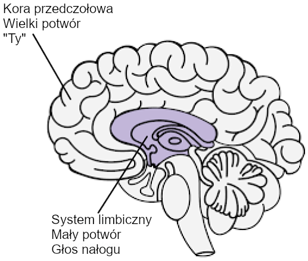

# Zasoby {-}

[Medytacje dla uzależnionych od porno](https://easypeasymethod.org/resources/meditations.pdf) - Guillaco

[EasyPeasy Lista kontrolna Oświadczeń](https://pastebin.com/dybv6qkD) - SWATxKATS

[9 Minutowa Medytacja](https://www.youtube.com/watch?v=tw7XBKhZJh4) - Sam Harris

[Kurs Medytacji Waking Up](https://wakingup.com) - Sam Harris

[Wyjście z nowoczesności](https://meta-nomad.net/exiting-modernity) - Meta Nomad

[List, który wysyłam do szkół](https://easypeasymethod.org/resources/principal.pdf)

[Wolność na zawsze (PMO Hacknotatki)](https://sites.google.com/view/freeforever/home)

[Dlaczego nawracasz - u/Different_Guide_5205](https://old.reddit.com/r/pmohackbook/comments/mynwjl/why_youre_relapsing/)

[Przeciwdziałanie stachu - u/Different_Guide_5205](https://old.reddit.com/r/pmohackbook/comments/n5027n/countering_fear/)

## Oświadczenia radzenia sobie REBT (ang. Racjonalna terapia zachowań emocjonalnych) {-}

- *"Mogę przestać PMO, nawet jeśli wydaje się to 'trudne'. To nie jest zbyt trudne i bez względu na to, jak wiele trudu to wymaga, warto to zrobić!"*.

- *"Jeśli będę ignorować i nigdy nie poddam się moim silnym popędom do PMO, sprawię, że coraz łatwiej będzie mi się im oprzeć "*.

- *"Mogę w pełni i bezwarunkowo zaakceptować siebie - tak, nawet ze wszystkimi moimi wadami i niedoskonałościami "*

- "PMO wydaje się szybko 'leczyć' moje problemy, ale tak naprawdę je pogarsza."

- *"Czasami bardzo chciałbym utopić swoje problemy w PMO, ale to nigdy nie jest powód, aby to zrobić. "*

- *"Najbardziej niekomfortowo jest, gdy nie dostaję tego, czego naprawdę chcę. Ale to nie jest straszne ani okropne, dopóki nie zdecyduję się uwierzyć, że tak jest, a ja zdecyduję się uwierzyć w coś bardziej realistycznego i pomocnego. "* *.

- *"Nigdy nie polubię niesprawiedliwego traktowania, ale cholernie dobrze mogę je znieść i być może spisek i schemat, aby je zatrzymać. "*

- *"Nieważne ile razy zawiodę w tym ważnym dążeniu, moja porażka nigdy nie czyni mnie niekompetentną wesz. To tylko czyni mnie osobą, która mogła zachować się niekompetentnie w tym czasie "*

- *"Nie potrzebuję absolutnie tego, czego chcę, ale mogę być nadal w miarę szczęśliwy, choć nie tak szczęśliwy, jak wtedy, gdy tego nie dostanę. "*

- *"Zdecydowanie wolę być wybitny w swojej pracy, ale nie muszę. Szkoda, jeśli nie jestem, ale to nie czyni mnie gorszym. Mogę zawsze próbować robić lepiej, nie musząc robić lepiej. "*

- *"Wiele rzeczy może przyczynić się do tego, że będę smutny i rozczarowany, ale kiedy żądam i rozkazuję, że te rzeczy nie mogą istnieć, to wtedy robię się spanikowany, przygnębiony i rozwścieczony. "*

- *"Tak, często nie udało mi się zrobić tego, co obiecałem, że zrobię, ale to nie znaczy, że nie mogę lub nie chcę zrealizować tej obietnicy "*

- *"Nienawidzę jak cholera bycia niespokojnym i przygnębionym, ale nie muszę natychmiast rozpuszczać tych uczuć za pomocą PMO. Podczas PMOowania chwilowo czuję się lepiej z moimi problemami, ale nie staję się lepszy. Na dłuższą metę PMO je pogarsza "*.

- *"Ludzie mnie nie oburzają, traktując mnie źle. Ja, jak świnia, decyduję się oburzać na ich złe traktowanie, żądając i nakazując, by zachowywali się lepiej. "*

## Połączenie EasyPeasy z wciągającą techniką rozpoznawania głosu Jacka Trimpeya (AVRT) {-}

*Uznanie dla az#8773 na Discordzie*

To jest dla osób, które zmagają się ze stosowaniem metody Easyway Allena Carra, aby wyjść z uzależnienia, pomimo usunięcia prania mózgu. Zamierzam założyć, że każdy, kto to czyta, przeczytał którąkolwiek z książek Allena Carra i zrozumiał jego metodę Easyway (zwaną jako Easypeasy). Jeśli nie, gorąco polecam to zrobić. Pomocne byłoby również przeczytanie "Racjonalnego odzyskiwania" Jacka Trimpeya. Jeśli nie czytałeś, to nie ma problemu, ponieważ zamierzam pokryć podstawy tego tutaj, ale polecam przeczytanie go tak czy inaczej, ponieważ będzie on wchodził w znacznie więcej szczegółów niż ja. To nie będzie skierowane do jednego konkretnego uzależnienia i dlatego będzie miało zastosowanie do każdego uzależnienia. Celem tego pisania jest porównanie Easyway z inną skuteczną metodą uzależnień zwaną "Techniką Rozpoznawania Głosu Uzależniającego" (AVRT) i połączenie tych dwóch. Chociaż wierzę, że Easyway jest lepszy od wszystkich innych metod odzyskiwania uzależnień zdecydowanie, wierzę, że zrozumienie AVRT zbyt może być brakującym ogniwem dla tak wielu, którzy nie udaje się przy użyciu Easyway mimo zabicia wielkiego potwora.

Istnieje wiele konkurencyjnych metod pokonywania uzależnienia, każda z nich ma różne wskaźniki sukcesu. Nie zamierzam wspominać o żadnej z nich, ponieważ większość z nich to strata czasu, a ja chcę zachować to tak krótko, jak to możliwe. Jedyne metody, o których napiszę, to Easyway Allena Carra i AVRT Jacka Trimpeya (założyciela Rational Recovery). Obie metody mają niezwykle wysokie wskaźniki sukcesu, ale każda z nich celuje w co innego. Easyway i AVRT są podobne w tym, że Easyway dzieli uzależnienie na "Małego potwora" i "Wielkiego potwora", a AVRT dzieli twój umysł na "Głos uzależnienia" (tak zwaną bestię) i "Ciebie". Głos uzależnienia i mały potwór to ta sama rzecz, a duży potwór (tak zwane pranie mózgu) to system przekonań, który sprawia, że myślisz, że twoje uzależnienie daje ci jakąś korzyść lub kulę. Easyway skupia się na wyeliminowaniu dużego potwora, nie zwracając uwagi na małego, natomiast AVRT skupia się na małym potworze, nie zwracając uwagi na dużego. Podczas gdy Easyway niszczy psychologiczne uzależnienie, AVRT uczy cię rozpoznawać fizyczne uzależnienie maskujące cię i oddzielać się od niego. Uważam za interesujące, że zarówno Easyway jak i AVRT mają bardzo wysokie wskaźniki sukcesu, mimo że skupiają się na przeciwnych rzeczach.

Chociaż uważam, że Easyway jest lepsze od wszystkich innych metod odzyskiwania uzależnień przez daleko, i podczas gdy polecam go ponad wszystko inne, mogę wybrać dwa małe dziury w nim. Po pierwsze uważam, że nie docenia ona małego potwora. Chcę uniknąć używania osobistych anegdot w tym piśmie, ale z moich doświadczeń i doświadczeń innych osób wynika, że niektórzy z nas nie radzą sobie z Easyway nie dlatego, że nie udało nam się całkowicie wyeliminować dużego potwora (chociaż to może się zdarzyć i zdarza), ale dlatego, że nie doceniliśmy małego potwora. Mały potwór nie jest problemem dla większości ludzi, co wyjaśnia wysoki wskaźnik sukcesu Easyway, ale dla innych, w tym mnie, może być. Druga dziura polega na tym, że Easyway twierdzi, że wszystkie porażki są wynikiem albo nieprzestrzegania instrukcji, albo nieusunięcia dużego potwora.

Podstawowym sednem Easyway jest to. Uzależnienie ma dwa składniki, fizyczne uzależnienie od dopaminy i psychologiczne uzależnienie złożone z przekonań (pranie mózgu), że twoje uzależnienie daje ci jakąś przyjemność lub podporę. Są one nazywane odpowiednio małym i dużym potworem. Według Easyway, mały potwór to nic innego jak puste, nieco niepewne uczucie, które jest ledwo wyczuwalne. Kiedy już zabijesz dużego potwora poprzez cofnięcie prania mózgu, ucząc się, że twój nałóg nie ma żadnych korzyści i że każda postrzegana przyjemność lub kula jest tylko iluzją, a co równie ważne, że nie ma się czego obawiać w życiu bez nałogu, pragnienia znikają. Zachcianki wynikają ze strachu, że życie bez twojej małej kuli byłoby nie do zniesienia, co powoduje, że wątpisz w rzucenie palenia, co jest zachcianką. Przezwyciężasz ten strach, uświadamiając sobie, o ile przyjemniejsze będzie twoje życie bez nałogu, i utrzymujesz to uczucie uniesienia.

Chociaż uważam, że jest to najlepsza metoda na wyleczenie się z uzależnienia, nie kładzie ona nacisku na małego potwora, ponieważ w teorii, gdy duży potwór zostanie załatwiony, bezsilny mały potwór po prostu zwiędnie i umrze na własną rękę, a to jest prawie niezauważalne, więc kogo to obchodzi. Mały potwór może być nieistotny dla wielu ludzi, ale z moich i innych doświadczeń wynika, że nie zawsze tak jest. Kiedy ludzie zawodzą z Easyway, według Easyway, są tylko dwa możliwe powody, albo nie postępowałeś prawidłowo i zgodnie z instrukcjami, albo nie udało ci się usunąć dużego potwora. Uważam, że jest to szkodliwe i wyjaśnię dlaczego później.

Technika Rozpoznawania Głosu Uzależniającego (AVRT) dzieli mózg na dwie części, niższy mózg (układ limbiczny), gdzie rezyduje twoje uzależnienie i wyższy mózg (kora przedczołowa), gdzie rezydujesz ty (lub przynajmniej twoje myśli i ego). Jack Trimpey odnosi się do uzależniającego głosu jako bestii, ponieważ rezyduje on w zwierzęcej części naszego mózgu i wie tylko jedno: "CHCĘ TO I CHCĘ TO TERAZ". Ja osobiście nie uważam za pomocne personifikowanie go jako bestii, ale przypuszczam, że jest to lepsze niż przekonanie, że to ty. Głos nałogu (AV, mały potwór) przejmie twój głos w głowie i użyje go przeciwko tobie, żebyś oddał się swojemu nałogowi. Musi to robić, ponieważ sam nie może kontrolować swoich funkcji motorycznych. Możesz spróbować tego teraz, podnieś rękę przed twarzą i poruszaj palcami. Teraz poproś swoje uzależnienie, żeby zrobiło to samo. Nie może. Oznacza to, że ostatecznie to ty masz tu kontrolę.

AV nie tylko porywa twój umysł-głos, ale także podstępnie ukrywa się za zaimkiem "ja". Mówi: "Naprawdę przydałby mi się teraz X", "Na pewno tęsknię za robieniem X", "Czy nie byłoby miło zrobić X właśnie teraz, przecież zasługuję na to po dzisiejszym dniu". AVRT podkreśla fakt, że nie jesteś swoim uzależniającym głosem, tylko myślisz, że nim jesteś. Kiedy rozpoznasz AV jako "nie ty" i powiesz mu "nie", porzuca on "ja" i zaczyna używać "ty", "my" lub "my". Jest to dowód na to, że to nie ty.

Kiedy mówisz "Nie" swojemu AV, dzieje się tak:
"Mógłbym naprawdę zrobić z X właśnie teraz" staje się "Oj daj spokój, mógłbyś naprawdę zrobić z X właśnie teraz i wiesz o tym". "Na pewno tęsknię za robieniem X" staje się "O daj spokój, zdecydowanie tęsknisz za robieniem X, nie czujesz tego?". "Czy nie byłoby miło zrobić X właśnie teraz, przecież zasługuję na to po dzisiejszym dniu" staje się "Zasługujemy na X właśnie teraz po tym wszystkim, co przeszliśmy, jak mogłeś nam tego odmówić?".

W tym momencie muszę coś wyjaśnić. To nie jest "przeciąganie liny", o którym mówi Allen Carr. "Przeciąganie liny" to dysonans poznawczy, czyli sytuacja, w której masz dwa lub więcej sprzecznych systemów przekonań i jest wynikiem niezabicia wielkiego potwora. "Naprawdę nie chcę robić X ze względu na ten negatywny efekt, który mi daje, ale jednocześnie sprawia, że jestem X, więc chcę to robić". To jest holowanie wojny i jest robieniem wielkiego potwora. Kiedy duży potwór zostanie zabity poprzez usunięcie prania mózgu, jedyne głosy nakazujące ci zaangażowanie się w twój nałóg będą pochodziły od małego potwora (AV). Ponieważ AV używa zaimka "ja", możliwe jest pomylenie AV z wielkim potworem.

Ważne jest również, aby zaznaczyć, że AV jest ogromnym kłamcą. Jego jedynym zmartwieniem jest uzyskanie dopaminy za wszelką cenę. Twój AV będzie próbował przekonać cię do postawienia się w potencjalnie śmiertelnych sytuacjach, jeśli będzie to oznaczało uzyskanie poprawki.

Wcześniej powiedziałem "Kiedy ludzie zawodzą z Easyway, według Easyway, są tylko dwa możliwe powody, albo nie postępowałeś zgodnie z instrukcjami prawidłowo, albo nie udało ci się usunąć wielkiego potwora. Wierzę, że jest to szkodliwe i wyjaśnię później dlaczego." Uważam, że jest to szkodliwe, ponieważ nierozpoznanie AV doprowadziło mnie i innych, którzy użyli Easyway do fałszywego przekonania, że nie zabiliśmy w pełni wielkiego potwora, więc ponownie czytamy książkę, aby spróbować ponownie zabić pranie mózgu, mimo że już to zrobiliśmy. Nierozpoznanie AV w połączeniu z przekonaniem, że "jeśli nie udało ci się z Easyway, to znaczy, że nie udało ci się zabić wielkiego potwora" spowoduje, że ponownie skupisz swoje wysiłki na wielkim potworze, podczas gdy został on już pokonany. Możesz skończyć w cyklu ponownego czytania książek Allena Carra, wytrzymując jakiś czas, a następnie powracając do niego w kółko.

Kiedy AV mówi coś w stylu "Chcę teraz zrobić X, bo to sprawia, że jestem X", jeśli cofnąłeś pranie mózgu i usunąłeś wielkiego potwora, możesz pomyśleć "Ale wiem, że to nie jest prawda, więc dlaczego wciąż wierzę, że tak jest? Czy nie udało mi się całkowicie cofnąć prania mózgu". Prawda jest taka, że usunąłeś pranie mózgu, czego dowodem jest fakt, że wiesz lepiej niż to, co mówi ci twój AV, po prostu myślisz, że AV to ty, ponieważ użył zaimka "ja". Rozpoznanie AV i zmuszenie go do ujawnienia się poprzez porzucenie "ja" na rzecz "ty", "my" lub "nas" powinno utwierdzić cię w przekonaniu, że to nie jest wielki potwór, tylko mały potwór. Gdyby rzeczywiście był to duży potwór, nie zastąpiłby "ja" dla "ty", "my" lub "nas".

Teraz, kiedy AV mówi "Proszę, czy możemy po prostu zrobić X jeszcze raz dla starych czasów, tylko jeszcze raz?", a ty mówisz "Nie", możesz czuć emocjonalną reakcję. Możesz poczuć strach lub smutek. Niezwykle ważne jest uświadomienie sobie, że to uczucie nie pochodzi od ciebie, tylko od niego. Jeśli nie jesteś w stanie rozpoznać AV, będziesz myśleć, że ta emocja pochodzi od ciebie i będziesz bardziej skłonny do poddania się. Rozpoznaj AV i fakt, że emocje z niego pochodzące nie pochodzą od ciebie, a następnie poczuj radość z tego powodu.

Kiedy połączysz obie te metody (w razie potrzeby, nie wszyscy ludzie wydają się mieć problem z tym małym potworem) i utrzymasz uczucie radości i uniesienia za każdym razem, gdy rozpoznasz AV, sukces jest twój.

