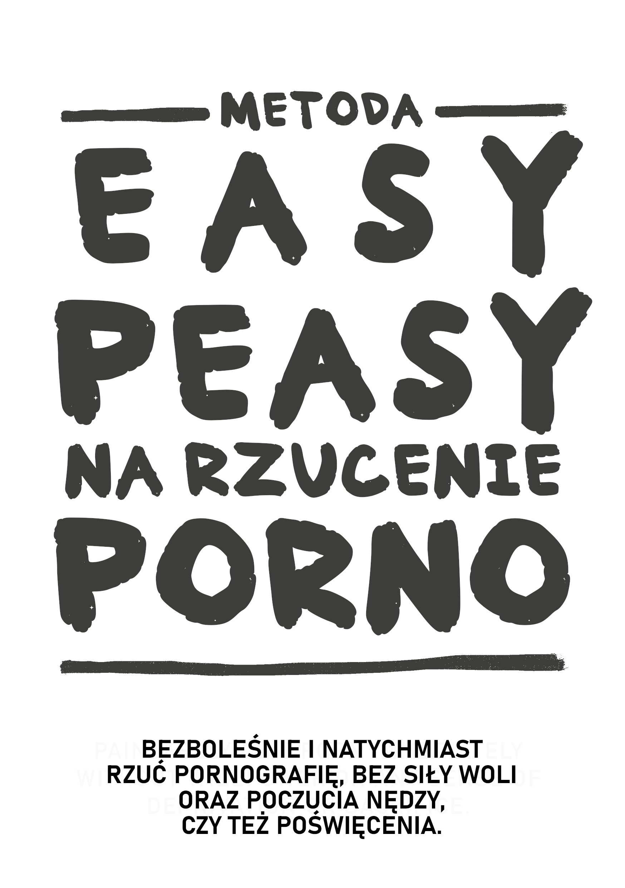

# Wstęp

- ([The English version here](../index.html))

{width=45% height=45%}

[Audiobook po Angielsku](https://www.youtube.com/watch?v=ZktxO6adTnI) ([MP3 ](https://1drv.ms/u/s!AnXDgZXI9WE5j9YGojB-crpKNyGeDw?e=aXyUrd))

NIE PRZESKAKUJ ROZDZIAŁÓW

Ta książka typu "Open source" natychmiast pozwoli ci na zaprzestanie oglądania pornografii, bezboleśnie i na stałe bez siły woli oraz poczucia nędzy, czy też poświęcenia. Nie wprowadzi żadnego osądu, wstydu oraz presji, aby poddać cię bolesnym środkom.

W rzeczywistości, nie ma absolutnie żadnej potrzeby na odcinanie lub zmniejszenia użycia w trakcie czytania; robienie tego jest wprawdzie szkodliwe.

Mógłbyś być pełen obaw o samej myśli, albo jednym z [millionów](https://old.reddit.com/r/nofap) [aktywnie](https://old.reddit.com/r/pornfree) [próbujących](https://rebootnation.org) to [rzucić](https://yourbrainrebalanced.com). Jeśli tak, chyba to co wcześniej czytałeś idzie przeciwko wszystkiemu co ci było mówione, ale spytaj siebie,czy to co ci powiedziano zadziałało? Jak tak, w ogóle nie czytałbyś tej książki

Zapewne utożsamiasz się z podanymi pytaniami:

-   Czy spędzasz zbyt wiele czasu oglądając pornografię niż wcześniej planowałeś?

-   Masz nieskuteczne wysiłki do zaprzestania lub ograniczenia konsumpcji pornografii?

-   Czy czas spędzony na pornografii konfliktował, lub przejął pierwszeństwo nad osobistymi lub zawodowymi zobowiązaniami, zainteresowaniami, nawet związkiem w twoim życiu?

-   Czy silisz się, aby ukryć swoją konsumpcję pornografii (np. usuwanie historii wyszukiwania, kłamanie o oglądaniu prono)?

-   Czy oglądanie pornografii stało się przyczyną znacznych problemów w intymnym(ch) związku(ach)?

-   Czy doświadczyłeś cykl podniecenia i przyjemności przed i w trakcie konsumpcji pornografii,z następującymi odczuciami wstydu, wyrzutów sumienia oraz żalu po obejrzeniu?

-   Czy spędzasz znaczny czas na myśleniu o pornografii, nawet bez oglądania jej?

-   Czy oglądanie pornografii spowodowało inne negatywne konsekwencje w osobistym lub zawodowym życiu (np. Nie przyjście do pracy, kiepskie wyniki, odrzucanie związku, problemy finansowe)?

Jeśli jesteś użytkownikiem porno, który jest od niej zależny dla masturbacji albo dla seksu *zupełnie* i *z jakiegoś powodu*, jedyne co musisz robić to czytać dalej.
Jeżeli jesteś to dla bliskiej ci osoby, jedyne co musisz robić to namówić ich do przeczytania.
Jeśli nie jesteś w stanie ich przekonać, samemu przeczytaj tą książkę. Zrozumienie metody wspomoże w przekazaniu wiadomości i powstrzymaniu swoich dzieci od zaczęcia. Nie daj się nabrać na fakt,że teraz nie mają dostępu to tego  -- Zrób wszystko zanim się uzależni.

## O książce {-}

Ta książka to przepisana wersja [przepisanej książki](https://sites.google.com/site/hackbookeasypeasy
) *Allen Carr's EasyWay to Smoking* dla pornografii. Jest darmowa and otwartoźródłowa and licencjonowana pod CC-BY-SA. Jej sukces zależy od założenia że:

NIE PRZESKOCZYSZ ROZDZIAŁÓW

Otwierając kłódkę, musisz wprowadzić liczby w odpowiedni układ. Z uzależnieniem jest to samo.

Osobiście, [originalna wersja Google Sites](https://sites.google.com/site/hackbookeasypeasy) (nie napisana przeze mnie) zmieniła moje życie. Jeśli jesteś taki sam jak większość, odkryłeś pornografię w dość młodym wieku i odtąd z niej korzystałem. Dopóki nie potykając się na przytłaczającą -- jeszcze jakoś sprawdzona -- literaturę ostrzegającą o zagrożeniach. Jak ja sam, prawdopodobnie udało ci się z streak-ami różnej długości czasowej, ale zawsze w końcu uległeś złudnym potrzebom. Z przyjemnością ogłoszę, że ta metoda działa zupełnie inaczej i to, że była jedyną metodą która zadziałała.

Albo to, że strona zainteresowana dała link to tej książki i jesteś sceptyczny. Na początek, dziękuję ci, że chociaż zerknąłeś na nią. Za chwilę rozszerzę ten temat, ale proszę o chwilowe przypomnienie pierwszego razu,  w którym oglądałeś pornografię. Spodziewałeś się, że będziesz wracał do niej do końca życia? Według osobistych i nieformalnych badań na ten temat (dręczenie do przeczytania jej), metoda EasyPeasy jest równie efektywne dla zwyczajnych użytkowników porno, jak dla ciężko uzależnionych. Nie jest strasznie długie, z wysoką szansą wielkich  korzyści, zatem błagam do dalszego czytania.

Metoda opisana hackbook-u jest:

-   Natychmiastowa.

-   Równie efektywna dla intensywnych i zwyczajnych użytkowników.

-   Nie powoduje żadnych złych napadów odstawiennych.

-   Nie potrzebuje żadnej siły woli.

-   Nie wymaga terapii szokowej, aids, czy sztuczek.

-   Nie wywoła zamiany tego uzależnienia na inne, takich jak objadanie się, palenie czy picie.

-   Trwały.

Znajdziesz to niemożliwe do uwierzenia, jednakże ten sentyment jest powtarzany przez wiele ludzi.

> *"To jest przełomowa praca na temat uzależnienia od pornografii"*
>
> --- Jakiś gość na Reddicie, którego nie mogę znaleźć. Nie myśl sobie,że sarkazm był celowy.

> "*Byłem uzależniony od 10 lat. Przez te 10 lat byłem sparaliżowany depresją, zwątpieniem, niepokojem i strachem przed wydostanie się mojego sekretu. Po każdej sesji, znienawidziłem się, a po każdej porno-diecie, wracałem od razu do wodnej zjeżdżalni. Jednakże ta książka pomogła mi zaprzestać. W przeszłości, zawsze stałem w obronie pornografii w przeszłości. Teraz, po przeczytaniu tej książki dwa razy, staję w ofensywie. Porno nie ma nade mną kontroli i teraz odczuwam to jak kiepski żart.*"
>
> --- u/DeepNewt

> "*Kilka dni temu, skończyłem 20 lat. Po raz pierwszy od długiego czasu, spędziłem moje urodziny wolny od porno pułapki, i to dzięki tej książce, na którą przypadkowo natknąłem kilka miesięcy temu. Przed tym, spędziłem tyle czasu próbując rzucić przez tradycyjne środki,i doświadczyłem tyle wewnętrznego zamieszania i na stałe oznaczyłem się jako uzależniony. Książka rozwiązała to wszystko za mnie. Kiedy wcześniej bałem się, że nie miałem kontroli na sobą nawet kiedy bez wiedzy dawno pokonałem tego potworka, mogę poczuć się dumny w uświadomieniu sobie, że nie muszę już być uzależniony.*
>
> *Nie mam naprawde powodu na postowanie tego, po prostu poczułem, że musiałem to umieścić gdzieś indziej niż w mojej głowie, bo because to znaczy wiele dla mnie. Jeśli to czytasz i myślisz o czytaniu lub poleceniu książki, uwierz mi, że działa lepiej niż inne dostępne metody. Moją najlepszą wskazówką to zapisywanie notatek, co brzmi zabawnie, ale naprawde pomogło mi umocnić pewne idee.*"
>
> --- u/Suspicious_Web_4594

> "*based*"
>
> --- anon, /fit/

## Ostrzeżenie

Jeśli spodziewasz się, że ta książka ’przestraszy’ cię do rzucenia, używając różnorodnych problemów zdrowotnych, na które użytkownicy są pod ryzykiem. Takich jak zaburzenie seksualne (włączając wywołane pornografią zaburzenie erekcji), niepewne podniecenie, utrata zainteresowania w prawdziwych partnerów seksualnych, hipofrontalność mózgu oraz oślepiające oskarżenie, że to jest brzydki, obrzydliwy nawyk i to, że *ty* jesteś głupią, tchórzliwą, meduzą ze słabą wolą, będziesz srodze rozczarowany. Te taktyki nigdy nie pomogły mi rzucić, a jakby miałyby pomóc tobie, już rzuciłbyś to.

Konwencjonalne metody rzucenia propagują użycie siły woli, albo 'diety na pornografię', zastępcze metody jak 'używanie co *n-ty* dzień' oraz odcięcie konsumpcji. Niektóre strony wymieniają recenzowane badania o neuroprzekaźnikach and neuroplastyczności, podczas gdy te strony są informacyjne, wielu jest świadomych ryzyk zdrowotnych i wybierają nicnierobienie, chociaż to, że te materiały są zazwyczaj unikane. Koniec końców, one są tak samo nieefektywne, bo właściwie nie usuwają powodów używania pornoli. Koniec końców, zamienienie czegoś w zakazany owoc to nie jest sposób na leczenie uzależnień.

Ta metoda, określona jako EasyPeasy, działa inaczej. Część rzeczy, które zostaną wypowiedziane mogą być trudne do uwierzenia, ale w czasie gdy przeczytasz całą książkę,nie tylko uwierzysz, będziesz też się zastanawiał jak mogłeś wyprać swój mózg do wierzenia w co innego.

Są tu powszechne mity, że wybieramy oglądanie porno. Porno nałogowcy (tak, nałogowcy) nie wybierają porno bardziej niż alkoholicy wybiera, aby być alkoholikami, tak samo jak narkomani nie wybierają bycie narkomanami. To prawda, że wybieramy włączenie laptopa czy smartfona, włączenie przeglądarki i odwiedzić nasz ulubiony "online harem". Occasionally I choose to go to the cinema, but I certainly didn't choose to spend my whole life in the cinema theatre. Dawniej, ciekawość i ludzka natura mnie tam zabrały, ale nie zacząłbym, jakbym wiedział,że uzależniłbym się, powodując spadek mojego zdrowia, szczęścia oraz związków. *"Jakbym wcześniej usłyszał o zaburzeniu seksualnym na moim pierwszym wejściu na stronę porno !"*

Daj sobie chwilę na zastanowienie. Czy kiedykolwiek podjąłeś ’pozytywną’ decyzję, że musisz/potrzebujesz porno do masturbacji ? Albo to, że powinieneś/musisz/potrzebujesz wywołane pornografią fantazje, aby urozmaicić seks ze swoim/-ją partnerem/-ką? Albo to ,że w niektórych okresach swojego życia, nie mogłeś nacieszyć się dobrym snem lub nawet przejść ten wieczór po ciężkim dniu pracy bez surfowania na porno? Albo to, że nie mógłbyś się skoncentrować lub znieść stres bez niej? W jakim etapie zdecydowałeś, że *potrzebujesz* porno, że *potrzebowałeś* na stałe w swoim życiu, z poczuciem niepewności ze sobą, nawet ogarnięty strachem bez porno, bez swojego online haremu?

Jak każdy użytkownik porno, zostałeś zwabiony na najbardziej złowrogą i subtelną pułapkę, taką że człowiek i natura nie połączyli się, by to wymyślić. Nie istnieje żadna żyjąca osoba, czy to użytkownik czy nie, która lubi myśli o swoich dzieciach korzystających z porno, po to aby sobie radzić z czymś lub dla przyjemności. To oznacza, że wszyscy uzależnieni życzyliby sobie, żeby nigdy nie zaczęli. To nie zaskakuje: nikt nie potrzebuje porno do cieszenia się życiem lub do radzenia sobie ze stresem zanim się uzależnili.

W tym samym czasie, wszyscy użytkownicy chcą dalej używać. Przecież nikt nie zmusza nas do odpalenia naszej przeglądarki w tryb incognito. Czy rozumiemy powód czy nie, tylko użytkownicy decydują się na zapukanie do drzwi swoich online haremów.

Jakby istniał magiczny przycisk, który użytkownik mógłby nacisnąć, aby obudzić się następnego ranka, jakby nigdy nie weszli na ich pierwszą stronę, jedynymi uzależnionymi byliby "eksperymentujący" młodzi ludzie.

Jedyne co nas powstrzymuje od rzucenia to **STRACH!** Strach spowodowany przekonaniem, że musimy przetrwać nieokreślony czas nędzy, deprywacji i niezaspokojonych pragnień, dążąc do bycia wolnym od porno. One powstają z nieracjonalnych przekonań, nauczonych i nabytych, takich jak:

-   Masturbacja lub seks prowadzący do orgazmu jest *jedyną* i *najważniejszą* rzeczą w życiu.

-   Porno jest ’bezpieczniejsze’ od prawdziwego seksu, ponieważ porno nie może mnie odrzucić.

-   Porno jest kształcące i użyteczne.

-   Uprawnienie do ’lepszego’ doświadczenia seksualnego.

-   Więcej to zawsze lepiej.

These irrational beliefs spawn irrational consequences when acted upon, including:

-   Czczenie and posiadanie obsesji, kiedy zostanie znaleziona ’perfekcyjna 10/10’.

-   Postrzeganie siebie jako przegrywa jeśli przegapisz seks, jak gdyby byłoby najważniejszą rzeczą w ludzkim doznaniu.

-   Wstrzymując się dla perfekcyjnej 10.

-	Bycie nadmiernie osadzającym i krytycznym wobec potencjalnych partnerek.

-	Skupienie się na stosunku, nieważne czy tego chce czy nie.

To strach, że cała noc samemu będzie nieszczęśliwa, spędzona walczeniem z niekontrolowanymi impulsami. Strach, że noc przed egzaminami będzie nocą prosto z piekła bez porno. Strach, że nigdy nie będziemy mogli się skoncentrować, radzić sobie ze stresem, albo to, że nie będziemy pewni siebie bez naszej podpory i że nasza osobistość i charakter się zmienia.

Ale przede wszystkim. Strach, że "raz uzależniony, to zawsze uzależniony", to że nigdy nie będziemy w pełni wolnymi, spędzając resztę swojego życia pragnąc okazjonalny, wywołany pornografią orgasm w dziwnych porach. Jeżeli, jak ja, wcześniej próbowałeś konwencjonalnych sposobów na rzucenie i przeszedłeś przez nędzę i tortury "metody siły woli", nie tylko zostaniesz dotknięty przez strach, będziesz przekonany, że nigdy nie rzucisz.

Jeśli jesteś lękliwy, ogarnięty strachem, albo czujesz, że czas nie jest dobry by rzucić, zapewniam cię, że twoja lękliwość i panika nie jest uwolniona przez porno -- jest przez nią spowodowane. Nie zdecydowałeś się wpaść do pułapki porno, ale jak wszystkie pułapki, są stworzone do zapewnienia, że tam utkniesz. Zapytaj samego siebie, kiedy widziałeś pierwsze zdjęcia i filmy pornograficzne, zdecydowałeś się wrócić do oglądania ich tak długo jak życie ci pozwoli? Zatem kiedy rzucisz? Jutro? Następny rok? Przestań się oszukiwać! Pułapka jest stworzona, aby trzymać cię przez całe życie. Dlaczego myślisz, że inny uzależnieni nie rzucają zanim to ich 'zabije'? 

Odniosłem się do magicznego przycisku; Metoda EasyPeasy działa jak ten magiczny przycisk. Pozwól że na chwilę wyjaśnię, EasyPeasy to nie magia, ale dla mnie i innych, którzy znaleźli w niej łatwe i przyjemne rzucenie porno, zdaje się na to!

Ostrzeżenie brzmi następująco:
To jest sytuacja kurczaka i jajka: każdy uzależniony chce rzucić i każdy uzależniony chce znaleźć rzucenie łatwe i przyjemne. Tylko **strach** powstrzymuje użytkowników od próby rzucenia. Największą korzyścią jest pozbycie się tego strachu, ale nie będziesz wolny od tego, czego się boisz, dopóki nie skończysz tej książki. Wręcz przeciwnie, twój strach może się zwiększy gdy kontynuujesz czytanie, co może powstrzymać cię od skończenia jej. Weźmy przykład od tej kobiety.

***"Właśnie skończyłam czytać EasyPeasy. Wiem, że to były tylko 4 dni, ale czuje się świetnie. Wiem, że nie muszę znów korzystać z porno. Po pierwsze zaczęłam czytać twoją książkę 5 miesięcy wcześniej, dostałam się na połowę i spanikowałam. Wiedziałam, że jak dalej bym czytała, musiałabym przestać. Czy nie zgłupiałem?"***

Nie zdecydowałeś się na wpadnięcie w tę pułapkę, ale żebyś był świadom: nie uciekniesz od niej, gdy nie dokonasz pozytywnej decyzji. Możesz już się rwać na rzucenie, lub być lękliwy na samą myśl,ale tak czy siak, proszę pamiętaj: **NIE MASZ NIC DO STRACENIA!**

Jeśli na końcu książki zdecydujesz, aby dalej oglądać porno dla masturbacji lub seksu, nic cię nie powstrzymuje. Nie musisz nawet odcinać lub zaprzestań używania pornografii w czasie czytania książki i pamiętaj, że nie ma na to terapii szokowej. Przeciwnie, mam tylko dla ciebie dobre wieści. Czy możesz sobie wyobrazić jak Andy Dufresne się poczuł, gdy wreszcie uciekł z więzienia w Shawshank? Tak ja się poczułem, kiedy uciekłem z pułapki porno i tak byli użytkownicy, którzy użyli metody EasyPeasy się poczuli. Pod koniec tej książki, tak się właśnie poczujesz!
Idź zrób to! 

## W końcu... {-}

Każdy może znaleźć łatwy i przyjemny sposób na rzucenie pornografii, włączając ciebie! Jedyne co musisz zrobić, to przeczytać resztę książki z otwartą głową; im więcej zrozumiesz, tym rzucenie będzie łatwiejsze. Nawet jak nie zrozumiesz ani słowa, o ile będziesz przestrzegał instrukcji, będzie to proste. Najważniejsze jest to, że nie będziesz przechodził przez życie snuciem się nad porno lub poczuciem deprywacji i na końcu książki, jedyną zagadką, będzie myślenie dlaczego robiłeś to przez tak długi czas.

Z EasyPeasy, są tylko dwie powody na porażkę.

**Porażka w realizacji instrukcji.**
Niektórzy znajdą w tym coś irytującego, że książka jest tak dogmatyczna w pewnych rekomendacjach, takich jak niepróbowanie zmniejszenia lub nieużywania substytutów. Z pewnością nie przeczę, że jest wiele ludzi, którym się udało z zaprzestaniu używaniu takich sztuczek, ale udało się im *pomimo*, a nie dzięki nim. Część ludzi mogą się kochać stojąc na hamaku, ale to nie jest najłatwiejszy sposób. Cyfry do otworzenia kłódki tej pułapki są w tej książce, ale muszą być użyte w odpowiedniej kolejności: przejście z jednego rozdziału na kolejny i nie pomijanie ich. 

**Porażka w zrozumieniu.**
Nie bierz wszystkiego za oczywiste, kwestionuj nie tylko co ci mówiono, ale też swoje własne poglądy oraz to co ci społeczeństwo powiedziało o seksie ,internetowym porno i o uzależnieniach. Na przykład, ci którzy wierzą, że to tylko nawyk, zapytaj się dlaczego inne nawyki -- które część z nich są przyjemne -- są łatwe do przerwania, kiedy nawyk po którym czujemy się źle, pochłania, czas i męskość jest takie trudne do przerwania. Ci którzy wierzą, że lubisz porno, zapytaj się dlaczego inne rzeczy, które są nieskończenie bardziej przyjemne możesz skorzystać lub odrzucić. Dlaczego *musisz* mieć pornografię, a panika się pojawia jak nie masz jej?

EasyPeasy jest o przekazaniu ci wiedzy o łatwości i przyjemności z rzucania porno. Jak inne z wielu, jednym z moich największych życiowych triumfów było wydostanie się z porno pułapki. Nie trzeba się czuć przygnębiony, przeciwnie, masz zamiar osiągnąć coś co każdy użytkownik na tej planecie chciałby osiągnąć: **WOLNOŚĆ!**

**PAMIĘTAJ, NIE PRZESKAKUJ ROZDZIAŁÓW.**

Kilka terminów zanim zaczniesz:
***PMO***: Cykl pornografii, masturbacji i orgazmu.
***Online harem***: Strony prowadzące szybko internetową pornografię.

## Wskazówki dla czytania, i ostatnie małe notatki 

**Nie tej książki jak normalnej**, jest bardzo krótka i powinieneś ją skończyć w kilka godzin. Większość ludzi bierze korzyść z *zaznaczania lub zapisywania notatek* i zazwyczaj rekomendowane **ponowne czytanie** kilka razy, aby w pełni w utrwalić te lekcje.

Dlaczego hackksiążka? Ponieważ Allen Carr dawno odszedł i instrukcje które uformował nie wliczają internetowej pornografii jako jedną z uzależnień, na które dostarczają leczenie. Nie zarabiam pieniężnie ani inaczej.

Przez całą książkę, ja sam, oryginalny Hackautor oraz Allen Carr będą się pojawiać transparentnie w celu przekazania ci wyjątkową i istotną metodę, żeby łatwo i bezboleśnie rzucić.

**Hackksiążka:** Książka na podstawie i zhakowana z innej książki. Oryginalny autor jest w pełni uznany. 

Liczba społeczeństw istnieje także dla tej hackksiążki, ale rekomendowałbym sprawdzenie ich dopiero po skończeniu czytania tej książki.

[urbit](https://urbit.org) - ~mislyr-midnyt/coomer (Teraz naprawde działa!! najlepsza możliwa metoda kontaktu, użyj jej prosz) | [archiwa coomer memów](https://coomer.org) | [analytics](https://plausible.io/easypeasymethod.org) | [matrix](https://matrix.to/#/!xmJZznbJXuwzEGSEti:matrix.org?via=matrix.org) | [discord](https://discord.com/invite/bCXEnf9) | [reddit](https://reddit.com/r/pmohackbook) | [formularz opinii](https://forms.gle/p7cTxowaNpKqgi5Z7)

Małe przypomnienie: **NIE PRZESKAKUJ ROZDZIAŁÓW**

Życzę ci powodzenia, ale jak będziesz bliższy nauczenia się, Nie będziesz go potrzebował.

Pozytywne klimaty,

Hackauthor² oraz Chris Miller (tłumacz)

{width=88 height=31}

Ta praca jest pod licencją [Creative Commons Attribution-ShareAlike 4.0 International License](https://creativecommons.org/licenses/by-sa/4.0/). Kod to [GPLv3](https://gitlab.com/snuggy/easypeasy/-/blob/master/LICENSE).
