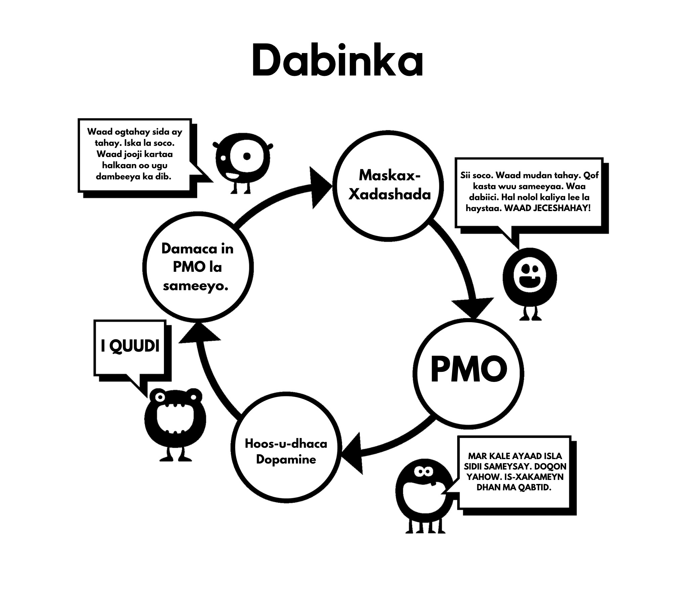

# Maskax-xadashada

Tani waa sababta labaad ee aan u bilowno isticmaalka. Fahamka maskax-xadashadaan waxay si buuxda nooga baahan tahay inaan koowdi baarno saameynta xoogga leh ee kicinta xad-dhaafsan oo aan caadiga ahayn. Maskaxdeena uma diyaarsanayn abuurista ‘harem’ taas oo noo oggolaanaysa in aan shan iyo toban daqiiqo gudaheed ku dhex rogrogno lammaane badan oo suurtagal ah marka loo eego nolosha dhowr awoowayaasheena isku darkood.

Waxaa jiray talooyin badan oo la marin habaabiyay waagi hore, hal tusaale ayaa ah in siigaysashada ay keento indho la'aan. Tani oo xeeladaha cabsiga kale la socoto ayaa si cad u aad badan. Fikradaha khaldan sida kuwaan oo kale waxay ahaayeen kuwo sax ah in cilmigu uu afgembiyo. Laakiin cunuga waxaa lala tuuray biyaha qabeyska; siddii sannadaheena ugu horrayeen, maskaxdeenna miyir-daboolanka ah ayaa lagu soo qulqulay farriimaha iyo sawirada galmada, joornaalada iyo xayeysiisyada oo galmo soo jeedis ku raran yihiin. Muuqaalaha muusiga pop-ka qaarkood aad bay u soo jeedinayaan, laakiin ha rajo-lumin, ciyaar ka dhig si aad u aqoonsato qaybaha ay isticmaalaan si ay dadka ku soo jiitaan — miiyaa qiimaha naxdinta leh, cusubnimada, midabka, cabbirka, taboo-ga, nostalgia-da, iwm. Ciyaarta noocan oo kale ah ayaa xataa la bari karaa dhallinta ka hor oo ay u noqoto hab oo wax lugu baro.

Fariinta dhexaad waa: *"Waxa ugu qiimeysan aduunkaan, fikraday iyo ficilkaygii ugu dambeeyay, waxay noqon doonaan orgasm."* Tan buunbuunin may tahay? U-firso duluc walba oo TV ama filim ah waxaadna arki doontaa isku dhafka dareenka (taabashada, urista, codka) iyo qaybaha faafinta (orgasm-ahaan) ee galmada. Saameynta tani kama diiwaan gashanayso miyirkeena, laakiin miyir-daboolanka ayaa haysta waqti uu ku dhuuqo.

## Sababo Cilmiyeesan

Waxaa jira sumcad si kale: cabsi-gelinta cillada galmada, khasaarada dhiirigalinta, ka doorbidida gabdhaha muuqaalaha porn ee kuwa dhabta ah, mareegta YourBrainOnPorn, iyo bulshooyinka internetka ee kala duwan. Laakiin kooxahaan kama caawiyaan dadka inay isticmaalka joojiyaan. Marka loo eego dhinaca macquulka ah, hababkuwaas waa inay shaqeeyaan, laakiin dhab ahaantii ma shaqeeyaan. Xataa khataraha caafimaadka ee ku liis gareeyeen daraasadaha dib loo eegay mareegta YourBrainOnPorn kuma filna inay joojiyso qof dhalinyar inuusan bilaabin.

Midda qososha leh waa awooda ugu xoogga badan ee wareerkaan uu yahay isticmaalaha naftigiisa. Waa khalad in loo maleeyo in isticmaalayaasha ay yihiin dad oo rabitaan-daciifsan ama inay jir-ahaan u daciif yihiin. Lidkeeda, waa inaad jir-ahaan xoog u yeelato si aad wax uga qabato balwadda ka dib markaad ogaato inay jirto. Waxaa laga yaabaa in dhinaca ugu xanuunka badan ay tahay inay naftooda ku calamayneeyaan dad oo khasaaroyaal ah iyo dad oo si aan loo adkeysan karin u af gaaban.  Waxay u badan tahay inuu saaxiib noqon karo mid oo aad u xiiso badan shaqsi ahaan haddii uusan hoos isku dhigin 'raaxays-raadinta' darteed.

## Dhibaatooyinka Isticmaalka Awood-Rabitaan

Isticmaalayaasha oo isticmaalayaan habka awooda-rabitaanka, waxay eedaan awood-rabitaan la’aantood markaysan jooji karin, iyagoo nabadood iyo farxadood duminayaan. Laakin waa hal shay in laga guul dareysto is-edbinta iyo mid kale in la is-nacaybo. Ka dib oo dhan, ma jiro sharci u baahan inaad kacsi ahaatid waqti kasta galmada ka hor, adigoo si habboon u kacdo oo awood u leh inaad qanciso lammaantaada. Waxaan ka shaqaynayna balwad - caado ma aha. Marnaba lama doodid naftaada si aad u joojiso caado sida ciyaarta golf, laakiin in la sameyo la mid ah balwadda porn waa caadi. Maxaa?

Soo-gaadhista joogtada ah ee kicinta xad-dhaafsan oo aan caadiga ahayn waxay dib u soo habeeysaa maskaxdaada, marka dhisida iska caabinta maskax-xadashadaan ayaa muhiim ah, sida markaad baabuur ka gadanayso iibiye baabuur: si asluub ​​leh ayaad madaxa u luxluxdaa, laakiin hal kelmad oo uu ninka sheegaya ma ka aamintid. Marka ha aaminin inay lagma maarmaan tahay inaad galmo sameyso intii aad awooddo, iyo inay lagma maarmaan tahay in dhammaantood ay noqdaan kuwo oo si gaar u wanaagsan, adigoo porn isticmaalaysa maqnaanshihiisa.

Hana dheelin ciyaarta porn ammaanka; shaydaankaagii yar ayaa ciyaartaas allifay sida uu kugu soo jiito. Porn-ka oo xirfada lahayn maamuul muu shahaado ka soo helay? Mareegaha porn waxay xog ka ururiyaan isticmaalkooda waxayna u isticmaalaan inay daboolaan baahidooda, haddii ay arkaan kor-u-kaca daawashada nooc gaar ah, waxay noocaas diiradda saari doonaan oo ay soo saari doonaan waxayaabahaas sida ugu dhakhshada badan. Ujeedada waxbarashada ama muuqaalaha porn 'ammaan' oo dhedigga suuq-geeyeen yee ku khiyaamin. Bilow inaad is weydiiso: *"Maxaan u samaynayaa? Ma u baahanahay?"*

**Maya! Dabcan uma baahnid!**

Isticmaalayaasha intooda badan waxay ku dhaartaan inay kaliya daawadaan porn oo static ah (sawiradda) ama porn oo jilicsan, iyo inay, sidaas darteed, u fiican yihiin, markay dhab ahaantii xarigga la jiitamayaan, iyagoo awooda-rabitaankooda ku dagaallamayaan inay iska caabiyaan jirrabadooda. Haddii la sameyo marar badan iyo waqti oo aad u dheer, waxay si weyn u yareenaysaa awood-rabitaankooda waxayna bilaabayaan inay ku guul dareystaan mashaariicda kale ee nolosha halkaasi oo awooda-rabitaanka ay qiimo weyn leedahay, sida jimicsiga, cunto caadasha nidaamsan (diet)-ka, iwm. Guul darada aagaggaas waxay ka dhigtaa inay dareemaan darxumeysi iyo dembi, isagoo dib ugu soo tuuraya isticmaalka porn. Haddii tan aysan dhicin, waxay xanaaqooda iyo niyad-jabkooda ku muujineyaan kuwa oo ay jecel yihiin.

Mar haddii aad porn balwad u yeelato, maskax-xadashada way kordhaysaa. Maskaxdaada miyir-daboolanka way ogtahay in shaydaanka yar uu u baahan yahay in la quudiyo, oo markaas wax kasta oo kale ka hor istaago. Waa cabsi ee dadka ka celisa inay joojiyaan, cabsida inay dareemaan maran, dareenka kalsooni la'aanta ah ay helaan markay joojiyaan daadasha dopamine ee maskaxdooda. Maadaama aadan ka warqabin macnaheedu maaha inaysan halkaas joogin. Uma baahnid inaad fahanto in ka badan inta mukulaasha u baahan tahay inay fahanto meesha tubada ay biyaha ka kulushahay: Mukulaasha waxay kaliya ogtahay haddii ay meel gaar ah fariisato, ay dareemayso diirimaadka.

## Dadbanaanta

Dadbanaanta maskaxdeena iyo ku-tiirsanaanta maamulka oo u horseeda maskax-xadashada waa dhibka aasaasiga ee *ka tanaasulida* porn. Barbaarinteena bulshada dhexdeeda, oo lagu xoojiyay maskax-xadashada balwaddeenna ayaa la isku daray maskax-xadashada ugu awooda badan: asxaabta, qaraabada iyo jaalleda. Odhaahda 'ka tanaasulidda' waa tusaale caadi ah oo maskaxda lagu xado, iyadoo tilmaamaysa inuu balwadlaha bixinayo hurid dhab ah. Laakiin runta quruxda badan waa inaysan jirin wax la iska tanaasulo; Taas lidkeeda, waxaad naftaada ka xorayn doontaa cudur xun oo aad gaarayso guulo wanaagsan oo cajiib ah. Waxaan hadda ka bilaabi doonaa in aan meesha ka saarno maskax-xadashadaan, annagoo ka bilaabayna annagoo tixraacaynin 'ka tanaasulidda' laakiin joojinta, jebinta, ama booska runta ah: **ka baxsashada!**

Waxa kaliya oo kowdi nagu qanciya inaan isticmaalno waa in dadka kale ay sameyaan, anagoo dareemayno inaan wax ka maqan nahay. Waxaan aad ugu dadaalnaa inaan la qabatimno, welina ma helin waxay ka maqan yihiin. Mar walba oo aan aragno muuqaal kale waxay noo xaqiijinaysaa inuu wax ku jira, haddii kale dadka ma samayn lahaayeen, ganacsiguna ma noqon lahayn mid oo sidaas u weyn. Xataa markuu balwadda iska saaro, isticmaalihii hore wuxuu dareemaa in wax laga qaatay markay dadka ka hadlayaan jilayaal oo maaweelo kacsi leh, heesaayay, ama xataa jilayaal porn inta lagu jiro xafladaha ama hawlaha bulshada. *"Waa inay wanaagsan yihiin haddii saaxibadayda dhamaantood ay iyaga ka hadlayaan, sax? Ma haystaan sawirro online oo lacag la'aan ah?"* Waxay dareemayaan ammaannimo, waxay qaadan doonaan hal fiirsi caawada iyo ka hor intaysan ogaanin, mar kale ayay ula qabatimeen.

Maskax-xadashada waa mid aad u awood badan, waxaanad u baahan tahay inaad ka digtoonaato saameynteeda. Tiknoolajiyada way sii socodaan inay koraan, mustaqbalkana waxay keeni doonaan mareega iyo hababka gelitaanka ee aad u xawaare badan. Warshadaha porn ayaa malaayiin ku maalgashanaya *virtual reality-ga* si ay u noqoto waxa ugu fiican ee soo socda. Ma naqaano halka oo aan u socono, mana u qalabaysan in aan la tacaalno tignoolajiyada oo hadda socdo ama waxa soo socota.

Waxaan u dhownahay inaan meesha ka saarno maskax-xadashadaan. Ogow inay ahayn kan oo aan isticmaale ahayn kan oo dareemayo in wax laga qaatay, balse waa isticmaalaha kan oo cimrigiisa ka qaadayo: 

-   Caafimaadka

-   Tamarta

-   Maalka

-   Nabadda Maskaxda

-   Kalsoonida

-   Geesinimada

-   Is-ixtiraamka

-   Farxadda

-   Xoriyada

Muxuu ka helayaa hurridkaan oo aadka u weyn? **GABI AHAAN WAXBA**, markii laga reebo dhalanteedka in la isku dayo in uu dib ugu soo laabto xaaladdii nabadda, xasilloonida iyo kalsoonida oo qofka aan isticmaalin mar walba ku raaxaysanayo.

## Xanuunada Ka Noqoshada

Sida hore loo sharaxay, isticmaalayaasha waxay aaminsan yihiin inay porn u isticmaalaan baashaal, nasasho, ama nooc oo waxbarashada ka mid ah. Laakin sababta dhabta ah waa inay iska nafisaan xanuunada ka noqoshada. Maskaxdeena oo miyir-daboolanka ah waxay bilaabataa inay barato in porn iyo siigaysashada waqtiyada qaarkood ay u janjeeraan inay noqdaan kuwo raaxo leh. Markaan si kordhaysa ugu sii qabatimno darooga, inta ka weyn ay baahida in la yareeyo xanuunada ka-noqoshada ay noqonayso iyo inta ka badan uu dabinka qarsoodisan hoos kuu jiidaaya. Habkaan wuxuu u dhacaa si tartiib tartiib ah oo aadan xataa ka warqabin. Isticmaalayaasha da'da yar intooda badan xataa ma ogaadaan inay la qabatimeen ilaa ay isku dayaan inay joojiyaan, iyo xataa markay heerkaas gaaraan, qaar badan ma qirid doonaan.

Tusaale ahaan, u fiirso wada-hadalkaan oo daaweeyaha la yeeshay boqolaal dhallinyaro ah:

>**Daaweeyaha:** "*Waad ogaatay porn inay daroogo tahay iyo in sababta kaliya ee aad weli u isticmaalayso ay tahay inaadan joojin karin.*"
>
>**Bukaanka:** "*Taas waa wax aan jirin! Waan ku raaxaystaa, haddii aanan sidaas ahayn, waan iska joojin lahaayay.*"

>**Daaweeyaha:** "*Waayahay, marka hal toddobaad kaliya lee jooji si aad iigu caddeyso inaad joojin karto haddii aad rabto.*"
>
>**Bukaanka:** "*Waxaas dhan looma baahna, waan ku raaxaystaa. Haddii aan rabi lahaayay inaan joojiyo, mar hore ayaan sameyn lahaayay.*" 
>
>**Daaweeyaha:** "*Hal toddobaad kaliya lee jooji si aad naftaada u caddeyso inaadan qabatimin.*"

>**Bukaanka:** "*Maxaa dan ah? Waan ku raaxaystaa."*

Sida hore loo sheegay, isticmaalayaasha waxay u janjeeraan inay iska yareeyaan xanuunada ka-noqoshadooda ee waqtiyada walbahaarka, caajiska, xogga-saarnaanta ama isku darkood. Cutubyada oo soo socda, waxaan beegsan doonaa dhinacyadaan oo maskax-xadashada.
