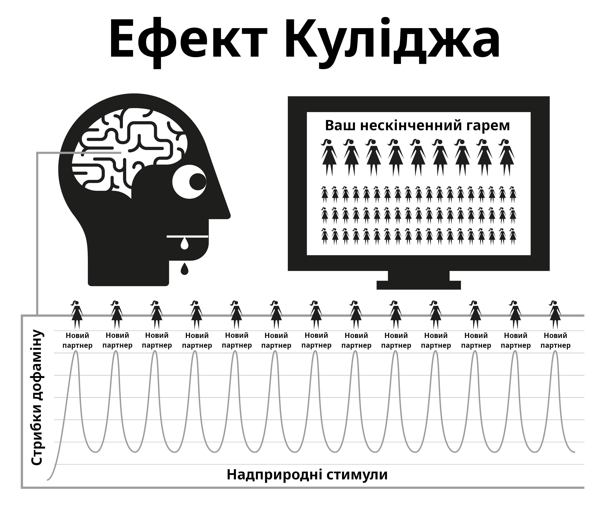

# Природа порно

Інтернет-порно працює шляхом злому природніх механізмів нагороди, які були зроблені для того, щоб ви як можна довше продовжували розмножуватись. Миттєва та доступна форма інтернет-порно змушує механізм нагороди у нашому мозку виробляти дофамін набагато довше, ніж можливо за нормальних умов. У науці це називається ефектом Куліджа, про який ви вже могли чути.

Дофамін — це нейротрансмітер, який повʼязаний з відчуттями бажання, а саме задоволення виробляється опіоїдами. Чим більше дофаміну, тим більше опіоїдів та більше дій. Без дофаміну такі заняття, як прийоми їжі, не є приємними та не виконуються, при чому жирна їжа та їжа з високим вмістом цукру виділяє більше дофаміну.

Дофамін також виділяється у відповідь на новизну. З безмежною кількістю доступної порнографії це переповнює лімбічну систему (центр нагороди), тому коли ви бачите порно вперше — ви дієте, отримуєте оргазм та викликаєте інший приплив опіоїдів. Мозок, який стимульований отримати максимально можливу кількість дофаміну, зберігає це як сценарій, який можна легко згадати, та зміцнює нейронні звʼязки шляхом вивільнення хімічної рідини, яка називається DeltaFosB. Тепер мозок викликає ці звʼязки у відповідь на різні натяки, такі як сексуальна реклама, час на самоті, стрес, або навіть поганий настрій, і раптом ви готові спуститися "водними гірками". Кожного разу коли це трапляється, вивільняється все більше DeltaFosB, щоб змащувати водні гірки і на них було легше спускатися наступного разу.

Лімбічна система має саморегуляторні механізми, щоб обмежити кількість дофамінових та опіоїдних рецепторів коли відбуваються часті та щоденні припливи дофаміну. На жаль, нам також потрібні ці рецептори для того, щоб тримати нас вмотивованими та витримувати щоденні життєві стреси. Номінальна кількість дофаміну, яка вивільняється природніми винагородами, просто не може порівнюватися до порнографії і не так ефективно абсорбується зменшеними рецепторами, що призводить до того, що ви почуваєтеся більш напруженими та дратівливими, ніж зазвичай. Цей процес називається десенситизацією.

У циклі ПМО ви перетнули "червону лінію" та спровокували такі емоції як провину, огиду, сором, тривогу та страх, що в свою чергу ще більше підвищує рівень дофаміну, і змушує мозок плутати ці відчуття із сексуальним збудженням.

З плином часу, ваш мозок десенситизується не тільки до попередніх переглянутих кліпів, але також і до схожих жанрів та рівнів шоку. Ця зменшена мотивація призводить до відчуття зменшеного задоволення, оскільки наш мозок постійно оцінює та підштовхує нас на пошук кліпів, щоб задовольнити свій голод. Тому ви шукаєте більше новизни, натискаєте на більш аматорські та шокуючі кліпи на домашній сторінці, які ви впевнено оминали при вашому першому перегляді.

> *“У росі дрібниць серце знаходить свій ранок і оновлюється."*
>
> --- Халіль Джебран

Швидкоплинне відчуття безпеки — це все, що потрібно для того, щоб пережити важкий момент у житті, але чи ваш десенситизований мозок зможе спіймати ту краплину дестресора, яку може відчувати мозок не-користувача?

Переповнення дофаміном працює як швидкий наркотик, який швидко полегшує синдром відміни. Багато користувачів мають ілюзію, що цей синдром є жахливою травмою, яку вони відчувають, коли намагаються або змушені зупинитися. Насправді це більше психологічна річ, оскільки користувач відчуває позбавлення від свого задоволення чи опори.

## Маленький монстр

Хімічний синдром відміни є настільки непомітним, що більшість користувачів жили та помирали, не знаючи, що вони були залежними. Багато користувачів мають страх від наркотиків, але насправді вони і є наркоманами. На щастя, цей наркотик легко кинути, але спочатку вам потрібно прийняти той факт, що ви справді є залежним. Відмова від порнографії не викликає фізичного болю — це просто пусте неспокійне відчуття ніби чогось не вистачає, тому багато хто вважає, що це повʼязано з сексуальним бажанням. При тривалому існуванні це відчуття перетворюється на нервовість, невпевненість, збудженість, зменшення впевненості та роздратованість. Це як голод за отрутою.

Через декілька секунд після початку сеансу починає поступати дофамін і тяга закінчується, що призводить до відчуття задоволення, коли ви спускаєтесь водними гірками. У перші дні синдром відміни та його подальше полегшення є настільки непомітним, що ми про нього навіть не знаємо. Коли ми стаємо регулярними користувачами, ми думаємо що це через те, що ми почали насолоджуватися або увійшли у "звичку". Правда ж у тому, що ми вже підсіли, але ще не знаємо про це. Маленький монстр вже у нашій голові, тому час від часу ми спускаємось водними гірками для того, щоб погодувати його.

Всі користувачі починають шукати порно з ірраціональних причин. *Єдина* причина чому будь-хто продовжує використовувати порно, неважливо чи це звичайний або важкий користувач, це щоб погодувати цього маленького монстра. Вся ця заплутана загадка являє собою послідовність жорстоких та незрозумілих покарань, але найбільш нещасним аспектом є отримане користувачем почуття насолоди від сеансу, коли він намагається повернутися до відчуття миру, спокою та впевненості, які його тіло мало до того, як він підсів.

## Противний шум

Чи знаєте ви це відчуття, коли ваш сусід увесь день свердлить стіни, і коли він раптово зупиняється, вас охоплюють чудові відчуття миру та спокою? Насправді це не спокій, а закінчення подразника. До того, як почати наш наступний сеанс, наші тіла є повними, але коли ми починаємо змушувати наш мозок качати дофамін і коли ми закінчуємо свою справу і він починає покидати нас, ми відчуваємо синдром відміни. Це не фізичний біль, а лише відчуття порожнечі. Ми навіть не помічаємо його існування, але він як капаючий кран всередині нас.

Наш природній мозок не розуміє цього, але йому і не потрібно. Ми знаємо, що ми хочемо порно, і що коли ми мастурбуємо тяга зникає. Але задоволення мимовільне, тому що для полегшення тяги потрібно більше порно. Як тільки ви отримуєте оргазм, тяга починається знову і пастка продовжує вас тримати. Виходить цикл зворотного звʼязку, якщо ви його не розірвете!

Пастка порно схожа на носіння малих черевиків тільки заради того, щоб отримати задоволення коли їх знімаєш. Існує три основні причини чому користувачі не можуть побачити цього.

1.  З самого народження нас наражали масованому промиванню мізків та казали, що інтернет-порно це просто новітня розробка, яка замінила друковане порно. Ця брехня супроводжується правдою, що мастурбація не є шкідливою, тож чому ми не маємо їм вірити?

2.  Фізичний синдром відміни від дофаміну виливається у порно-сеанс через те, що він не супроводжується болем, а тільки пустим невпевненим відчуттям, яке важко відрізнити від голоду та нормального стресу, оскільки саме в цей час ми шукаємо порно в інтернеті. Ми схильні вважати це відчуття нормальним.

3.  Але головна причина, через яку користувачі не бачать інтернет-порно у його справжньому світлі — це тому що воно працює навпаки. Коли ви *не* споживаєте його, тоді ви страждаєте від відчуття порожнечі. Через те, що процес підсідання на порно є дуже непомітним та поступовим у перші дні, відчуття порожнечі здається нормальним, і тому ми не вважаємо попередній сеанс його причиною. У той момент, коли запускається браузер і ви починаєте свій сеанс, ви отримуєте миттєве піднесення і стаєте менш нервовими або більш розслабленими, тому заслуга за це дається інтернет-порно.

Через цей принцип "навпаки" важко кинути всі наркотики. Уявіть у якій паніці буде героїновий наркоман без героїну, а тепер уявіть його щастя коли він нарешті вставляє голку собі у вену. Люди, які не залежні від героїну, не страждають від цього панічного відчуття.

Героїн не полегшує це відчуття — він його спричиняє. Так само не-користувачі не страждають від пустого відчуття потреби інтернет-порно, або не панікують коли у них немає інтернету. Не-користувачі не можуть зрозуміти як користувачі можуть отримувати задоволення від двовимірних відео без звуку та з абнормальними пропорціями тіла. Зрештою, користувачі не можуть зрозуміти цього також.

Ми говоримо про те, що інтернет-порно є розслабляючим та приємним, але як ви можете бути задоволеними, якщо ви були незадоволені спочатку? Не-користувач не відчуває незадоволеного стану, він є повністю розслабленим після не-сексуального побачення, у той час як користувач не розслабиться поки він не задовольнить свого "маленького монстра".

## Задоволення чи підтримка?

Важливе нагадування: головна причина чому користувачам важко кинути, це через те, що вони думають що вони жертвують справжнім задоволенням або підтримкою. Необхідно зрозуміти, що ви *абсолютно нічим* не жертвуєте. Найкращий спосіб зрозуміти тонкощі порно пастки — це порівняти його з їжею. Звичка регулярних прийомів їжі не дає нам почуватися голодними між ними, а тільки тоді, коли прийом їжі відкладено. У цьому немає фізичного болю, тільки пусте відчуття, яке ми називаємо голодом. Сам процес тамування нашого голоду є дуже приємним.

Порнографія здається такою самою, але насправді це не так. Як і з голодом, у ній немає фізичного болю і механізм нагороди працює майже так само, але ця схожість із їжею змушує користувача вірити, що у порно є справжнє задоволення або підтримка. Хоча їжа та порно виглядають дуже схожими, насправді це повні протилежності.

-   Ви їсте для того, щоб вижити та наповнитись енергією, у той час як порно забирає її.

-   Їжа по-справжньому смачна і процес прийому їжі по-справжньому приємний досвід, яким ми насолоджуємось протягом нашого життя. Порно включає у себе саботаж рецепторів щастя і тому руйнує ваші шанси справлятися з життям та почуватися щасливим.

-   Їжа не створює голоду і по-справжньому полегшує його, у той час як перший порно-сеанс починає тягу за дофаміном та наступними сеансами. Воно не полегшує його, а забезпечує страждання на все життя.

Чи є прийоми їжі звичкою? Якщо ви так думаєте, спробуйте повністю її зупинити! Описувати прийоми їжі як звичку це все одно що описувати дихання як звичку. Вони разом необхідні для нашого виживання. Так, люди мають звичку задовольняти свій голод у різний час різною їжею, але прийоми їжі самі по собі це не звичка. Так само і порно. Єдина причина, чому користувачі відкривають браузер — це у спробах зупинити відчуття порожнечі, яке створив попередній сеанс, у різний час з різними жанрами, що загострюються.

В інтернеті порно часто називають звичкою, і для простоти EasyPeasy буде це робити також. Але ми завжди знаємо що порно це не звичка, — це **наркотична залежність**! Коли ми починаємо використовувати порно, ми маємо змусити себе справлятися з ним. Але до того, як ми це помітимо, ми переходимо у химерні та шокуючі жанри. Уся насолода у полюванні, а не у вбивстві. Дофамін швидко покидає наше тіло після оргазму, це пояснює те, чому користувачі хочуть відкласти оргазм шляхом перебігання з однієї вкладинки у браузері до іншої.

## Перетинаючи червону лінію

Як і з будь-яким іншим наркотиком, тіло має схильність виробляти імунітет до ефектів однотипних старих відео, наш мозок хоче більшого або щось інше. Після коротких періодів перегляду одного і того ж самого відео воно припиняє повне полегшення синдрому відміни, який був створений попереднім сеансом. Відбувається перетягування канату у цьому порно-раю: ви хочете залишитись на безпечній стороні своєї "червоної лінії", але ваш мозок просить вас натиснути на заборонене відео.

Ви відчуваєте себе краще після цього сеансу, але ви стаєте більш нервовим і менш розслабленим ніж хтось, хто ніколи не починав, навіть якщо ви живете у своєму "порно-раю." Ця позиція навіть ще смішніша, ніж носити малі черевики, тому що коли ви проживаєте своє життя, якась кількість дискомфорту після того, як ви зняли черевики залишається. Через те, що користувачі знають, що маленький монстр має бути ситим, вони самі обирають час, що зазвичай є чотирма типами випадків або їхньою комбінацією:

Нудьга / Концентрація — Дві повні протилежності!
Стрес / Розслаблення — Дві повні протилежності!

Який магічний наркотик може раптово відмінити той ефект, який він мав хвилини тому? Правда в тому, що порно не послаблює нудьгу та стрес і не викликає концентрації та розслаблення. Якщо ви подумаєте про це, які ще види відпочинку є у нашому житті, окрім сну? Якщо у вас є ідеї перейти до інших типів "реалістичних" або "мʼяких" жанрів порно, то зверніть, будь ласка, увагу, що вміст цієї книги стосується всього порно — друкованого, вебкамів, платного, чат-порно, стрімів тощо. Людське тіло є найскладнішим обʼєктом на планеті, але жоден вид, навіть найнижча амеба чи червʼяк не виживає, якщо він не знає різниці між їжею та отрутою.

Шляхом природного відбору наш розум і тіло розробили техніки для нагородження дій, які розмножують та підтримують людство. Вони не готові до надприродніх стимулів, які є більшими та яскравішими ніж щось, що можна знайти у природі, оскільки навіть найтихіша 2D картинка спричиняє у нас збудження. Але якщо повторно переглядати ту саму картинку, ви не будете більш збудженим. У реальному житті, перевірки і баланси запевняють що ви робитимете щось інше, але у інтернет-порно нема такого обмежувача, що змушує вас проводити своє життя у віртуальному гаремі!

Це неправда, що тільки фізично та психічно слабкі люди стають користувачами, а ті, кому їхній перший сеанс здався відразливим, є вилікуваними назавжди. Або ж вони не підготовлені психічно проходити через важкий процес навчання щоб підсісти, бояться "бути спійманим", або не мають достатньо технічного досвіду, щоб керувати налаштуваннями приватності у браузері. Можливо, найбільш трагічна частина цього всього бізнесу відноситься до молоді, яка досвідчена у знаходженні матеріалу і прикриванні своїх слідів.

Насолода від інтернет-порно це ілюзія. Стрибаючи від жанру до жанру, ми просто тримаємо свою "мавпу" новизни у межах "червоної лінії", або "безпечного" порно для того, щоб отримати дофамін. Як героїнові наркомани, все, чим вони насправді насолоджуються — це ритуал полегшення тяги.

## Кайф від танців навколо червоної лінії

Навіть коли користувачі переглядають одне відео, вони самі пропускають некрасиві моменти кліпів. Навіть якщо це соло відео, вони відфільтровують частини тіла, які виглядають для них найпривабливіше. Дехто отримує задоволення коли танцює навколо червоної лінії з виправданнями, що вони люблять "мʼяке" порно і не є залежними від надприродніх стимулів. Але спитайте користувача, який вірить що він полюбляє конкретного актора або жанр: "*Якщо ти не можеш отримати доступ до свого звичного порно і можеш отримати тільки небезпечний жанр, ти перестанеш мастурбувати?*"

Нізащо! Користувач буде мастурбувати на будь-що: на загострені жанри, різні сексуальні орієнтації, схожих акторів, небезпечну обстановку — на все, що годує маленького монстра. Спочатку це буде відчуватись жахливо, але з плином часу він навчиться отримувати задоволення від них. Користувачі шукатимуть пусте заповнення після реального сексу, довгого робочого дня, застуди, хвороби, і навіть під час візиту в до лікаря.

Насолода не має нічого спільного з цим; якщо ми хочемо тільки сексу, немає сенсу бути з ноутбуком. Деяким користувачам стає страшно, коли вони розуміють що є наркоманами і через це думають, що тепер їм буде ще важче зупинитися. Насправді, це гарні новини через дві важливі причини.

1.  Незважаючи на те, що ми знаємо що мінуси порно сильно переважують його плюси, ми віримо що у порно є щось, від чого ми справді отримуємо насолоду, або що воно грає у ролі підтримки. Ми маємо ілюзію, що після того, як ми перестанемо його використовувати, утвориться порожнеча, і деякі події у нашому житті ніколи не будуть такими самими. Насправді, порно нічого не додає, а тільки забирає.

2.  Хоча інтернет-порно це найбільший тригер для новизни та спричиненого сексом дофамінового переповнення, через швидкість, з якою ви підсідаєте, ви ніколи не станете сильно залежним. Синдром відміни є настільки непомітним, що більшість користувачів жили та помирали не знаючи, що вони його мали.

Чому ж тоді багатьом користувачам так важко зупинится, чому вони проходять через місяці тортур і проводять залишок своїх життів, час від часу дивлячись порно? Це друга причина — промивання мізків. Із залежністю від дофаміну дуже легко справлятися, більшість користувачів можуть бути без порно днями у відрядженнях або у подорожах, та не відчувають синдрому відміни. Їх маленький монстр у безпеці, він знає що вони відкриють свій ноутбук відразу як повернуться до своєї кімнати у готелі.

## Аналогія з курцями

Існує гарна аналогія з курцями. Якщо вони проведуть десять годин без цигарки, вони будуть виривати волосся у себе на голові, але більшість курців куплять нову машину і не будуть палити в ній. Багато хто ходить у театри, супермаркети, храми, і той факт, що вони не можуть там курити, не спричиняє жодних проблем. Вони майже задоволені, коли хтось чи щось не дає їм палити.

Користувачі автоматично відмовляються від інтернет-порно в будинку своїх батьків під час сімейних зборів та інших подій майже без дискомфорту. Насправді, більшість користувачів змогли збільшити періоди під час яких вони утримуються без проблем. З нейрологічним маленьким монстром легко справлятися навіть коли ви є залежними. Існують мільйони користувачів, які залишаються звичайними користувачами все своє життя, і вони є так само залежними, як і важкі користувачі. Існують навіть важкі користувачі, які кинули залежність, але переглядають порно час від часу, тим самим змащуючи водну гірку для наступного разу.

Як було сказано раніше, порно залежність не є головною проблемою — вона просто працює як каталізатор для того, щоб тримати наші мізки збентеженими над справжньою проблемою — промиванням мізків. Але не думайте, що погані ефекти інтернет-порно є перебільшеними; вони є заниженими. Іноді ходять чутки, що нейронні звʼязки створюються на все життя і ви ніколи не зможете кинути залежність повністю, але це неправда. Наш розум і тіла це чудові машини, які відновлюються за декілька тижнів.

Ніколи не пізно зупинитися! Швидкий пошук онлайн спільнот покаже, що люди всіх вікових категорій відновлюють свої життя та життя своїх партнерів. Як і з будь-чим, дехто виносить це на інший рівень шляхом практики утримання сперми, Кареззи, та шляхом розділення чутливої та дітородної частин сексу, що робить їхніх партнерів щасливіше, ніж ніколи.

Для важких користувачів буде розрадою дізнатися, що вони можуть зупинится так само легко як і звичайні користувачі, і в якомусь розумінні навіть ще простіше. Чим далі порно тягне вас вниз, тим більшим буде полегшення. Коли я зупинявся, я відразу звів використання нанівець і ні разу не мав жодного неприємного відчуття. Насправді, процес був приємним, навіть під час періоду синдрому відміни.

Але спочатку ми маємо видалити промивання мізків.
