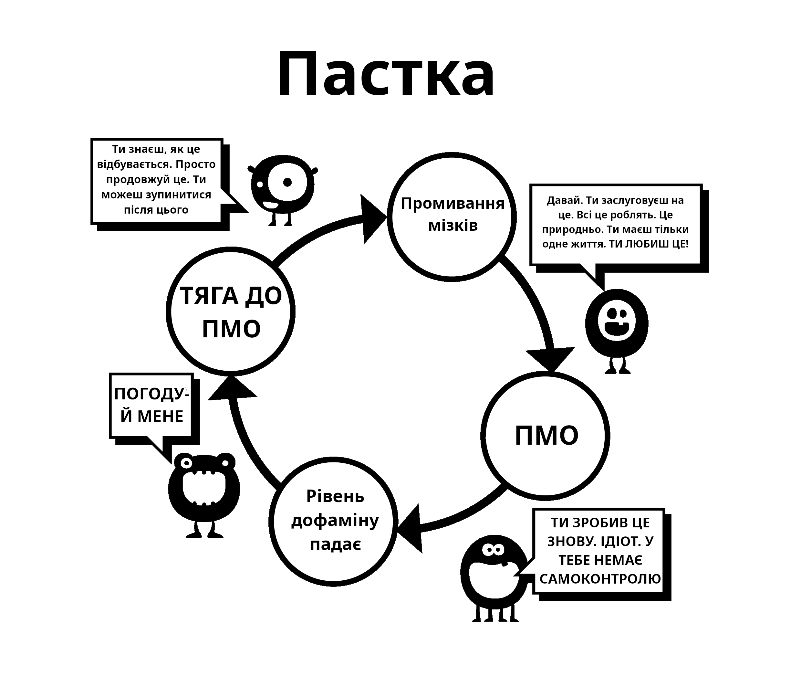

# Промивання мізків

Це друга причина, через яку ми починаємо використовувати порно. Щоб зрозуміти її, спочатку потрібно розглянути ефекти надприродніх стимулів. Наші мізки просто не готові до створення "онлайн-гарему", що дозволяє нам стрибати між більшою кількістю потенційних партнерів за 15 хвилин, ніж наші предки мали протягом декількох поколінь.

У минулому було багато помилкових думок, наприклад що мастурбація призводить до сліпоти. Науковці зробили правильно, коли відкинули такі помилкові уявлення. Але, з самого дитинства наша підсвідомість бомбардується сексуальними повідомленнями та картинками, журналами, та рекламою, яка заряджена натяками. Деякі поп-відео є еротичними, але не засмучуйтесь, перетворіть це на гру визначення компонентів, які вони використовують — чи це шок, новизна, колір, розмір, табу, тощо. Такою грою можна навіть навчати дітей.

В основі цього промивання мізків лежить повідомлення *"Найбільш дорогоцінна річ на цій землі, моя остання думка і дія — це оргазм."* Це перебільшення? Подивіться сюжет до будь-якого серіалу чи фільму, і ви побачите суміш чуттєвих (дотик, запах, голос) та дітородних (оргазмових) частин сексу. Цей вплив не реєструється на нашій свідомості, але наша підсвідомість має час на те, щоб це поглинути.

## Наукова аргументація

З іншої сторони існує публічність: залякування імпотенцією, втрата мотивації, вибір порно над реальними жінками, YourBrainOnPorn.com та різні інтернет-субкультури. Але всі ці рухи не зупиняють людей від використання. Якщо подумати логічно, то вони мають змусити зупинитися, але по факту такого немає. Навіть ризики здоровʼю, які перелічені у джерелах на YourBrainOnPorn є недостатніми, щоб завадити підлітку почати використовувати порно.

Іронічно, найбільшою силою у цьому всьому є самі користувачі. Це неправда, що користувачі це слабохарактерні або фізично слабкі люди. Ви маєте бути фізично сильним, щоб справлятися з залежністю після того, як ви дізналися про її існування. Можливо, найбільш гіркий аспект це те, що вони вважають себе нещасними невдахами та нестерпними інтровертами. Скоріше за все, такі люди були би більш цікавими вживу, якби вони не шукали самозадоволення увесь свій вільний час.

## Проблеми з методом сили волі

Користувачі, які кидають за допомогою методу сили волі, звинувачують нестачу їхньої сили волі та руйнують свій спокій і щастя. Одна річ зазнати невдачі у самодисципліні, а інша річ ненавидіти себе. Адже немає ніякого закону, який вимагає від вас завжди бути твердим перед сексом та бути належним чином збудженим, щоб задовольнити свого партнера. Ми працюємо над залежністю, а не звичкою. Ви жодного разу не сперечались із собою, щоб припинити таку звичку, як грати у гольф, але робите те саме з порно залежністю, чому?

Постійний контакт з надприродніми стимулами перепрограмовує ваш мозок, тому дуже важливо побудувати опір до цього промивання мізків. Ніби ви купляєте машину з пробігом — ви виховано киваєте головою, але не вірите жодному слову, яке каже продавець. Тому не вірте що вам необхідно мати настільки багато сексу, наскільки це можливо; якщо він такий гарний, тоді навіщо використовувати порно за його відсутності?

Також не грайте гру з безпечним порно — її придумав ваш маленький монстр для того, щоб заманити вас. Аматорське порно сертифіковане якоюсь установою? Порносайти збирають дані зі своїх користувачів і використовують їх для своїх цілей, і якщо вони побачать стрибок популярності у конкретній категорії, вони сфокусуються на отримання контенту для неї. Не давайте обдурити себе освітнім наміром "безпечних" кліпів з жінками. Почніть питати себе: *"Навіщо я роблю це? Чи справді мені це потрібно?"*

**Ні, звичайно не потрібно!**

Більшість користувачів клянуться, що вони дивляться тільки статичне та мʼяке порно, і тому з ними все буде добре, у той час коли насправді вони натягують ланцюг, та борються зі своєю силою волі, щоб опиратися бажанням. Якщо таке робити дуже часто і дуже довго, це сильно зменшує їхню силу волі і вони починають зазнавати невдач у інших життєвих проєктах, де сила волі має велике значення: такі як фітнес, дієта тощо. Невдача у цих проєктах змушує їх почуватися нещасними та винними, і це знову веде їх до порно. Якщо вони не отримають порно, вони будуть виливати злість та депресію на своїх близьких.

Коли ви стаєте залежними від інтернет-порно, промивання мізків збільшується. Ваша підсвідомість знає, що маленький монстр має бути ситий, та блокує все інше. Це страх не дає людям кинути, страх цієї порожнечі, це невпевнене відчуття, яке вони отримують, коли вони перестають переповнювати свій мозок дофаміном. Якщо ви про це не знаєте, це не означає що цього не існує. Ви не маєте розуміти це, так само як коту не потрібно розуміти де є гарячі труби — він просто знає, що якщо він сяде в якомусь конкретному місці, йому буде тепло.

## Пасивність

Пасивність нашого розуму і залежність від авторитету, що веде до промивання мізків — це основна складність у киданні порно. Наше виховання у суспільстві посилюється промиванням мізків нашої залежності та обʼєднується з найбільш сильним — нашими друзями, рідними і колегами. Слово "відмовлятися" це класичний приклад промивання мізків, що має на увазі справжню жертву. Але правда в тому, що немає від чого відмовлятися; навпаки — ви будете звільняти себе від жахливої хвороби і досягати дивовижних позитивних результатів. Ми почнемо видаляти промивку мізків прямо зараз, починаючи з того, що не будемо казати "відмовлятися", а будемо казати "зупинятися", "виходити", або більш правильне слово — "звільнятися"!

Єдина річ, через яку ми починаємо — це тому що інші люди це роблять і ми відчуваємо, що ми втрачаємо щось. Ми важко працюємо для того, щоб підсісти, але ніколи не знаходимо чого ж нам не вистачало. Кожного разу коли ми бачимо ще одне відео, це переконує нас, що у ньому має щось бути, інакше б люди не робили цього і бізнес не був би таким великим. Навіть коли вони звільняються від цієї звички, екс-користувачі почуваються позбавленими, коли на вечірках заходить розмова про якусь порно зірку. *"Вони мають бути класними якщо всі мої друзі говорять про них, правда? Чи мають вони безкоштовні фотографії онлайн?"* Вони почуваються у безпеці, тому просто глянуть одну фотографію вночі і до того як помітять це, вони знову підсядуть.

Промивання мізків дуже сильне і ви маєте знати про його ефекти. Технології продовжують розвиватися, і майбутнє принесе набагато швидші сайти та методи доступу. Порно індустрія інвестує мільйони у віртуальну реальність для того, щоб вона стала наступною модною річчю. Ми не знаємо куди це нас занесе, ми не готові справлятися з сучасними технологіями, або з тим, що буде в майбутньому.

Ми збираємось видалити промивку мізків. Не-користувач нічого не втрачає, а користувач втрачає життя:

-   Здоровʼя

-   Енергії

-   Добробуту

-   Душевного спокою

-   Впевненості

-   Сміливості

-   Самоповаги

-   Щастя

-   Свободи

Що вони отримують у результаті цих жертв? **АБСОЛЮТНО НІЧОГО**, окрім ілюзорних спроб повернутися до стану тиші, спокою та впевненості, які завжди має не-користувач.

## Синдром відміни

Як було сказано раніше, користувачі вважають, що вони використовують порно для насолоди або для своєрідного навчання. Справжня ж причина — це полегшення синдрому відміни. Наша підсвідомість починає вивчати, що інтернет-порно та мастурбація є приємними у деякий час. Коли ми стаємо більш залежними від наркотику, тим більшою стає потреба полегшення синдрому відміни, і тим глибше нас тягне ця пастка. Цей процес відбувається настільки повільно, що ви навіть не помічаєте цього. Багато хто з молоді не знає про те, що вони залежні, допоки не спробують зупинитися, і навіть тоді багато хто не визнає цього.

Ось приклад розмови, яку психолог мав з сотнями пацієнтами-дітьми:

>**Психолог:** “*Ви розумієте, що інтернет-порно це наркотик і єдина причина, чому ви його використовуєте, це тому що ви не можете зупинитись.*”
>
>**Пацієнт:** “*Нісенітниця! Я отримую насолоду від нього, інакше я б зупинився.*”
>
>**Психолог:** “*Тоді зупиніться на один тиждень щоб довести мені, що ви можете це зробити.*”
>
>**Пацієнт:** “*У цьому немає потреби, я отримую від нього насолоду. Якби я хотів зупинитися, я б це зробив.*”
>
>**Психолог:** “*Просто спробуйте зупинитися на тиждень щоб довести собі, що ви не є залежним.*”
>
>**Пацієнт:** “*Який у цьому сенс? Я насолоджуюсь цим.”*

Як було сказано раніше, користувачі схильні полегшувати свій синдром відміни коли вони відчувають стрес, нудьгу, концентрацію, або комбінацію цього всього. У наступних розділах ми розглянемо ці аспекти промивання мізків.
