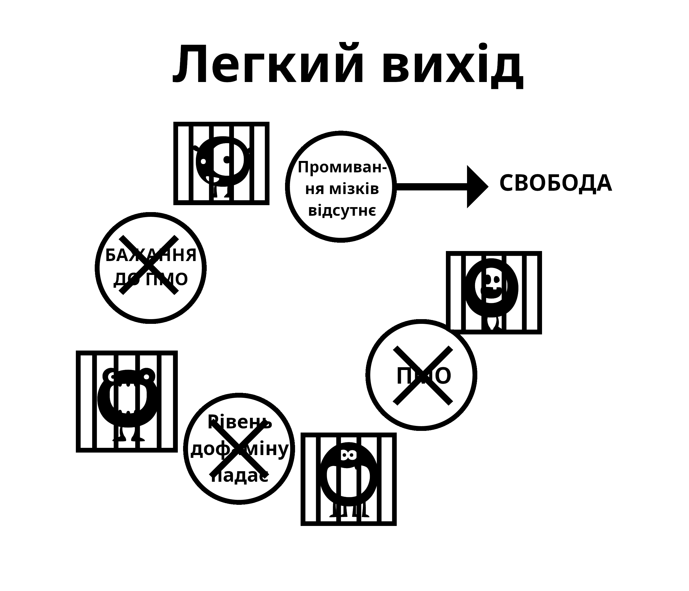

# Фактори промивання мізків

Великий монстр порно-пастки зʼявляється через різні фактори, включаючи вплив суспільства, медіа-зображення, наратив колег та власний внутрішній наратив користувача. Невміння деконструювати ці помилки під час використання методу сили волі зрештою призводить до відчуття позбавлення, що повертає користувача назад у пастку. Деконструкція уявної цінності порно має вирішальне значення для успіху та дозволяє вам побачити де вас обкрадають!

Важливо зазначити, що існує звʼязок між промиванням мізків та страхом. Страх відчуття ***майбутнього синдрому відміни*** — це те, що його створює. Страх і є тією самою ломкою. Згадайте як ви мали симптоми відміни, такі як спітнілі долоні, нестачу повітря, проблеми зі сном та неможливість нормально думати. Тепер подумайте про схожі ситуації, коли ви мали ці відчуття: інтервʼю на новій роботі, нервування поруч з красивою людиною, публічні виступи, тощо. Це ті самі відчуття, які створює страх. Простими словами, як фізичний наркотик може досі впливати на людей, які зупинилися місяці тому? Проблема має бути психологічною, так?

## Стрес

Користувачами керують не тільки великі трагедії у житті, але також і незначні стреси, які ведуть їх у заборонену "небезпечну" зону, яка до цього була зачинена. Стреси включають у себе соціалізацію, телефонні дзвінки, сімейні обовʼязки та багато іншого. Візьмімо телефонні дзвінки для прикладу, особливо для бізнесмена. Більшість дзвінків надходить не від задоволених клієнтів чи боса, який вас вітає — тобто завжди присутній якийсь стрес. Коли вони приходять додому до буденного сімейного життя, де кричать діти та їхній партнер щось від них вимагає, це штовхає користувача (якщо він ще не робить цього) фантазувати про полегшення, яке порно обіцяє цієї ночі. Він, не знаючи цього, відчуває симптоми відміни, його дестресори послаблені і не готові до додаткових подразників. Користувач частково полегшує ці симптоми та звичайний стрес, у нього зменшується загальний стрес і він отримує тимчасовий заряд бадьорості. Ця бадьорість не є ілюзією, користувачі справді відчувають себе краще ніж до цього, але вони є більш напруженими, ніж якби вони були не-користувачами.

Наступний приклад не зроблений для того, щоб шокувати вас — EasyPeasy обіцяє так не робити; він тут для того, щоб показати як порно руйнує ваші нерви, замість того щоб розслабляти їх.

Спробуйте уявити, що ви дійшли до того стану, коли ви вже не можете бути збудженими, навіть з дуже сексуальним і красивим партнером. Зупиніться на один момент і спробуйте візуалізувати життя, де дуже чарівна людина, яка вас любить, має конкурувати і програвати віртуальним порно-зіркам у вашому "гаремі" для того, щоб отримати вашу увагу. Уявіть стан мозку людини, яка продовжує використовувати порно коли отримала це попередження, і помирає навіть не маючи реального сексу з партнером. Таких людей можна назвати дивними, але такі історії не є вигадками — це те, що новизна порно робить з вашим мозком. Чим довше ви проживаєте, тим більше зменшується сміливість і тим більше користувач вірить у те, що порно робить навпаки.

Чи відчували ви колись паніку, коли інтернет раптово перестає працювати або стає дуже повільним? Не-користувачі не відчувають цього, тому що саме інтернет-порно *спричиняє* це відчуття. З часом це систематично руйнує ваші нерви та мужність, що змушує DeltaFosB формувати високі водні гірки та прогресивно руйнує ваше вміння казати ні. Коли ж мужність вже вбита, користувач починає вірити у те, що порно — це їхній новий партнер, і не може жити без нього.

*Інтернет-порно не розслабляє ваші нерви, воно повільно руйнує їх*. Одна з найбільших переваг звільнення від залежності — це повернення своєї природної впевненості.

Не потрібно судити себе на основі вашої здатності задовольнити партнера — це не свобода. Але цю свободу не можна досягти, якщо ви продовжуєте змащувати дофамінову водну гірку такими способами, які відрізають ваше щастя та лібідо шляхом повторення однієї і тої самої деструктивної поведінки.

## Нудьга

Якщо ви схожі на більшість людей, то щойно ви лягаєте в ліжко, ви вже знаходитесь на своєму улюбленому порно-сайті, і скоріше за все ви не помітите цього, поки вам про це не скажуть. Це стало звичкою. Схожим чином, те, що порно полегшує нудьгу є ще однією неправдою, тому що нудьга це настрій, який виникає коли вас позбавлено порно на довгий час, або намагаєтеся зменшити його використання.

Насправді ситуація виглядає так: коли ви є залежним до надприродньої тяги інтернет-порно і потім намагаєтесь утримуватись, це відчувається ніби чогось не вистачає. Якщо ви можете зайняти свій мозок чимось не стресовим, ви можете провести довгий період часу не турбуючись відсутністю наркотика. Але коли вам нудно, то не існує нічого, що допомогло б вам відвернути увагу від порно. Тоді ви годуєте монстра. Коли ви не намагаєтесь опиратися цьому, навіть запуск браузера стає підсвідомим процесом. Цей ритуал є автоматичним — якщо користувач намагається згадати свої сеанси, то у нього виходить згадати тільки малу частину.

Правда у тому, що порно збільшує нудьгу непрямим шляхом, тому що через оргазми ви почуваєтесь летаргічно, і замість того, щоб займатися енергійними речами, користувачі просто лінуються, нудьгують і полегшують свій синдром відміни. Опиратися промиванню мізків також важливо, тому що користувачі зазвичай дивляться порно коли їм нудно, оскільки наш мозок запрограмований бачити інтернет-порно як щось цікаве. Так само нам промивали мізки що секс, навіть поганий секс, допомагає розслабленню. Це факт, що під час смутку або стресу, подружжя хочуть мати секс. При відсутності розділення між чуттєвим та дітородним сексом зверніть увагу на те, як швидко ви захочете піти геть одне від одного, після того як ви досягнули оргазму. Якби подружжя вирішило просто обійняти одне одного, поговорити та піти спати, вони б відчували себе полегшено.

## Концентрація

Мастурбація та секс не допомагають концентрації — коли ви намагаєтесь сконцентруватись, ви автоматично намагаєтесь не відволікатись. Тому, коли користувач хоче сконцентруватися, він навіть не думає, а автоматично відкриває браузер, годує маленького монстра, частково закінчує тягу і далі займається своїми справами, вже забувши що він дивився порно. Після років заливання дофаміном нейрологічні зміни впливають на такі здібності як пошук інформації, планування та контроль імпульсів.

Також ви маєте знаходити новизну для наступного сеансу, тому що той самий матеріал вже не генерує достатньо дофаміну та опіоїдів. Тому ви маєте блукати вулицями інтернету в пошуках новизни та шукати колодязь із забороненим матеріалом, що в свою чергу створює більше стресу та залишає вас пустим після закінчення.

Концентрація також страждає через те, що рецептори дофаміну знищуються через природну толерантність до великих сплесків, що зменшує користь малих сплесків дофаміну від природніх дестресорів. Ваша концентрація та натхнення значно підвищаться, якщо цей процес буде зменшено. Для багатьох саме аспект концентрації заважає їм досягти успіху за допомогою методу сили волі; вони можуть змиритися з дратівливістю та поганим характером, але нездатність зосередитися на чомусь важкому, коли у них немає звичної підтримки, руйнує багатьох.

Втрата концентрації, від якої страждають користувачі, коли намагаються звільнитися від порно, відбувається не через відсутність сексу або порно. У вас є психічні завади коли ви від чогось залежні. А коли ви маєте психічні завади, то що ви робите? Ви відкриваєте браузер, але це не знищує їх — що ви робите у такому разі? Ви робите те, що маєте робити — просто продовжуєте, як це роблять не-користувачі.

Коли ви є користувачем, ніщо ніколи не звинувачується на причину — користувачі ніколи не мають *сексуальної дисфункції*, просто іноді вони не в настрої. У момент, коли ви перестаєте користуватися, все, що йде не так, звинувачується на причину, через яку ви зупинилися. Тепер, коли у вас є психічна завада, замість того, щоб просто продовжувати робити те, що ви робите, ви починаєте казати *"От якби я тільки міг подивитися на свій гарем, це б вирішило всі мої проблеми"*. А потім ви починаєте піддавати сумніву свої наміри звільнитися від рабства.

Якщо ви вважаєте, що порно це справжня допомога концентрації, то якщо ви переживаєте за це, це гарантуватиме, що ви не зможете концентруватися. Саме сумніви створюють проблеми, а не фізичні симптоми відміни. Завжди памʼятайте, користувач страждає від синдрому відміни, а не не-користувач.

## Розслаблення

Більшість користувачів вважають, що порно допомагає їм розслабитись. Це не так. Шалений пошук дози в цих "темних алеях інтернету" і внутрішня боротьба за те, щоб зірватися з ланцюга та перетнути червону лінію, точно не *звучить* як розслабляюче заняття.

Із настанням ночі після далекої подорожі до нового місця, або після довгого дня ми сідаємо розслабитись, тамуємо свій голод та спрагу, і почуваємось повністю задоволеними. Але порно-користувачі не почуваються задоволеними, тому що у них є ще один голод, який їм треба тамувати. Користувачі вважають порно вишенькою на торті, але насправді це просто "маленький монстр", який має поїсти. Правда в тому, що залежний ніколи не може бути повністю розслабленим, і з плином часу це ставатиме все гірше і гірше. Ось приклад онлайн-коменту від екс-користувача:

> "Я справді думав, що у мене вселився злий демон, але тепер я знаю, що так воно і було. Однак проблема була не у якійсь моїй ваді, а у маленькому інтернет-порно монстрі. У той час я думав, що у мене є всі проблеми на світі, але коли я дивлюсь назад на своє життя, я дивуюсь, де був увесь цей великий стрес. Все інше в моєму житті було під моїм контролем. Єдине, що мене контролювало — це порно-рабство. Сумно те, що навіть сьогодні я не можу переконати своїх дітей, що це рабство було причиною моєї дратівливості."

Я завжди чую, як порно залежні намагаються виправдати свою залежність словами "*Це допомагає мені розслабитись*". Подивіться на цю онлайн розповідь батька-одинака, чий шестирічний син хотів прийти до нього в ліжко на ніч після страшного фільму, але батько відмовив, щоб він міг дивитися порно годинами.

Є ще одна аналогія з курцями: декілька років тому влада погрожувала заборонити курцям всиновлювати дітей. Тоді подзвонив чоловік і сказав "*Ви неправі. Я памʼятаю, що коли я був дитиною, якщо мені потрібно було щось сказати мамі, я чекав поки вона не запалить цигарку, тому що тоді вона була більш спокійною.*" Чому цей чоловік не міг поговорити з мамою коли вона не палила цигарку?

Чому деякі користувачі відчувають стрес, коли вони не можуть отримати свою дозу, навіть після реального сексу? Одна історія розповідає про чоловіка, який працював у сфері реклами, та мав вечори вільними для побачень, але втратив інтерес водити жінок на вечерю, оскільки інтернет-порно було простішим; йому не було потрібно витрачати кошти на ресторани і він не міг отримати "ні" від свого партнера. Навіщо переживати, якщо його маленький монстр продовжує тримати його у схемі з малим ризиком та великою нагородою на кінчиках його пальців відразу коли він прийде додому?

Чому тоді не-користувачі повністю розслаблені? Чому користувачі не можуть розслабитись без дози протягом дня чи двох? Прочитайте про досвід користувача, який заприсягнувся кинути і ви побачите його боротьбу з тягами. Він точно не є розслабленим, коли йому не дозволено мати "єдине задоволення", від якого він "отримує насолоду". Він забув, як це відчувається бути повністю розслабленим. Порно можна порівняти з мухою, яка попалась у мухоловку: спочатку муха їсть нектар, але в якийсь момент часу рослина починає їсти муху.

Чи не прийшов час вилізти з мухоловки?

## Енергія

Більшість користувачів знають про прогресивні ефекти новизни порно і який вплив має пошук загострень на центр винагороди їхнього мозку та сексуальні системи. Але вони не знають про ефекти, які воно має на їхній рівень енергії.

Одна з тонкощів порно-пастки це те, що фізичні і психічні ефекти, які вона нам дає, відбуваються настільки повільно, що ми не знаємо про них і вважаємо це за норму. Цей ефект схожий на погане харчування: ми дивимось на людей з ожирінням і думаємо як вони взагалі дозволили собі дійти до такого стану. Але уявіть, що це сталося за ніч — ви пішли у ліжко, увесь у мʼязах і без граму жиру на вашому тілі — а прокинулися з ожирінням. Замість того, щоб відчувати себе повністю розслабленим і повним енергії, ви почуваєтесь нещасним, летаргічним, і ледве-ледве можете розплющити очі.

Ви були б у паніці, та гадали б яку страшну хворобу ви підхопили за ніч — але хвороба така сама. Той факт, що вам знадобилось двадцять років для того, щоб дійти до цього стану, не має значення. Порно є таким самим: якби було можливо відразу перенести ваш розум і тіло, щоб дати вам пряме порівняння як би ви себе відчували, якщо б кинули порно за три тижні, то цього було б достатньо, щоб переконати вас. Ви б не тільки почувались більш здоровим з більшою кількістю енергії, але були б переповнені впевненістю та підвищеною концентрацією.

Нестача енергії, втома, та все, що відноситься до цього, разом підмітається під ганчірку "старіння". Друзі і колеги, хто також живе малорухливим життям, нормалізують таке поводження ще далі. Думки, що енергія є ексклюзивною тільки дітям, а старіння починається вже в двадцятих — це також промивання мізків, так само як неусвідомлення про правильне харчування і культуру фізичних вправ у результаті посиленого впливу десенситизації дофаміном.

Незадовго після зупинки перегляду порно туман у вашій голові зникне. Суть у тому, що з порно ви завжди витрачаєте свою енергію і під час цього процесу ви порушуєте хімію у своїй лімбічній системі. На противагу киданню цигарок, де повернення вашого фізичного і психічного здоровʼя є поступовим процесом, звільнення від порно дає чудові результати з першого дня. Вбивство "маленького монстра" і закриття водних гірок потребує трохи часу, але відновлення вашого кола нагороди — це ніщо як повільний спуск у яму. Якщо ви проходите через травму методу сили волі, усе здоровʼя та енергія, яку ви отримали, будуть знищені депресією, від якої ви страждатимете. На жаль, EasyPeasy не має можливості перенести ваш розум на три тижні вперед, але це можете ви! Ви інстинктивно знаєте що те, що вам кажуть, це правда, все що вам треба — це використати свою уяву!

## Сеанс перед виходом у соціум

Це брехня яка ніби має сенс, але насправді ні. Для того, щоб контролювати свій апетит, ви будете їсти вдома, перед тим як йти в ресторан або на вечірку? Це те, що ви робите з сеансами перед тим як йти гуляти. Спроба втопити своїх метеликів, використовуючи порно і препарати зробить справи тільки гіршими у майбутньому.

Перегляд порно перед важливими зустрічами або подіями обумовлений двома або більше соціальними причинами для пошуку задоволення чи підтримки, а соціальні події по своїй суті є одночасно стресовими та розслабляючими. Це може виглядати як протиріччя, але будь-яка форма соціалізації може бути стресовою — навіть із друзями, коли ви хочете бути собою та повністю розслабленими. Існує багато подій, коли одночасно присутні декілька факторів, наприклад водіння автомобіля, оскільки на кону ваше життя. Це стресова активність, яка вимагає концентрації уваги протягом великого періоду часу. Вам не потрібно звертати увагу на ці фактори, оскільки ваша підсвідомість вже знає про це. Так само, коли ви застрягаєте у пробці або нудьгуєте під час довгих поїздок магістраллю, ваш мозок захоплює обіцянка подивитися порно, коли ви приїдете додому.

Іншим гарним прикладом є перше побачення, коли ваш мозок закидує вас питаннями про людину, яку ви збираєтесь зустріти. Потім, коли ваш ентузіазм починає затухати, після того як ви зустрілися з людиною вживу, ви починаєте почуватись дуже розслабленим, а потім винним за це. Перетягування канату почалось: "*Я хочу сексу, або заберіть мене звідси як можна швидше*", що підштовхує вас до перегляду порно після побачення.

Навіть якщо побачення пройшло гарно і через декілька годин ви поїхали до нього/неї додому, не важливо як це все пройде, ви не будете задоволеними, якщо єдиною вашою ціллю був оргазм. Іншим разом, коли ви їдете один додому, замість того, щоб похвалити себе за свої зусилля, ви думаєте тільки про свій онлайн-гарем. Можете не сумніватися, що хтось у такій ситуації матиме сеанс коли дістанеться дому. І часто після таких ночей, за якими хтось буде сумувати більше за все, ми задумуємось про зупинку використання порнографії, коли прокидаємось з відчуттям тривожної порожнечі. Ми думаємо, що життя більше ніколи не буде таким приємним як раніше. Насправді, це працює за таким самим принципом: сеанси просто дають полегшення від синдрому відміни та кожного разу змащують водні гірки для наступного сеансу.

Запамʼятайте — особливими є не інтернет-порно і гарем, а події. Як тільки зникне потреба у перегляді порно, такі події стануть більш приємними, а стресові ситуації менш стресовими.

