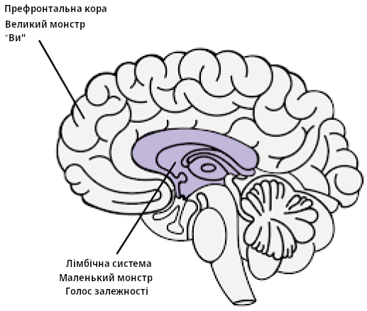

# Ресурси {-}

[Медитації порно-залежного](../resources/meditations.pdf) - Guillaco

[Список EasyPeasy](https://old.reddit.com/r/pmohackbook/comments/id6nie/easypeasy_statements_checklist/) - SWATxKATS

[9-ти хвилинна медитація](https://www.youtube.com/watch?v=tw7XBKhZJh4) - Sam Harris

[Курс медитацій для пробудження](https://wakingup.com) - Sam Harris

[Покидаючи сучасність](https://jdemeta.net/2019/09/15/exiting-modernity/) - Meta Nomad // ([pdf](https://jdemeta.net/wp-content/uploads/2019/09/Exiting-Modernity.pdf))

[Лист, який я надсилаю до шкіл](../resources/principal.pdf)

[Свобода назавжди (нотатки ПМО)](https://sites.google.com/view/freeforever/home)

[Чому ви робите повторення - u/Different_Guide_5205](https://old.reddit.com/r/pmohackbook/comments/mynwjl/why_youre_relapsing/)

[Опираючись страху - u/Different_Guide_5205](https://old.reddit.com/r/pmohackbook/comments/n5027n/countering_fear/)

## Раціонально-емоційно-поведінкова терапія {-}

- *"Я можу зупинити цикл ПМО, навіть якщо це "важко" зробити. Але це не дуже важко, і неважливо скільки це займе часу, воно того варте!"*

- *"Якщо я продовжу ігнорувати та ніколи не буду здаватися сильним тягам до ПМО, то мені буде все легше та легше ним опиратися."*

- *"Я можу повністю і безумовно прийняти себе — так, навіть з усіма своїми недоліками."*

- *"Здається, що ПМО швидко "лікує" мої проблеми, але насправді воно робить їх гіршими."*

- *"Іноді, я хочу втопити свої проблеми у ПМО, але це не є причиною, щоб так робити."*

- *"Мені стає дуже незручно, коли я не отримую те, що справді хочу. Але це не жахливо до того моменту, допоки я у це вірю. А я обираю вірити у щось більш реалістичне та корисне."*

- *"Мені ніколи не почне подобатися несправедливе ставлення, але я можу протистояти йому, і, можливо, будувати плани щоб його зупинити."*

- *"Неважливо скільки разів я зазнаю невдачі у цій важливій гонитві, мої невдачі ніколи не зроблять мене некомпетентною вошею. Це просто робить мене людиною, яка, можливо, вела себе некомпетентно у той час."*

- *"Якщо я не отримаю того, що я хочу, я все одно можу бути у міру щасливим, хоч і не таким щасливим, ніж якби я це отримав."*

- *"Я віддаю перевагу бути неперевершеним у своїй роботі, але це не обовʼязково. Дуже погано якщо я не такий, але це не робить мене неповноцінним. Я завжди можу продовжувати намагатися бути кращим без потреби бути кращим."*

- *"Багато речей можуть змусити мене шкодувати та розчаруватися, але коли я вимагаю, щоб ці речі не існували, тоді я панікую, стаю депресивним та розлюченим."*

- *"Так, у мене часто не виходило робити те, що я обіцяв, але це не означає, що я не можу або не витримаю цю обіцянку."*

- *"Я ненавиджу бути тривожним і депресивним, але я не маю відразу топити ці відчуття за допомогою ПМО. Коли я повторюю цикл ПМО, я тимчасово почуваюся краще у своїх проблемах, але я не стаю кращим. У довгостроковій перспективі, ПМО робить лише гірше."*

- *"Люди не злять мене коли вони ставляться до мене погано. Я безглуздо вирішую злитися через їх погане поводження, вимагаючи й наказуючи їм діяти краще."*

## Поєднання EasyPeasy з Addictive Voice Recognition Technique (AVRT) Джека Трімпея {-}

*Дякую az#8773 з Discord*

Це для тих людей, які мають проблеми з використанням методу Алена Карра під назвою Easyway для відновлення від залежності, не зважаючи на видалення промивання мізків. Я вважатиму, що всі, хто це читає, вже прочитали якусь книгу Алена Карра і розуміють його метод Easyway (те саме, що й EasyPeasy). Якщо ні, то я дуже рекомендую це зробити. Також буде плюсом, якщо ви читали "Раціональне Відновлення" Джека Трімпея. Якщо ви не читали цю книгу, то це нічого страшного, оскільки я поясню її основи тут. Але я все одно рекомендую прочитати її, оскільки у ній написано все більш детально, ніж тут. Це не буде націлено на якусь одну окрему залежність, і тому може застосовуватися до будь-якої залежності. Цей текст написаний для порівняння Easyway з іншим успішним методом кидання залежності, який називається "Addictive Voice Recognition Technique" (AVRT) та обʼєднати їх разом. Хоча я вважаю, що Easyway поки що набагато кращий від усіх методів відновлення від залежності, я вважаю що розуміння AVRT також може бути втраченим звʼязком для тих багатьох, у кого не виходить використовувати Easyway не зважаючи на те, що вони вбили великого монстра.

Існує багато конкуруючих методів для кидання залежностей, кожен з яких має різний рівень успіху. Я не буду згадувати про них, тому що більшість із них це марна трата часу, а я хочу розказати про це максимально коротко. Єдині методи, про які я буду писати — це Easyway Алена Карра та AVRT Джека Трімпея. Обидва методи мають екстремально високий рівень успіху, але кожен ставить за ціль різні речі. Easyway та AVRT є схожими у тому, що Easyway розділяє залежність на "Маленького Монстра" та "Великого Монстра", а AVRT розділяє ваш розум на "Голос залежності" (звіра) та "Вас". Голос залежності та маленький монстр це одна і та сама річ, а великий монстр (промивання мізків) це ваша система вірувань, яка змушує вас думати, що ваша залежність дає вам якусь вигоду чи підтримку. Easyway фокусується на знищення великого монстра, не звертаючи увагу на маленького монстра, у той час поки AVRT фокусується на маленького монстра, не звертаючи уваги на великого монстра. Поки Easyway руйнує психологічну залежність, AVRT навчає вас розрізняти фізичну залежність, яка маскується під вас, та відділяти себе від неї. Дуже цікаво, що Easyway та AVRT мають такий високий рівень успіху, не зважаючи на те, що вони фокусуються на протилежних речах.

Хоча я вважаю, що Easyway поки що є найкращим методом для виходу із залежності, і хоча я рекомендую його над всіма іншими, я можу визнати у ньому два маленьких недоліки. По-перше, мені здається що він недооцінює маленького монстра. Я хочу уникнути особистих розповідей у цьому тексті, але з мого досвіду та досвіду інших, дехто з нас не може досягти успіху за допомогою Easyway не через те, що нам не вдалось знищити великого монстра (хоча таке теж буває), а через те, що ми недооцінили маленького монстра. Маленький монстр — це не проблема для багатьох людей, що пояснює високий успіх Easyway, але для когось, у тому числі й мене, це може бути проблемою. Другий недолік полягає у тому, що Easyway каже, що всі невдачі це результат або невиконання інструкцій, або невміння видалити великого монстра.

Ось коротко про Easyway. Залежність має два компоненти: фізичну залежність від дофаміну та психологічну залежність, яка складається з думок (промивання мізків), що ваша залежність дає вам якесь задоволення чи опору. Це називається маленький та великий монстри, відповідно. Опираючись на Easyway, маленький монстр це всього лише пусте, трохи невпевнене ледве помітне відчуття. Коли ви зрозумієте, що ваша залежність не дає вам переваг, і що все це отримане задоволення чи опора це просто ілюзія, та коли ви зрозумієте, що у житті без вашої залежності немає чого боятися, тоді ваша тяга до порно зникне. Тяга до порно виникає через страх, що життя без вашої маленької опори буде нестерпним, що дає вам сумніви чи варто вам кидати, а це і є тягою. Ви долаєте цей страх шляхом розуміння наскільки більш приємним буде ваше життя без порно, та продовжуєте підтримувати це відчуття легкості.

Хоча я вважаю, що це найкращий метод для виходу із залежності, він не акцентує вагу на маленькому монстрі, тому що в теорії, коли ви справитесь із великим монстром, безнадійний безсилий маленький монстр просто завʼяне та помре сам по собі, і він все одно майже непомітний, тож кому на нього не байдуже. Маленький монстр може бути незначним для багатьох людей, але з мого досвіду та досвіду інших здається що це не завжди так. Коли люди зазнають невдачі використовуючи Easyway, відповідно до методу Easyway, є тільки дві можливих причини: або вони не виконували інструкції належним чином, або у них не вийшло видалити великого монстра. Я вважаю що це згубно, і я поясню пізніше чому це так.

Техніка розпізнавання голосу залежності (AVRT) розділяє мозок на дві частини: нижній мозок (лімбічна система), де проживає ваша залежність, та верхній мозок (префронтальна кора), де живете ви (або ваші думки та его). Джек Трімпей розповідає про голос залежності як про звіра, тому що він живе у звіриній частині нашого мозку і знає лише одну річ — "Я ХОЧУ ЦЕ І Я ХОЧУ ЦЕ ЗАРАЗ". Особисто мені його персоніфікація як звіра не допомагає, але, я думаю, що це краще ніж вважати що це ви. Голос залежності (ГЗ, маленький монстр) вкраде ваш голос розуму і буде використовувати його проти вас, щоб потурати вам у вашій залежності. Він має це робити, тому що він не може контролювати ваші моторні функції. Ви можете спробувати це зараз, підніміть вашу руку перед вашим обличчям та поворушіть пальцями. Тепер попросіть вашу залежність зробити те саме. Вона не може. Це означає, що в кінці кінців ви єдиний, хто має контроль.

ГЗ не тільки викрадає ваш голос розуму, але також оманливо ховається за займенником "Я". Він каже: "Я справді міг би зайнятися X прямо зараз", "Я справді сумую за тим, щоб робити X", "Чи не було б добре зробити X прямо зараз? Зрештою, я заслужив це після сьогоднішнього дня". AVRT звертає увагу на той факт, що ви не є вашим голосом залежності, ви просто так думаєте. Коли ви побачите, що ГЗ це "не ви" і скажете йому ні, він відкидає "Я", і починає використовувати "ти", "нас", або "ми". Це доказ, що він — це не ви.

Коли ви кажете "Ні" вашому ГЗ, трапляється таке:
"Я справді міг би зайнятися Х прямо зараз" стає "Ну давай, ти справді міг би скористатися X прямо зараз, і ти це знаєш". "Я справді сумую за тим, щоб робити Х" стає "Ну давай, тобі точно не вистачає X, ти не відчуваєш цього?" "Чи не було б добре зробити Х прямо зараз? Зрештою, я заслужив це після сьогоднішнього дня" стає "Ми заслуговуємо на те, щоб зробити X прямо зараз, після всього, через що ми пройшли. Як ти міг відмовити нам у цьому?"

У цей момент я хочу щось прояснити. Це не "перетягування канату", про яке розповідає Ален Кар. "Перетягування канату" це когнітивний дисонанс, коли ви маєте дві чи більше конфліктних систем вірувань і у результаті ви не вбиваєте великого монстра. "Я справді не хочу робити Х, через цей негативний ефект, який воно мені дає, але воно також робить мені Х, тому я хочу робити це." Це перетягування канату і вибрики великого монстра. Коли великий монстр помре шляхом видалення промивання мізків, єдиний голос, який казатиме вам зайнятися вашою залежністю буде йти від маленького монстра (ГЗ). Через те, що ГЗ використовує займенник "Я", є можливість переплутати ГЗ із великим монстром.

Також важливо сказати, що ГЗ це великий брехун. Його єдине бажання це отримати дофамін будь-якою ціною. Ваш ГЗ спробує переконати вас поміщати себе у потенційно смертоносні ситуації, якщо це означає отримати дозу.

Раніше я сказав: "Коли люди зазнають невдачі при використанні Easyway, відповідно до методу Easyway є тільки дві можливих причини: або ви не виконували інструкції належним чином, або у вас не вийшло видалити великого монстра. Я вважаю, що це згубно, і я поясню пізніше чому це так." Я вважаю що це згубно, тому що невдача розпізнати ГЗ привела мене та інших, хто використовував Easyway, до неправильних думок, що ми не повністю вбили великого монстра, тож ми перечитували книгу, щоб спробувати вбити промивку мізків знову, не зважаючи на те, що ми вже це зробили. Невдачі розпізнати ГЗ, який поєднується з думкою, що "якщо у тебе не вийшло кинути за допомогою Easyway, це означає що у тебе не вийшло вбити великого монстра", змусять вас знову концентрувати ваші сили на великого монстра, хоча він вже був переможений. Ви можете потрапити у цикл перечитування книг Алена Карра, триматися деякий час, і потім повторюватись знову і знову.

Коли ГЗ каже щось схоже на: "Я хочу зробити Х зараз, тому що це робить мені Х", якщо ви відмінили промивку мізків та видалили маленького монстра, ви можете подумати: "Але я знаю що це неправда, то чому я досі вважаю це за істину? У мене не вийшло повністю видалити промивку мізків?" Правда у тому, що ви видалили промивку мізків, це підтверджується фактом, що ви знаєте це краще, ніж те, що вам каже ГЗ. Просто ви думаєте що ГЗ це ви, тому що він використовує займенник "Я". Ви підтвердите що це не великий, а маленький монстр, коли помітите ГЗ та змусите його показати себе, шляхом заміни "я" на "ти", "ми" або "нас". Якби це справді був великий монстр, він би не змінював "я" на "ти", "ми" або "нас".

Тепер, коли ГЗ каже: "Будь ласка, можна ми просто зробимо Х ще один раз заради старих часів, лише один?" і ви кажете "Ні", ви можете відчувати емоційну відповідь. Ви можете відчувати страх або сум. Дуже важливо зрозуміти, що це відчуття йде не від вас, воно йде від нього. Якщо ви не можете помітити ГЗ, ви будете думати що ця емоція йде від вас і будете більш схильні здатися йому. Помітьте ГЗ і той факт, що емоції, які йдуть від нього, не йдуть від вас, і потім відчувайте радість від цього.

Коли ви обʼєднаєте ці два методи разом (якщо необхідно, не всі люди мають проблему з маленьким монстром) та будете підтримувати відчуття радості та легкості, коли помічаєте ГЗ, ви досягнете успіху.
